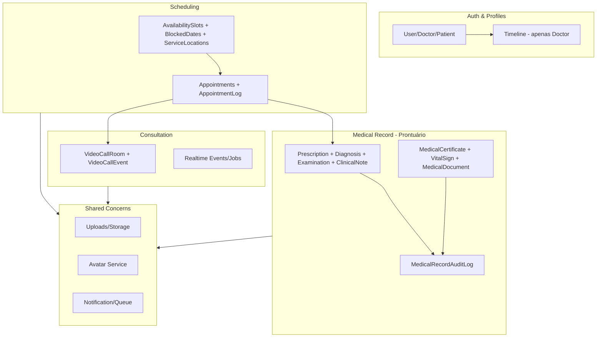

# Bounded Contexts - Telemedicina Para Todos

## Visão Geral

Este documento descreve a arquitetura de **Bounded Contexts** adotada no projeto, como utilizá-la no dia a dia e como estendê-la para novos domínios.

## Por que Bounded Contexts?

- **Coesão**: Entidades relacionadas ficam agrupadas (ex.: Prescription, Diagnosis, Examination pertencem ao mesmo contexto de Prontuário)
- **Policies centralizadas**: Uma `MedicalRecordPolicy` cobre todo o prontuário
- **Evolução**: Contextos podem ser extraídos como pacotes Laravel no futuro
- **Sem modularização prematura**: Mantemos monólito; evitamos complexidade de pacotes separados antes da necessidade

## Diagrama de Referência



## Contexto Medical Record (Implementado)

### Estrutura Atual

```
app/MedicalRecord/
├── Domain/
│   ├── ValueObjects/
│   │   ├── CID10Code.php          # Validação CID-10 (RN-DIAG-001)
│   │   ├── PrescriptionItem.php    # Item de prescrição
│   │   └── VitalSignValue.php     # Sinais vitais com limites
│   └── Exceptions/
│       └── PrescriptionWithoutSignatureException.php  # RN-PRESC-002
├── Application/
│   └── Services/
│       └── MedicalRecordService.php
└── Infrastructure/
    ├── Persistence/Models/
    │   ├── Prescription.php
    │   ├── Diagnosis.php
    │   ├── Examination.php
    │   ├── ClinicalNote.php
    │   ├── MedicalCertificate.php
    │   ├── VitalSign.php
    │   ├── MedicalDocument.php
    │   └── MedicalRecordAuditLog.php
    └── ExternalServices/
        ├── UnconfiguredICPBrasilAdapter.php
        └── DevelopmentICPBrasilAdapter.php
```

### Namespaces

| Camada | Namespace Base |
|--------|----------------|
| Domain | `App\MedicalRecord\Domain\*` |
| Application | `App\MedicalRecord\Application\Services` |
| Infrastructure/Models | `App\MedicalRecord\Infrastructure\Persistence\Models` |
| Infrastructure/External | `App\MedicalRecord\Infrastructure\ExternalServices` |

### Regras de Negócio (SystemRules.md)

- **RN-PRESC-001**: Prescrição DEVE ter assinatura digital ICP-Brasil (futuro)
- **RN-PRESC-002**: Prescrição sem assinatura válida NÃO pode ser emitida
- **RN-AUDIT-001**: Toda ação em prontuário DEVE gerar log de auditoria
- **RN-DIAG-001**: Diagnóstico DEVE conter código CID-10 válido
- **RN-EXAM-001**: Exame anexado DEVE passar por validação de magic bytes

### Uso no Código

**Controllers** injetam e usam apenas o Service:

```php
use App\MedicalRecord\Application\Services\MedicalRecordService;

class DoctorPatientMedicalRecordController extends Controller
{
    public function __construct(
        private readonly MedicalRecordService $medicalRecordService,
    ) {}

    public function storeDiagnosis(StoreDiagnosisRequest $request, Patient $patient)
    {
        $this->authorize('registerDiagnosis', $patient);
        $diagnosis = $this->medicalRecordService->registerDiagnosis(...);
        // ...
    }
}
```

**Value Objects** são usados para validar antes de persistir (integração pendente):

```php
// Exemplo futuro em MedicalRecordService::registerDiagnosis()
$cid10 = new CID10Code($payload['cid10_code']);
$diagnosis = Diagnosis::create([
    'cid10_code' => $cid10->value(),
    // ...
]);
```

**Models de outros contextos** (User, Doctor, Patient, Appointments) permanecem em `App\Models\` e são referenciados pelos Models do MedicalRecord via relacionamentos Eloquent.

---

## Guia de Uso (daqui para frente)

### 1. Adicionar nova entidade ao Medical Record

1. Criar Model em `app/MedicalRecord/Infrastructure/Persistence/Models/`
2. Namespace: `App\MedicalRecord\Infrastructure\Persistence\Models`
3. Criar migration em `database/migrations/`
4. Adicionar relacionamento em `Appointments`, `Doctor`, `Patient` (em `app/Models/`) se necessário
5. Atualizar `MedicalRecordService` para incluir no fluxo de prontuário
6. Criar Factory em `database/factories/` com `$model` apontando para o novo namespace

### 2. Adicionar Value Object

1. Criar em `app/MedicalRecord/Domain/ValueObjects/`
2. Implementar validação no construtor (lançar `InvalidArgumentException` se inválido)
3. Usar no Service ou FormRequest antes de persistir
4. Manter imutável (readonly quando possível)

### 3. Adicionar integração externa (ex.: ICP-Brasil)

1. Criar interface em `app/MedicalRecord/Domain/` (opcional) ou Adapter direto
2. Implementar em `app/MedicalRecord/Infrastructure/ExternalServices/ICPBrasilAdapter.php`
3. O `MedicalRecordService` chama o Adapter; não conhece detalhes da API
4. Usar `PrescriptionWithoutSignatureException` quando assinatura inválida

### 4. O que NÃO colocar dentro do contexto

- **Controllers**: permanecem em `app/Http/Controllers/`
- **Form Requests**: em `app/Http/Requests/`
- **Events Laravel** (PrescriptionIssued, etc.): em `app/Events/` — para compatibilidade com listeners
- **Observers**: em `app/Observers/` — importar model do contexto
- **Policies**: `MedicalRecordPolicy` em `app/Policies/` — injeta o Service do contexto

---

## Contextos Futuros (Scheduling, Consultation, Auth)

Ao migrar um domínio para Bounded Context:

1. Criar `app/{Contexto}/` com Domain, Application, Infrastructure
2. Mover Models para `Infrastructure/Persistence/Models/`
3. Mover Services para `Application/Services/`
4. Atualizar imports em Controllers, Observers, Events, Factories
5. Registrar Observers no AppServiceProvider com classe do novo namespace
6. Atualizar Arquitetura.md e este documento

### Contexto Scheduling (Implementado)

```
app/Scheduling/
└── Infrastructure/
    └── Persistence/Models/
        ├── Appointments.php
        ├── AppointmentLog.php
        ├── AvailabilitySlot.php
        ├── BlockedDate.php
        └── ServiceLocation.php
```

Os models antigos em `App\Models\` e `App\Models\Doctor\BlockedDate` permanecem como aliases (@deprecated) para compatibilidade.

### Ordem sugerida de migração

1. ~~**Scheduling**~~ — ✅ Implementado
2. ~~**Consultation**~~ — ✅ Implementado (VideoCallRoom, VideoCallEvent)
3. **Auth & Profiles** — User, Doctor, Patient, TimelineEvent

### Contexto Consultation (Implementado)

```
app/Consultation/
└── Infrastructure/
    └── Persistence/Models/
        ├── VideoCallRoom.php
        └── VideoCallEvent.php
```

Os models antigos em `App\Models\` permanecem como aliases (@deprecated).

---

## Referências

- [Arquitetura do Sistema](Arquitetura.md)
- [Regras do Sistema](../requirements/SystemRules.md)
- [Pendências (TrueIssues)](../TrueIssues.md)

---

*Última atualização: Janeiro 2026*
