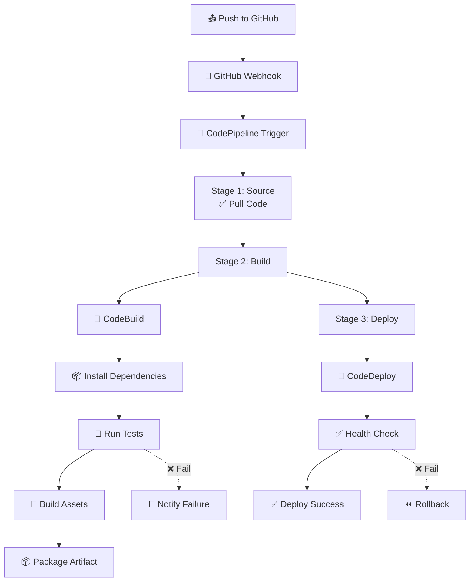

# 🚀 Estratégia Avançada de Migração AWS - Telemedicina Para Todos

## 📋 Sobre Este Documento

Este documento apresenta uma **estratégia avançada e estruturada** para preparar e migrar o projeto Telemedicina Para Todos para a AWS Cloud. Foco em **arquitetura híbrida escalável**, começando como monolito em EC2 e evoluindo para serverless conforme a demanda cresce.

### 📑 Sumário Navegável
- [📋 Sobre Este Documento](#-sobre-este-documento)
- [🎯 Visão Geral da Arquitetura](#-visão-geral-da-arquitetura)
- [🏗️ Arquitetura Híbrida Proposta](#️-arquitetura-híbrida-proposta)
- [📊 Diagramas de Arquitetura](#-diagramas-de-arquitetura)
- [🔧 Preparação Local do Projeto](#-preparação-local-do-projeto)
- [☁️ Infraestrutura AWS](#️-infraestrutura-aws)
- [🔄 Pipeline CI/CD](#-pipeline-cicd)
- [📹 Sistema de Videoconsultas na AWS](#-sistema-de-videoconsultas-na-aws)
- [🔒 Segurança e Compliance](#-segurança-e-compliance)
- [📈 Estratégia de Escalabilidade](#-estratégia-de-escalabilidade)
- [💰 Otimização de Custos](#-otimização-de-custos)
- [🎯 Roadmap de Implementação](#-roadmap-de-implementação)
- [📚 Referências e Recursos](#-referências-e-recursos)

---

## 🎯 Visão Geral da Arquitetura

### **Filosofia: Evolução Gradual**
A estratégia adotada é uma **arquitetura híbrida** que começa simples (monolito em EC2) e escala para serverless conforme a demanda cresce. Isso permite:

- **Baixo risco** na migração inicial
- **Custos controlados** no início
- **Escalabilidade automática** quando necessário
- **Flexibilidade** para adotar novas tecnologias

### **Estágios de Evolução**

#### **Fase 1: Monolito em EC2 (Inicial)**
Código atual migrado "lift-and-shift" para EC2, mantendo a mesma arquitetura local mas na nuvem.

#### **Fase 2: Serviços Gerenciados (Intermediário)**
Separação de responsabilidades usando RDS, ElastiCache, S3 e CloudFront.

#### **Fase 3: Serverless Parcial (Avançado)**
Migração de funcionalidades específicas para Lambda, mantendo núcleo em EC2.

#### **Fase 4: Full Serverless (Futuro)**
Microserviços completamente serverless com API Gateway e Lambda.

---

## 🏗️ Arquitetura Híbrida Proposta

### **Fluxo de Requisições**

```
Usuário (Browser/Mobile)
    ↓
CloudFront (CDN + SSL)
    ↓
Application Load Balancer (HTTPS/WebSocket)
    ↓
EC2 Auto Scaling Group (Laravel App + Reverb)
    ↓
    ├── RDS PostgreSQL (Multi-AZ)
    ├── ElastiCache Redis (Cluster Mode)
    └── S3 (Arquivos, Logs, Backups)
```

### **Componentes Específicos**

#### **1. Frontend (CloudFront + S3)**
- **CloudFront**: Distribuição global de assets estáticos
- **S3**: Armazenamento de assets compilados (JS, CSS, imagens)
- **SSL/TLS**: Certificado via ACM (AWS Certificate Manager)
- **Compressão**: Gzip/Brotli automático

#### **2. Load Balancer**
- **Application Load Balancer (ALB)**: Roteamento HTTP/HTTPS
- **Sticky Sessions**: Necessário para Laravel Reverb (WebSocket)
- **Health Checks**: Monitoramento de instâncias EC2
- **SSL Termination**: Reduz carga no backend

#### **3. Application Layer**
- **EC2 Auto Scaling**: Múltiplas instâncias baseadas em demanda
- **Laravel 12**: Framework PHP principal
- **Laravel Reverb**: Servidor WebSocket integrado
- **Inertia.js**: Renderização SPA sem APIs REST separadas

#### **4. Data Layer**
- **RDS PostgreSQL**: Banco de dados principal (Multi-AZ para HA)
- **ElastiCache Redis**: Cache e sessões (Cluster mode para escalabilidade)
- **S3**: Storage de arquivos, logs, backups

#### **5. WebSocket Communication**
- **Laravel Reverb**: Servidor WebSocket nativo
- **Horizontal Scaling**: Via Redis Pub/Sub
- **Connection Pooling**: Gerenciado pelo ALB
- **Health Monitoring**: Via CloudWatch

#### **6. Video Conferencing (WebRTC)**
- **Peer-to-Peer**: Conexão direta entre usuários
- **Laravel Reverb**: Canal de sinalização WebSocket
- **STUN/TURN**: Servidor para NAT traversal (AWS EC2 ou serviço externo)
- **PeerJS**: Biblioteca frontend simplificando WebRTC

---

## 📊 Diagramas de Arquitetura

### **Diagrama 1: Arquitetura Geral AWS**

```mermaid
graph TB
    User[👤 Usuário] --> CloudFront[☁️ CloudFront<br/>CDN + SSL]
    
    CloudFront --> ALB[⚖️ Application Load Balancer<br/>HTTPS + WebSocket]
    
    ALB --> EC2-1[🖥️ EC2 Instance 1<br/>Laravel + Reverb]
    ALB --> EC2-2[🖥️ EC2 Instance 2<br/>Laravel + Reverb]
    ALB --> EC2-N[🖥️ EC2 Instance N<br/>Auto Scaling]
    
    EC2-1 --> RDS[(🗄️ RDS PostgreSQL<br/>Multi-AZ)]
    EC2-2 --> RDS
    EC2-N --> RDS
    
    EC2-1 --> Redis[(⚡ ElastiCache Redis<br/>Cluster Mode)]
    EC2-2 --> Redis
    EC2-N --> Redis
    
    EC2-1 --> S3[📦 S3 Buckets<br/>Assets + Logs + Backups]
    EC2-2 --> S3
    EC2-N --> S3
    
    RDS --> RDS-Backup[💾 RDS Automated Backups]
    S3 --> S3-Log[📋 CloudWatch Logs]
    
    ALB --> CW[📊 CloudWatch<br/>Monitoring + Alerts]
    
    style CloudFront fill:#FF9900
    style ALB fill:#FF9900
    style EC2-1 fill:#232F3E
    style EC2-2 fill:#232F3E
    style EC2-N fill:#232F3E
    style RDS fill:#3F48CC
    style Redis fill:#DC143C
    style S3 fill:#569A31
    style CW fill:#FF4D00
```



### **Diagrama 2: Fluxo de Videoconsulta (WebRTC)**

```mermaid
sequenceDiagram
    participant Patient as 🏥 Paciente
    participant Doctor as 👨‍⚕️ Médico
    participant Laravel as Laravel Backend
    participant Reverb as Reverb WebSocket
    participant PeerJS as PeerJS + WebRTC
    
    Patient->>Laravel: POST /video-call/request/{doctor_id}
    Laravel->>Reverb: Broadcast RequestVideoCall event
    Reverb->>Doctor: WebSocket: Recebe convite
    Doctor->>Doctor: Exibe notificação e aceita
    
    Doctor->>Laravel: POST /video-call/request/status/{patient_id}
    Laravel->>Reverb: Broadcast RequestVideoCallStatus event
    Reverb->>Patient: WebSocket: Médico aceitou
    
    Patient->>PeerJS: Inicia conexão P2P
    PeerJS->>PeerJS: Usa Reverb como canal de sinalização
    PeerJS->>PeerJS: Estabelece conexão STUN/TURN
    
    Doctor->>PeerJS: Inicia conexão P2P
    PeerJS->>PeerJS: Usa Reverb como canal de sinalização
    
    PeerJS<->>PeerJS: Conexão P2P estabelecida<br/>Fluxo de vídeo/áudio direto
    
    Patient->>Laravel: Encerra consulta
    Doctor->>Laravel: Encerra consulta
    Laravel->>Laravel: Salva logs e duração
```

### **Diagrama 3: Pipeline CI/CD**

```mermaid
graph LR
    Dev[💻 Desenvolvedor] --> Git[📦 GitHub Repository]
    
    Git --> CodePipeline[🔄 AWS CodePipeline]
    
    CodePipeline --> CodeBuild[🔨 AWS CodeBuild]
    CodeBuild --> Test[🧪 PHPUnit Tests]
    CodeBuild --> Build[📦 Build Assets]
    CodeBuild --> Env[🔐 Set Environment Variables]
    
    Test -->|Success| Build
    Build -->|Success| Env
    Env --> CodeDeploy[🚀 AWS CodeDeploy]
    
    CodeDeploy --> ALB[⚖️ Application Load Balancer]
    ALB --> BlueGreen[🔄 Blue-Green Deployment]
    
    BlueGreen --> Prod-New[🌟 Nova Versão<br/>EC2 Instances]
    BlueGreen --> Prod-Old[📦 Versão Antiga<br/>EC2 Instances]
    
    Prod-New --> Health[✅ Health Check]
    Health -->|Pass| Prod-Old[🗑️ Terminate Old]
    Health -->|Fail| Prod-New[⏪ Rollback]
    
    style Git fill:#181717
    style CodePipeline fill:#FF9900
    style CodeBuild fill:#FF9900
    style CodeDeploy fill:#FF9900
    style Health fill:#90EE90
```



---

## 🔧 Preparação Local do Projeto

### **1. Organização do Código**

#### **Variáveis de Ambiente**
Todo projeto deve usar variáveis de ambiente para configuração. **NUNCA** hardcode valores sensíveis:

**`.env` para Desenvolvimento Local:**
```env
APP_NAME="Telemedicina Para Todos"
APP_ENV=local
APP_DEBUG=true
APP_URL=http://localhost:8000

# Database
DB_CONNECTION=pgsql
DB_HOST=localhost
DB_PORT=5432
DB_DATABASE=telemedicina
DB_USERNAME=postgres
DB_PASSWORD=secret

# Cache
CACHE_DRIVER=redis
REDIS_HOST=localhost
REDIS_PASSWORD=null
REDIS_PORT=6379

# Queue
QUEUE_CONNECTION=redis

# Broadcasting
BROADCAST_CONNECTION=reverb
REVERB_APP_ID=local-app-id
REVERB_APP_KEY=local-app-key
REVERB_APP_SECRET=local-app-secret
REVERB_HOST=localhost
REVERB_PORT=8080
REVERB_SCHEME=http

# Filesystem
FILESYSTEM_DISK=local
```

**`.env` para Produção AWS:**
```env
APP_NAME="Telemedicina Para Todos"
APP_ENV=production
APP_DEBUG=false
APP_URL=https://telemedicina.example.com

# Database - RDS
DB_CONNECTION=pgsql
DB_HOST=telemedicina-db.xxxxx.us-east-1.rds.amazonaws.com
DB_PORT=5432
DB_DATABASE=telemedicina_prod
DB_USERNAME=${DB_USERNAME}
DB_PASSWORD=${DB_PASSWORD}

# Cache - ElastiCache
CACHE_DRIVER=redis
REDIS_HOST=telemedicina-cache.xxxxx.0001.use1.cache.amazonaws.com
REDIS_PASSWORD=${REDIS_PASSWORD}
REDIS_PORT=6379

# Queue - ElastiCache
QUEUE_CONNECTION=redis

# Broadcasting - Reverb
BROADCAST_CONNECTION=reverb
REVERB_APP_ID=${REVERB_APP_ID}
REVERB_APP_KEY=${REVERB_APP_KEY}
REVERB_APP_SECRET=${REVERB_APP_SECRET}
REVERB_HOST=telemedicina.example.com
REVERB_PORT=443
REVERB_SCHEME=https

# Filesystem - S3
FILESYSTEM_DISK=s3
AWS_ACCESS_KEY_ID=${AWS_ACCESS_KEY_ID}
AWS_SECRET_ACCESS_KEY=${AWS_SECRET_ACCESS_KEY}
AWS_DEFAULT_REGION=us-east-1
AWS_BUCKET=telemedicina-files-prod
AWS_USE_PATH_STYLE_ENDPOINT=false

# CloudFront
CLOUDFRONT_URL=https://xxxxx.cloudfront.net

# Monitoring
LOG_CHANNEL=cloudwatch
```

#### **Evitar Dependências Locais Fixas**
- **NUNCA** use caminhos absolutos como `/var/www/html` ou `C:\Users\...`
- Use funções do Laravel: `storage_path()`, `base_path()`, `public_path()`
- Use helper `asset()` para URLs de assets
- Configure `APP_URL` corretamente em cada ambiente

### **2. Simulação de Ambiente Produtivo Localmente**

#### **Opção 1: Docker Compose (Recomendado)**
Crie um arquivo `docker-compose.yml` para rodar PostgreSQL, Redis e aplicação juntos:

```yaml
version: '3.8'

services:
  app:
    image: php:8.2-fpm-alpine
    volumes:
      - .:/var/www/html
    working_dir: /var/www/html
    depends_on:
      - postgres
      - redis
    environment:
      - APP_ENV=local
      - DB_HOST=postgres
      - REDIS_HOST=redis

  postgres:
    image: postgres:16-alpine
    environment:
      POSTGRES_DB: telemedicina
      POSTGRES_USER: postgres
      POSTGRES_PASSWORD: secret
    ports:
      - "5432:5432"
    volumes:
      - postgres_data:/var/lib/postgresql/data

  redis:
    image: redis:7-alpine
    ports:
      - "6379:6379"
    volumes:
      - redis_data:/data

volumes:
  postgres_data:
  redis_data:
```

#### **Opção 2: Laravel Sail**
Já incluído no projeto, execute:
```bash
./vendor/bin/sail up -d
./vendor/bin/sail composer install
./vendor/bin/sail npm install
./vendor/bin/sail artisan migrate
```

### **3. Pipeline de Build Local (Pré-CI/CD)**

#### **Script de Build Automatizado**
Crie scripts para automatizar o build e deploy:

**`scripts/build.sh` (Linux/Mac):**
```bash
#!/bin/bash
set -e

echo "🔨 Building Telemedicina Para Todos..."

# Install Composer dependencies
echo "📦 Installing Composer dependencies..."
composer install --no-dev --optimize-autoloader

# Install NPM dependencies
echo "📦 Installing NPM dependencies..."
npm ci

# Build frontend assets
echo "🎨 Building frontend assets..."
npm run build

# Run tests
echo "🧪 Running tests..."
php artisan test

# Optimize Laravel
echo "⚡ Optimizing Laravel..."
php artisan config:cache
php artisan route:cache
php artisan view:cache
php artisan event:cache

# Clear caches
echo "🧹 Clearing caches..."
php artisan cache:clear
php artisan config:clear

echo "✅ Build completed successfully!"
```

**`scripts/build.bat` (Windows):**
```batch
@echo off
echo 🔨 Building Telemedicina Para Todos...

echo 📦 Installing Composer dependencies...
composer install --no-dev --optimize-autoloader

echo 📦 Installing NPM dependencies...
call npm ci

echo 🎨 Building frontend assets...
call npm run build

echo 🧪 Running tests...
php artisan test

echo ⚡ Optimizing Laravel...
php artisan config:cache
php artisan route:cache
php artisan view:cache
php artisan event:cache

echo ✅ Build completed successfully!
```

### **4. Testes e Qualidade de Código**

#### **PHPUnit Tests**
Execute regularmente:
```bash
php artisan test
# ou para cobertura de código
php artisan test --coverage
```

#### **Linting e Formatação**
```bash
# PHP
./vendor/bin/pint

# JavaScript/TypeScript
npm run lint
npm run format:check
```

---

## ☁️ Infraestrutura AWS

### **1. Configuração de Serviços Principais**

#### **VPC e Networking**
- **VPC**: Rede privada isolada
- **Subnets Públicas**: Para Load Balancer e NAT Gateway
- **Subnets Privadas**: Para EC2, RDS, ElastiCache
- **Internet Gateway**: Acesso à internet para subnets públicas
- **NAT Gateway**: Acesso à internet para recursos privados
- **Security Groups**: Firewall por instância
- **Route Tables**: Roteamento de tráfego

#### **EC2 (Elastic Compute Cloud)**
- **Instance Type**: `t3.medium` ou `t3.large` (início)
- **AMI**: Amazon Linux 2023 ou Ubuntu 22.04
- **Storage**: 30GB SSD gp3 (raiz) + 100GB para dados
- **Security Group**: Portas 80, 443, 8080 (Reverb)
- **Key Pair**: SSH para administração

**Softwares Instalados:**
- PHP 8.2+ com FPM
- Nginx como reverse proxy
- Composer para dependências PHP
- Node.js 20+ para builds frontend
- Supervisor para manter processos ativos
- CloudWatch Agent para métricas

#### **RDS PostgreSQL**
- **Instance Class**: `db.t3.medium` (Multi-AZ para HA)
- **Engine Version**: PostgreSQL 16
- **Storage**: 100GB gp3 (Auto-scaling habilitado)
- **Backup Retention**: 7 dias
- **Performance Insights**: Habilitado
- **Parameter Group**: Otimizado para Laravel

#### **ElastiCache Redis**
- **Node Type**: `cache.t3.medium`
- **Cluster Mode**: Habilitado (para escalabilidade horizontal)
- **Num. Shards**: 2 shards (início)
- **Num. Replicas**: 1 por shard
- **Auth Token**: Habilitado para segurança

#### **S3 Buckets**
- **`telemedicina-assets-prod`**: Assets estáticos (CSS, JS, imagens)
- **`telemedicina-uploads-prod`**: Uploads de usuários (documentos, fotos)
- **`telemedicina-logs-prod`**: Logs da aplicação
- **`telemedicina-backups-prod`**: Backups do RDS

**Configurações de Bucket:**
- **Versioning**: Habilitado
- **Encryption**: Server-side encryption (SSE-S3)
- **Lifecycle Rules**: Expiração de logs após 90 dias
- **CORS**: Configurado para CloudFront
- **Access Control**: IAM roles

#### **CloudFront Distribution**
- **Origin Domain**: S3 bucket `telemedicina-assets-prod`
- **SSL Certificate**: Via ACM (AWS Certificate Manager)
- **Caching**: Otimizado para assets estáticos
- **Compression**: Gzip e Brotli habilitados
- **Custom Headers**: Security headers (CSP, HSTS)

#### **Application Load Balancer**
- **Scheme**: Internet-facing
- **Type**: Application Load Balancer (Layer 7)
- **Availability Zones**: Múltiplas AZs para HA
- **Target Groups**: EC2 instances
- **Health Checks**: HTTP 200 em `/health`
- **Sticky Sessions**: Cookie-based (necessário para Reverb)
- **SSL Certificates**: Via ACM

### **2. IAM (Identity and Access Management)**

#### **Policies Principais**
- **EC2 Instance Role**: Permissões para acessar S3, CloudWatch
- **CodeDeploy Role**: Permissões para deploy em EC2
- **Lambda Execution Role**: Para funções serverless futuras

#### **Princípio do Menor Privilégio**
Cada role tem **apenas** as permissões necessárias para sua função.

---

## 🔄 Pipeline CI/CD

### **1. Estrutura do Pipeline**



### **2. GitHub Actions (Alternativa)**

**`.github/workflows/deploy.yml`:**
```yaml
name: Deploy to AWS

on:
  push:
    branches: [main]

jobs:
  test:
    runs-on: ubuntu-latest
    steps:
      - uses: actions/checkout@v3
      - name: Setup PHP
        uses: shivammathur/setup-php@v2
        with:
          php-version: '8.2'
      - name: Run Tests
        run: |
          composer install
          php artisan test
  deploy:
    needs: test
    runs-on: ubuntu-latest
    steps:
      - uses: actions/checkout@v3
      - name: Configure AWS Credentials
        uses: aws-actions/configure-aws-credentials@v2
        with:
          aws-access-key-id: ${{ secrets.AWS_ACCESS_KEY_ID }}
          aws-secret-access-key: ${{ secrets.AWS_SECRET_ACCESS_KEY }}
          aws-region: us-east-1
      - name: Deploy to CodeDeploy
        run: |
          aws deploy create-deployment \
            --application-name telemedicina \
            --deployment-group-name production \
            --s3-location bucket=telemedicina-deployments,key=latest.zip
```

### **3. CodeBuild Specification**

**`buildspec.yml`:**
```yaml
version: 0.2

phases:
  pre_build:
    commands:
      - echo Logging in to Amazon ECR...
      - echo Build started on `date`
  build:
    commands:
      - echo Build started on `date`
      - composer install --no-dev --optimize-autoloader
      - npm ci
      - npm run build
      - php artisan test
  post_build:
    commands:
      - echo Build completed on `date`
      - echo Creating deployment package...
      - zip -r deploy.zip . -x "node_modules/*" ".git/*"
artifacts:
  files:
    - deploy.zip
```

### **4. CodeDeploy AppSpec**

**`appspec.yml`:**
```yaml
version: 0.0
os: linux

files:
  - source: /
    destination: /var/www/html

permissions:
  - object: /var/www/html
    owner: nginx
    group: nginx
    mode: 755

hooks:
  ApplicationStop:
    - location: scripts/stop.sh
      timeout: 300
  BeforeInstall:
    - location: scripts/before_install.sh
      timeout: 300
  AfterInstall:
    - location: scripts/after_install.sh
      timeout: 600
  ApplicationStart:
    - location: scripts/start.sh
      timeout: 300
  ValidateService:
    - location: scripts/validate.sh
      timeout: 300
```

---

## 📹 Sistema de Videoconsultas na AWS

### **1. Arquitetura WebRTC**

O sistema de videoconsulta usa **WebRTC (Web Real-Time Communication)** para conexões P2P entre médico e paciente, com **Laravel Reverb** como servidor de sinalização.

**Componentes:**
- **PeerJS**: Biblioteca frontend simplificando WebRTC
- **Laravel Reverb**: Canal de sinalização WebSocket
- **STUN/TURN**: Servidores para NAT traversal (necessários para conexões P2P)

### **2. Fluxo de Videoconsulta**

#### **Passo 1: Requisição de Chamada**
Paciente solicita videoconsulta via interface → Laravel recebe POST request → Evento `RequestVideoCall` é broadcastado via Reverb → Médico recebe notificação em tempo real.

#### **Passo 2: Aceite da Chamada**
Médico aceita → Evento `RequestVideoCallStatus` é broadcastado → Paciente recebe confirmação.

#### **Passo 3: Estabelecimento P2P**
Ambos os usuários carregam a página de vídeo → PeerJS gera IDs únicos → Conexão P2P é estabelecida usando Reverb como canal de sinalização → Fluxo de vídeo/áudio inicia.

#### **Passo 4: Encerramento**
Qualquer usuário encerra → Evento de encerramento → Conexão P2P é fechada → Logs são salvos no banco.

### **3. Configuração STUN/TURN**

**STUN (Session Traversal Utilities for NAT):**
- Permite descobrir endereço IP público
- Gratuito e disponível via serviços públicos

**TURN (Traversal Using Relays around NAT):**
- Servidor de relay para conexões que STUN não consegue estabelecer
- Requer infraestrutura própria ou serviço pago

**Opções AWS:**
- **EC2 Instance**: Configurar TURN server (ex: Coturn) em instância EC2
- **Third-party**: Serviços como Twilio, Vonage, Agora.io

### **4. Escalabilidade de WebSockets**

**Laravel Reverb Scaling:**
- **Redis Pub/Sub**: Permite múltiplas instâncias EC2 compartilharem conexões WebSocket
- **Horizontal Scaling**: Novas instâncias EC2 podem ser adicionadas automaticamente
- **Connection Pooling**: ALB gerencia distribuição de conexões

**Configuração:**
```env
REVERB_SCALING_ENABLED=true
REVERB_SCALING_CHANNEL=reverb
REDIS_URL=redis://telemedicina-cache.xxxxx.cache.amazonaws.com:6379
```

---

## 🔒 Segurança e Compliance

### **1. Segurança em Camadas**

#### **Camada 1: Rede**
- **VPC**: Isolamento de rede lógica
- **Security Groups**: Firewall por instância
- **NACL**: Firewall adicional por subnet
- **Private Subnets**: RDS e ElastiCache não acessíveis diretamente da internet

#### **Camada 2: Aplicação**
- **HTTPS**: SSL/TLS obrigatório (forçado via CloudFront e ALB)
- **HSTS**: HTTP Strict Transport Security habilitado
- **CORS**: Configurado para domínios específicos
- **Rate Limiting**: Proteção contra brute force

#### **Camada 3: Dados**
- **Encryption at Rest**: RDS, S3 e ElastiCache criptografados
- **Encryption in Transit**: TLS para todas as conexões
- **Secrets Management**: AWS Secrets Manager para credenciais

#### **Camada 4: Autenticação**
- **Laravel Authentication**: Sistema de autenticação robusto
- **Password Hashing**: Bcrypt com alto custo
- **2FA**: Opcional via SMS ou TOTP
- **Session Management**: Tokens JWT ou sessions seguras

### **2. Compliance com LGPD**

#### **Princípios de Proteção de Dados**

**1. Finalidade:**
- Coleta de dados apenas para finalidades específicas e legítimas (telemedicina)
- Consentimento explícito do usuário

**2. Adequação:**
- Dados coletados são compatíveis com a finalidade
- Não coleta dados desnecessários

**3. Necessidade:**
- Coleta apenas dados mínimos necessários
- Evitar coleta de dados sensíveis não essenciais

**4. Transparência:**
- Informações claras sobre coleta e uso de dados
- Política de privacidade acessível

**5. Segurança:**
- Medidas técnicas e organizacionais adequadas
- Criptografia, backups, controle de acesso

**6. Prevenção:**
- Medidas para prevenir danos
- Monitoramento contínuo de vulnerabilidades

**7. Não Discriminação:**
- Tratamento isonômico dos dados pessoais

**8. Responsabilização:**
- Demonstrar conformidade com LGPD
- Auditorias regulares

#### **Implementações Práticas**

**Logs e Rastreabilidade:**
- **CloudWatch Logs**: Registro de todas as ações médicas
- **Laravel Audit Log**: Tabela `appointment_logs` registra mudanças em agendamentos
- **Retenção**: Logs mantidos por período legal (mínimo 5 anos para dados médicos)

**Anonimização de Dados:**
- Dados antigos (> 7 anos) podem ser anonimizados
- Processo automatizado via Lambda ou cron jobs

**Controle de Acesso:**
- **IAM Roles**: Permissões baseadas em princípio do menor privilégio
- **Laravel Policies**: Autorização granular por recurso
- **Auditoria de Acesso**: Logs de quem acessou quais dados

**Backup e Recuperação:**
- **RDS Automated Backups**: Backups diários com retenção de 7 dias
- **S3 Versioning**: Histórico completo de alterações em arquivos
- **Disaster Recovery**: Teste de recuperação trimestral

**Notificação de Incidentes:**
- Processo automatizado de notificação em caso de vazamento de dados
- Comunicação com ANPD (Autoridade Nacional de Proteção de Dados) em até 72 horas

### **3. Monitoramento e Alertas**

#### **CloudWatch**
- **Métricas**: CPU, memória, disco, rede, requisições HTTP
- **Logs**: Aplicação, Nginx, PHP-FPM, Reverb
- **Alarms**: Alertas quando métricas ultrapassam thresholds

#### **AWS X-Ray**
- Rastreamento distribuído de requisições
- Identificação de gargalos
- Análise de latência

#### **Health Checks**
- **ALB Health Checks**: Monitoramento de instâncias EC2
- **Route 53 Health Checks**: Monitoramento de endpoints
- **Self-Healing**: Auto-replacement de instâncias com falha

### **4. Auditoria e Compliance**

#### **AWS Config**
- Inventário contínuo de recursos
- Avaliação de conformidade
- Histórico de mudanças

#### **AWS CloudTrail**
- Registro de todas as chamadas de API
- Auditoria de ações administrativas
- Detecção de atividades suspeitas

#### **Penetration Testing**
- Testes de segurança regulares (trimestral)
- Bug bounty program (opcional)
- Relatórios de vulnerabilidades

---

## 📈 Estratégia de Escalabilidade

### **1. Escalabilidade Vertical vs Horizontal**

#### **Escalabilidade Vertical (Scale Up)**
- Aumentar tamanho da instância (ex: t3.medium → t3.large)
- **Prós**: Simples, rápido
- **Contras**: Limitado pelo maior tamanho disponível

#### **Escalabilidade Horizontal (Scale Out)**
- Adicionar mais instâncias EC2
- **Prós**: Ilimitado, mais resiliente
- **Contras**: Requer balanceamento de carga, estado compartilhado

**Recomendação**: Começar com **Auto Scaling** para crescer horizontalmente automaticamente.

### **2. Auto Scaling Configuration**

**Auto Scaling Group:**
- **Min Size**: 2 instâncias (para HA)
- **Desired Size**: 3 instâncias (normal)
- **Max Size**: 10 instâncias (pico de tráfego)

**Scaling Policies:**
- **CPU Usage > 70%**: Adicionar instância
- **CPU Usage < 30%**: Remover instância
- **Request Count > 1000/min**: Adicionar instância

**Lifecycle Hooks:**
- **Before Scale Out**: Health check antes de adicionar instância
- **After Scale In**: Cleanup antes de remover instância

### **3. Database Scaling**

#### **Read Replicas**
- **Primary**: RDS Primary (writes)
- **Replicas**: 2-3 Read Replicas (reads)
- **Benefício**: 3-4x mais capacidade de leitura

#### **Connection Pooling**
- **PgBouncer**: Connection pooling para PostgreSQL
- Reduz overhead de conexões
- Recomendado para alta concorrência

#### **Query Optimization**
- Índices otimizados para queries frequentes
- Query analysis com EXPLAIN
- Pagination para grandes result sets

### **4. Caching Strategy**

#### **Application Cache**
- **ElastiCache Redis**: Cache de queries frequentes
- **TTL**: 5-60 minutos dependendo do dado
- **Cache Tags**: Invalidação seletiva

#### **CDN Cache**
- **CloudFront**: Cache de assets estáticos
- **TTL**: 1 ano para assets versionados
- **Cache Invalidation**: On-demand quando necessário


---

## 🎯 Roadmap de Implementação

### **Fase 1: Preparação Local (2-4 semanas)**
- [ ] Configurar Docker Compose com PostgreSQL e Redis
- [ ] Migrar de SQLite para PostgreSQL
- [ ] Configurar variáveis de ambiente
- [ ] Criar scripts de build
- [ ] Testes de integração locais

### **Fase 2: Infraestrutura Básica AWS (2-3 semanas)**
- [ ] Criar conta AWS
- [ ] Configurar VPC, Subnets, Security Groups
- [ ] Criar instância EC2 e instalar Laravel
- [ ] Configurar RDS PostgreSQL
- [ ] Configurar ElastiCache Redis
- [ ] Deploy manual inicial

### **Fase 3: Serviços Adicionais (2-3 semanas)**
- [ ] Configurar S3 buckets
- [ ] Configurar CloudFront
- [ ] Configurar Application Load Balancer
- [ ] Configurar SSL/TLS via ACM
- [ ] Configurar Route 53 (DNS)

### **Fase 4: Escalabilidade (3-4 semanas)**
- [ ] Configurar Auto Scaling Group
- [ ] Configurar ElastiCache cluster mode
- [ ] Implementar connection pooling
- [ ] Otimizar queries de banco
- [ ] Configurar Read Replicas (se necessário)

### **Fase 5: CI/CD (2-3 semanas)**
- [ ] Configurar AWS CodePipeline
- [ ] Configurar AWS CodeBuild
- [ ] Configurar AWS CodeDeploy
- [ ] Implementar blue-green deployment
- [ ] Configurar health checks

### **Fase 6: Monitoramento e Segurança (2-3 semanas)**
- [ ] Configurar CloudWatch
- [ ] Implementar alertas e notificações
- [ ] Configurar AWS WAF
- [ ] Implementar backup automatizado
- [ ] Configurar disaster recovery

### **Fase 7: Otimização (Ongoing)**
- [ ] Análise de custos
- [ ] Otimização de queries
- [ ] Tuning de instâncias
- [ ] Implementação de caching agressivo
- [ ] Contínua melhoria

---

## 📚 Referências e Recursos

### **Documentação AWS**
- [AWS Well-Architected Framework](https://aws.amazon.com/architecture/well-architected/)
- [AWS Documentation](https://docs.aws.amazon.com/)
- [AWS Free Tier](https://aws.amazon.com/free/)
- [AWS CloudFormation](https://aws.amazon.com/cloudformation/)

### **Documentação Laravel**
- [Laravel Documentation](https://laravel.com/docs)
- [Laravel Reverb](https://reverb.laravel.com/)
- [Inertia.js](https://inertiajs.com/)

### **WebRTC e Videoconsultas**
- [WebRTC Documentation](https://webrtc.org/)
- [PeerJS Documentation](https://peerjs.com/)
- [STUN/TURN Servers](https://www.metered.ca/tools/openrelay/)

### **Security e Compliance**
- [LGPD - Lei Geral de Proteção de Dados](https://www.gov.br/cidadania/pt-br/acesso-a-informacao/lgpd)
- [OWASP Top 10](https://owasp.org/www-project-top-ten/)
- [AWS Security Best Practices](https://aws.amazon.com/security/security-resources/)

### **Training e Certificações**
- [AWS Training](https://aws.amazon.com/training/)
- [AWS Certified Solutions Architect](https://aws.amazon.com/certification/certified-solutions-architect-associate/)
- [Laravel Bootcamp](https://bootcamp.laravel.com/)

### **Comunidade**
- [AWS User Groups](https://aws.amazon.com/developer/community/usergroups/)
- [Laravel Community](https://laravel.com/community)
- [Stack Overflow - AWS](https://stackoverflow.com/questions/tagged/amazon-web-services)

---

## 🎓 Conclusão

Esta documentação fornece uma **estratégia completa e estruturada** para migrar o projeto Telemedicina Para Todos para a AWS Cloud. A abordagem de **evolução gradual** permite:

1. **Baixo risco**: Começar simples e escalar conforme necessário
2. **Custos controlados**: Pagar apenas pelo que usar
3. **Alta disponibilidade**: Arquitetura resiliente desde o início
4. **Segurança**: Múltiplas camadas de proteção
5. **Compliance**: Conformidade com LGPD e regulamentações médicas

**Próximos passos:**
1. Revisar este documento com a equipe
2. Ajustar estratégia conforme necessidade específica do projeto
3. Iniciar Fase 1: Preparação Local
4. Seguir roadmap sequencialmente
5. Iterar e melhorar continuamente

**Lembre-se**: A jornada para a nuvem não é uma corrida, mas uma **maratona**. Paciência, planejamento e execução disciplinada são chaves para o sucesso! 🚀

---

*Última atualização: Dezembro 2024*
*Versão da documentação: 2.0*
*Autor: Estratégia Avançada de Migração AWS*
