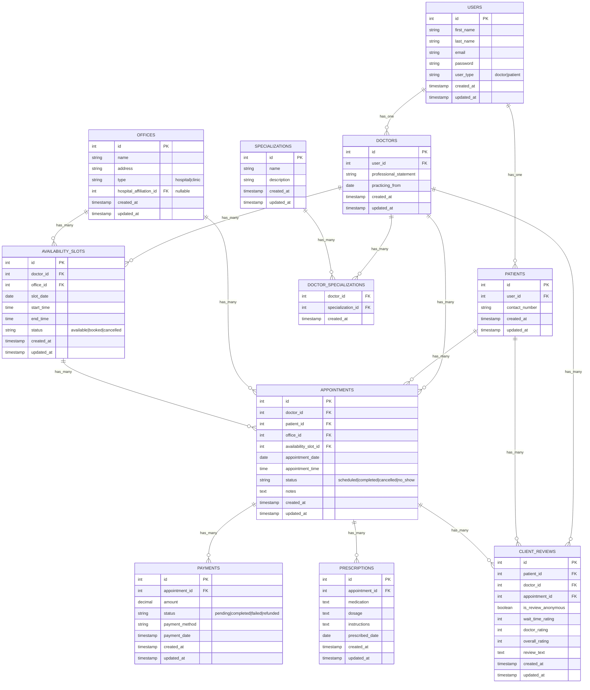

# Diagrama do Banco de Dados - Telemedicina Para Todos

## Diagrama Entidade-Relacionamento (ERD)

## Estrutura das Tabelas

### Tabelas Principais

1. **USERS** - Usuários base do sistema (médicos e pacientes)
2. **DOCTORS** - Informações específicas dos médicos
3. **PATIENTS** - Informações específicas dos pacientes
4. **SPECIALIZATIONS** - Especializações médicas
5. **OFFICES** - Locais de atendimento (hospitais/clínicas)
6. **AVAILABILITY_SLOTS** - Horários disponíveis dos médicos
7. **APPOINTMENTS** - Agendamentos de consultas
8. **PAYMENTS** - Pagamentos das consultas
9. **PRESCRIPTIONS** - Prescrições médicas
10. **CLIENT_REVIEWS** - Avaliações dos pacientes

### Relacionamentos

- **1:1** entre USERS e DOCTORS/PATIENTS
- **1:N** entre DOCTORS e APPOINTMENTS/AVAILABILITY_SLOTS
- **1:N** entre PATIENTS e APPOINTMENTS
- **1:N** entre APPOINTMENTS e PAYMENTS/PRESCRIPTIONS
- **N:N** entre DOCTORS e SPECIALIZATIONS (via tabela pivot)
- **1:N** entre OFFICES e AVAILABILITY_SLOTS/APPOINTMENTS

### Observações

- O sistema usa uma tabela USERS central para autenticação
- DOCTORS e PATIENTS herdam de USERS (polimorfismo)
- AVAILABILITY_SLOTS controla a disponibilidade dos médicos
- APPOINTMENTS é a entidade central que conecta médicos, pacientes e pagamentos
- CLIENT_REVIEWS é opcional e permite avaliações anônimas
