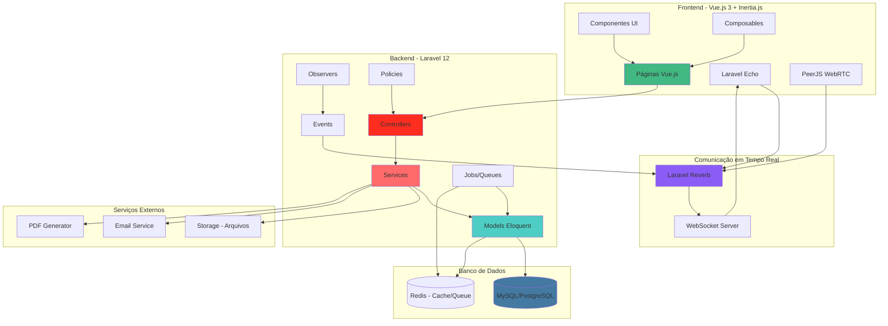

# Diagrama de Arquitetura Geral - Telemedicina Para Todos

## Visão Geral da Arquitetura

Este diagrama apresenta a arquitetura completa do sistema, mostrando as camadas, tecnologias e fluxo de dados.

## Camadas da Arquitetura

### 1. Camada de Apresentação (Frontend)
- **Vue.js 3** com Composition API
- **Inertia.js** para integração SPA
- **Tailwind CSS 4** para estilização
- **Reka UI** como biblioteca de componentes
- **Laravel Echo** para eventos em tempo real
- **PeerJS** para videoconferência WebRTC

### 2. Camada de Aplicação (Backend)
- **Controllers**: Recebem requisições HTTP e retornam respostas Inertia
- **Services**: Contêm a lógica de negócio principal
- **Models**: Entidades de domínio com Eloquent ORM
- **Policies**: Autorização e permissões

### 3. Camada de Infraestrutura
- **Laravel Reverb**: Servidor WebSocket para comunicação em tempo real
- **Queue System**: Processamento assíncrono de jobs
- **Cache**: Redis para cache e sessões
- **Storage**: Sistema de arquivos para documentos médicos

### 4. Camada de Dados
- **MySQL/PostgreSQL**: Banco de dados relacional principal
- **Redis**: Cache e filas de processamento

## Fluxo de Dados

1. **Requisição HTTP**: Cliente faz requisição → Controller
2. **Validação**: Controller valida via Form Requests
3. **Lógica de Negócio**: Controller chama Service
4. **Persistência**: Service utiliza Models para acessar banco
5. **Resposta**: Controller retorna dados via Inertia.js
6. **Renderização**: Vue.js renderiza a página no cliente

## Comunicação em Tempo Real

1. **Evento**: Service dispara Event
2. **Broadcasting**: Event é transmitido via Laravel Reverb
3. **WebSocket**: Cliente recebe via Laravel Echo
4. **Atualização**: Interface é atualizada automaticamente

---

*Última atualização: Janeiro 2025*

