# Diagrama de Fluxo de Consulta - Telemedicina Para Todos

## Fluxo Completo: Do Agendamento à Finalização

Este diagrama mostra o fluxo completo de uma consulta, desde o agendamento pelo paciente até a finalização pelo médico.

```mermaid
flowchart LR
    Start([Paciente busca médico]) --> Search[Buscar médicos disponíveis]
    Search --> Select[Selecionar médico e horário]
    Select --> Check{Contato de emergência<br/>completo?}
    Check -->|Não| Complete[Completar cadastro]
    Complete --> Check
    Check -->|Sim| Create[Agendar consulta]
    Create --> Status1[Status: SCHEDULED]
    Status1 --> Notify1[Notificação enviada]
    
    Notify1 --> Wait[Esperar horário da consulta]
    Wait --> TimeCheck{10 min antes<br/>do horário?}
    TimeCheck -->|Não| Wait
    TimeCheck -->|Sim| DoctorStart[Doctor pode iniciar]
    
    DoctorStart --> StartConsult[Doctor inicia consulta]
    StartConsult --> Status2[Status: IN_PROGRESS]
    Status2 --> CreateRoom[Criar sala de videoconferência]
    CreateRoom --> Notify2[Notificar paciente]
    Notify2 --> VideoCall[Videoconferência ativa]
    
    VideoCall --> Record[Registrar prontuário]
    Record --> Diagnose[Diagnóstico CID-10]
    Record --> Prescription[Prescrições]
    Record --> Exams[Exames solicitados]
    Record --> Vitals[Sinais vitais]
    Record --> Notes[Anotações clínicas]
    Record --> Certificates[Atestados]
    
    Diagnose --> SaveDraft{Salvar rascunho?}
    Prescription --> SaveDraft
    Exams --> SaveDraft
    Vitals --> SaveDraft
    Notes --> SaveDraft
    Certificates --> SaveDraft
    
    SaveDraft -->|Sim| Draft[Dados salvos como rascunho]
    Draft --> Continue[Continuar consulta]
    Continue --> Record
    
    SaveDraft -->|Não| Finalize{Finalizar consulta?}
    Finalize -->|Não| Record
    
    Finalize -->|Sim| FinalizeConsult[Finalizar consulta]
    FinalizeConsult --> Status3[Status: COMPLETED]
    Status3 --> Lock[Bloquear edição de dados críticos]
    Lock --> GeneratePDF[Gerar PDF da consulta]
    GeneratePDF --> ExpireRoom[Expirar sala de videoconferência]
    ExpireRoom --> Notify3[Notificar paciente]
    Notify3 --> Audit[Registrar em auditoria]
    Audit --> End([Consulta finalizada])
    
    style Status1 fill:#e3f2fd
    style Status2 fill:#fff3e0
    style Status3 fill:#e8f5e9
    style CreateRoom fill:#f3e5f5
    style VideoCall fill:#f3e5f5
    style Lock fill:#ffebee
```

## Estados da Consulta

### Estados Principais
1. **SCHEDULED** - Consulta agendada
2. **IN_PROGRESS** - Consulta em andamento
3. **COMPLETED** - Consulta finalizada
4. **CANCELLED** - Consulta cancelada
5. **NO_SHOW** - Paciente não compareceu
6. **RESCHEDULED** - Consulta reagendada

## Pontos de Decisão

### 1. Validação de Cadastro
- Paciente deve ter contato de emergência completo
- Sem isso, não pode agendar consultas

### 2. Início da Consulta
- Médico pode iniciar 10 minutos antes do horário agendado
- Sistema cria sala de videoconferência automaticamente
- Paciente recebe notificação para entrar

### 3. Durante a Consulta
- Médico pode salvar rascunho a qualquer momento
- Dados podem ser editados livremente
- Múltiplos registros podem ser feitos

### 4. Finalização
- Após finalizar, dados críticos são bloqueados
- Apenas complementos podem ser adicionados
- PDF é gerado automaticamente
- Sala de videoconferência expira

## Componentes do Prontuário

Durante a consulta, o médico pode registrar:
- **Diagnóstico**: Com código CID-10
- **Prescrições**: Medicamentos e instruções
- **Exames**: Solicitações de exames
- **Sinais Vitais**: Pressão, temperatura, etc.
- **Anotações Clínicas**: Notas públicas ou privadas
- **Atestados**: Atestados médicos digitais
- **Documentos**: Anexos ao prontuário

## Auditoria

Todas as ações são registradas em:
- **AppointmentLogs**: Logs de eventos da consulta
- **MedicalRecordAuditLogs**: Auditoria de prontuário (LGPD)

---

*Última atualização: Janeiro 2025*

