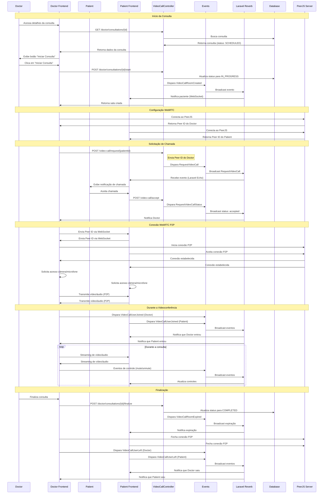

# Diagrama de Fluxo de Videoconferência - Telemedicina Para Todos

## Fluxo de Videoconferência WebRTC

Este diagrama mostra como funciona a videoconferência em tempo real usando WebRTC e Laravel Reverb.

## Componentes da Videoconferência

### Frontend
- **PeerJS**: Biblioteca WebRTC para conexão P2P
- **Laravel Echo**: Cliente para receber eventos WebSocket
- **Vue.js Components**: Interface de vídeo

### Backend
- **VideoCallController**: Gerencia requisições de chamada
- **Events**: Eventos de videoconferência
  - `RequestVideoCall`: Solicitação de chamada
  - `RequestVideoCallStatus`: Status da chamada
  - `VideoCallRoomCreated`: Sala criada
  - `VideoCallRoomExpired`: Sala expirada
  - `VideoCallUserJoined`: Usuário entrou
  - `VideoCallUserLeft`: Usuário saiu

### Infraestrutura
- **Laravel Reverb**: Servidor WebSocket
- **PeerJS Server**: Servidor de sinalização WebRTC

## Fluxo de Conexão WebRTC

1. **Sinalização**: Via Laravel Reverb (WebSocket)
2. **Conexão P2P**: Estabelecida via PeerJS
3. **Streaming**: Vídeo/áudio transmitido diretamente entre clientes
4. **Controles**: Mute/unmute sincronizados via eventos

## Segurança

- **Autorização**: Apenas participantes da consulta podem se conectar
- **Validação**: Verificação de permissões antes de criar sala
- **Expiração**: Salas expiram automaticamente após finalização
- **Auditoria**: Eventos registrados para compliance

---

*Última atualização: Janeiro 2025*

