# Diagrama de Arquitetura em Camadas - Telemedicina Para Todos

## Visão Detalhada das Camadas do Sistema

Este diagrama mostra a arquitetura em camadas com responsabilidades e tecnologias de cada camada.

```mermaid
graph TB
    subgraph "Camada de Apresentação"
        A1[Vue.js Pages]
        A2[Vue Components]
        A3[Composables]
        A4[Inertia.js Client]
        A5[Laravel Echo]
        A6[PeerJS WebRTC]
    end

    subgraph "Camada de Aplicação - Controllers"
        B1[Auth Controllers]
        B2[Doctor Controllers]
        B3[Patient Controllers]
        B4[Settings Controllers]
        B5[VideoCall Controller]
        B6[Shared Controllers]
    end

    subgraph "Camada de Aplicação - Services"
        C1[AppointmentService]
        C2[AvailabilityService]
        C3[MedicalRecordService]
        C4[TimelineEventService]
        C5[AvatarService]
        C6[ScheduleService]
    end

    subgraph "Camada de Domínio - Models"
        D1[User/Doctor/Patient]
        D2[Appointments]
        D3[MedicalRecord Context]
        D4[VideoCall]
        D5[Timeline Events]
    end

    subgraph "Bounded Context MedicalRecord"
        MR1[Prescription/Diagnosis/Examination]
        MR2[ClinicalNote/MedicalCertificate]
        MR3[VitalSign/MedicalDocument/AuditLog]
    end

    subgraph "Camada de Infraestrutura - Events"
        E1[RequestVideoCall]
        E2[AppointmentStatusChanged]
        E3[VideoCallRoomCreated]
        E4[VideoCallRoomExpired]
    end

    subgraph "Camada de Infraestrutura - Jobs"
        F1[CleanupOldVideoCallEvents]
        F2[ExpireVideoCallRooms]
        F3[UpdateAppointmentFromRoom]
        F4[GenerateMedicalRecordPDF]
    end

    subgraph "Camada de Infraestrutura - Observers"
        G1[AppointmentsObserver]
    end

    subgraph "Camada de Infraestrutura - Policies"
        H1[AppointmentPolicy]
        H2[MedicalRecordPolicy]
        H3[VideoCallPolicy]
        H4[Doctor Policies]
    end

    subgraph "Camada de Persistência"
        I1[(MySQL/PostgreSQL)]
        I2[(Redis Cache)]
        I3[File Storage]
    end

    subgraph "Camada de Comunicação"
        J1[Laravel Reverb]
        J2[WebSocket Server]
        J3[HTTP Server]
    end

    A1 --> A2
    A2 --> A3
    A1 --> A4
    A4 --> B1
    A5 --> J1
    A6 --> J1

    B1 --> C1
    B2 --> C1
    B2 --> C2
    B2 --> C6
    B3 --> C1
    B3 --> C2
    B4 --> C4
    B5 --> C1
    B6 --> C3

    C1 --> D2
    C2 --> D2
    C3 --> D3
    D3 --> MR1
    D3 --> MR2
    D3 --> MR3
    C4 --> D5
    C5 --> D1
    C6 --> D2

    D1 --> I1
    D2 --> I1
    MR1 --> I1
    MR2 --> I1
    MR3 --> I1
    D4 --> I1
    D5 --> I1

    C1 --> E2
    B5 --> E1
    E1 --> J1
    E2 --> J1
    E3 --> J1
    E4 --> J1

    E1 --> F1
    E3 --> F2
    E2 --> F3
    C3 --> F4

    D2 --> G1
    G1 --> E2

    B1 --> H1
    B2 --> H2
    B5 --> H3
    B2 --> H4

    D1 --> I2
    D2 --> I2
    C3 --> I3

    J1 --> J2
    B1 --> J3

    style A1 fill:#42b883
    style B1 fill:#ff2d20
    style C1 fill:#ff6b6b
    style D1 fill:#4ecdc4
    style E1 fill:#8b5cf6
    style I1 fill:#4479a1
    style J1 fill:#f39c12
```

## Responsabilidades por Camada

### Camada de Apresentação
**Tecnologias**: Vue.js 3, TypeScript, Tailwind CSS, Inertia.js
- Renderização de interface
- Interação do usuário
- Comunicação com backend via Inertia
- Eventos em tempo real via Echo
- Videoconferência via PeerJS

### Camada de Aplicação - Controllers
**Tecnologias**: Laravel Controllers
- Recebem requisições HTTP
- Validação via Form Requests
- Orquestram Services
- Retornam respostas Inertia
- Aplicam Policies

### Camada de Aplicação - Services
**Tecnologias**: PHP Services
- Lógica de negócio
- Regras de negócio
- Coordenação de fluxos
- Utilizam Models diretamente
- Disparam Events

### Camada de Domínio - Models
**Tecnologias**: Eloquent ORM
- Entidades de domínio
- Relacionamentos
- Validações de dados
- Scopes e Accessors
- Business rules básicas

### Camada de Infraestrutura - Events
**Tecnologias**: Laravel Events
- Comunicação assíncrona
- Broadcasting em tempo real
- Desacoplamento de componentes

### Camada de Infraestrutura - Jobs
**Tecnologias**: Laravel Queues
- Processamento assíncrono
- Tarefas pesadas
- Limpeza automática
- Geração de documentos

### Camada de Infraestrutura - Observers
**Tecnologias**: Laravel Observers
- Hooks de modelo
- Logs automáticos
- Notificações

### Camada de Infraestrutura - Policies
**Tecnologias**: Laravel Policies
- Autorização
- Permissões granulares
- Controle de acesso

### Camada de Persistência
**Tecnologias**: MySQL/PostgreSQL, Redis, File System
- Armazenamento de dados
- Cache
- Arquivos e documentos

### Camada de Comunicação
**Tecnologias**: Laravel Reverb, WebSocket, HTTP
- Comunicação em tempo real
- Requisições HTTP
- Broadcasting

## Fluxo de Dados Típico

1. **Requisição**: Frontend → Controller
2. **Validação**: Controller valida entrada
3. **Autorização**: Controller verifica Policy
4. **Lógica**: Controller chama Service
5. **Persistência**: Service usa Model → Database
6. **Eventos**: Service dispara Event → Broadcasting
7. **Resposta**: Controller → Inertia → Frontend
8. **Atualização**: Frontend recebe via Echo

## Princípios de Design

- **Separation of Concerns**: Cada camada tem responsabilidade única
- **Dependency Inversion**: Camadas superiores dependem de abstrações
- **Single Responsibility**: Cada classe tem uma responsabilidade
- **Open/Closed**: Aberto para extensão, fechado para modificação

---

*Última atualização: Janeiro 2026 - Bounded Context MedicalRecord*

