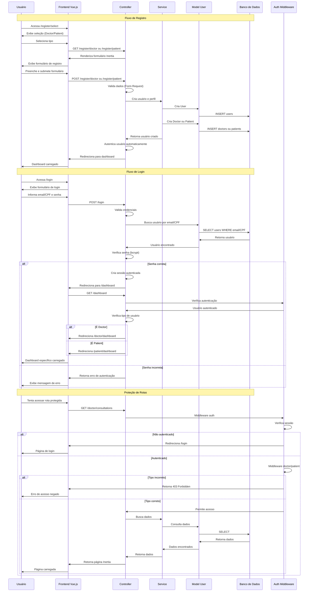

# Diagrama de Fluxo de Autenticação - Telemedicina Para Todos

## Fluxo de Autenticação e Registro

Este diagrama mostra os fluxos de autenticação, registro e redirecionamento de usuários.

## Tipos de Usuário

### Doctor (Médico)
- Registro requer: Nome, Email, Senha, CRM, Especializações
- Após login: Redirecionado para `/doctor/dashboard`
- Rotas protegidas: `/doctor/*`

### Patient (Paciente)
- Registro requer: Nome, Email, Senha, Gênero, Data de nascimento, Telefone
- Após login: Redirecionado para `/patient/dashboard`
- Rotas protegidas: `/patient/*`

## Middleware de Autenticação

### auth
- Verifica se o usuário está autenticado
- Redireciona para `/login` se não autenticado

### doctor
- Verifica se o usuário é um médico
- Retorna 403 se não for médico

### patient
- Verifica se o usuário é um paciente
- Retorna 403 se não for paciente

## Segurança

- **Senhas**: Criptografadas com bcrypt
- **Sessões**: Gerenciadas pelo Laravel
- **CSRF**: Proteção automática em formulários
- **Sanctum**: Autenticação para API (quando necessário)

---

*Última atualização: Janeiro 2025*

