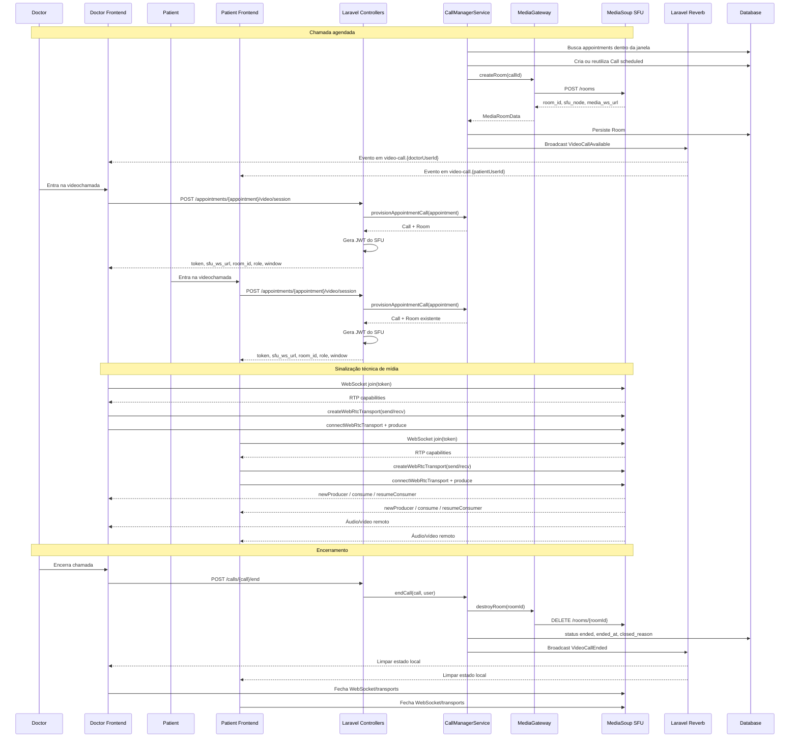
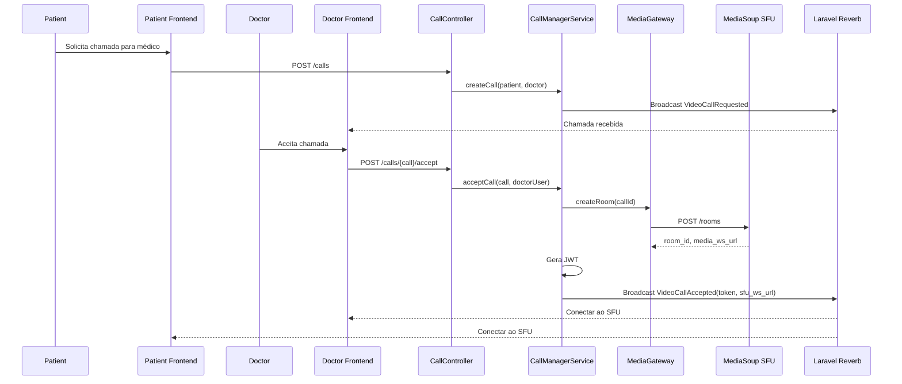

# Diagrama de Fluxo de Videoconferência - Telemedicina Para Todos

## Fluxo de Videoconferência WebRTC com SFU

Este diagrama mostra o fluxo atual de videochamada: Laravel controla negócio, Reverb avisa estado e o SFU MediaSoup transporta áudio/vídeo.

## Chamada ad-hoc

## Componentes

- **Laravel:** `CallController`, `AppointmentVideoSessionController`, `CallManagerService`.
- **Persistência:** `calls` e `rooms`.
- **Eventos Reverb:** `VideoCallAvailable`, `VideoCallRequested`, `VideoCallAccepted`, `VideoCallRejected`, `VideoCallEnded`.
- **Frontend:** `useVideoCall.ts`, `useVideoCallSession.ts`, `useSfu.ts`, `videoCall` store.
- **SFU:** MediaSoup via WebSocket para sinalização técnica e WebRTC para mídia.

## Observações

- Reverb não transporta SDP, ICE, `peerId` nem mídia.
- O `roomId` confiável vem do backend/SFU e fica no JWT ou em resposta autenticada.
- O token do SFU é curto e deve ser renovado pelo backend quando necessário.
