# Diagrama de Componentes Frontend - Telemedicina Para Todos

## Estrutura de Componentes Vue.js

Este diagrama mostra a hierarquia e organização dos componentes frontend.

```mermaid
graph TB
    subgraph "Layouts"
        A[AppLayout]
        B[AuthLayout]
        C[SettingsLayout]
    end

    subgraph "App Shell"
        D[AppShell]
        E[AppHeader]
        F[AppSidebar]
        G[AppContent]
        H[NavMain]
        I[NavUser]
    end

    subgraph "UI Components - Reka UI"
        J[Button]
        K[Input]
        L[Card]
        M[Dialog]
        N[Dropdown]
        O[Avatar]
        P[Alert]
        Q[Sidebar]
    end

    subgraph "Pages - Doctor"
        R[DoctorDashboard]
        S[DoctorConsultations]
        T[DoctorConsultationDetail]
        U[DoctorPatients]
        V[DoctorSchedule]
        W[DoctorAvailability]
    end

    subgraph "Pages - Patient"
        X[PatientDashboard]
        Y[PatientSearchConsultations]
        Z[PatientAppointments]
        AA[PatientMedicalRecord]
        AB[PatientConsultationDetail]
    end

    subgraph "Pages - Auth"
        AC[Login]
        AD[RegisterDoctor]
        AE[RegisterPatient]
        AF[RegisterSelect]
    end

    subgraph "Pages - Settings"
        AG[Profile]
        AH[Password]
        AI[Appearance]
    end

    subgraph "Composables"
        AJ[useAuth]
        AK[useAuthGuard]
        AL[useDoctorRegistration]
        AM[usePatientRegistration]
        AN[useAppearance]
    end

    A --> D
    D --> E
    D --> F
    D --> G
    F --> H
    F --> I
    
    R --> A
    S --> A
    T --> A
    U --> A
    V --> A
    W --> A
    
    X --> A
    Y --> A
    Z --> A
    AA --> A
    AB --> A
    
    AC --> B
    AD --> B
    AE --> B
    AF --> B
    
    AG --> C
    AH --> C
    AI --> C
    
    R --> J
    R --> K
    R --> L
    S --> M
    T --> N
    U --> O
    X --> P
    Y --> Q
    
    R --> AJ
    S --> AJ
    X --> AJ
    AD --> AL
    AE --> AM
    AG --> AN

    style A fill:#42b883
    style D fill:#42b883
    style R fill:#ff6b6b
    style X fill:#4ecdc4
    style AC fill:#feca57
    style J fill:#a55eea
```

## Organização de Componentes

### Layouts
- **AppLayout**: Layout principal da aplicação (com sidebar e header)
- **AuthLayout**: Layout para páginas de autenticação
- **SettingsLayout**: Layout para páginas de configurações

### App Shell
Componentes estruturais que compõem o layout principal:
- **AppShell**: Container principal
- **AppHeader**: Cabeçalho com logo e navegação
- **AppSidebar**: Barra lateral com menu
- **AppContent**: Área de conteúdo principal
- **NavMain**: Navegação principal
- **NavUser**: Menu do usuário

### UI Components (Reka UI)
Biblioteca de componentes reutilizáveis:
- **Button**: Botões com variantes
- **Input**: Campos de entrada
- **Card**: Cards de conteúdo
- **Dialog**: Modais e diálogos
- **Dropdown**: Menus dropdown
- **Avatar**: Avatares de usuário
- **Alert**: Alertas e notificações
- **Sidebar**: Sidebars colapsáveis

### Pages - Doctor
Páginas específicas para médicos:
- **DoctorDashboard**: Dashboard do médico
- **DoctorConsultations**: Lista de consultas
- **DoctorConsultationDetail**: Detalhes da consulta
- **DoctorPatients**: Lista de pacientes
- **DoctorSchedule**: Configuração de agenda
- **DoctorAvailability**: Gestão de disponibilidade

### Pages - Patient
Páginas específicas para pacientes:
- **PatientDashboard**: Dashboard do paciente
- **PatientSearchConsultations**: Busca de médicos
- **PatientAppointments**: Minhas consultas
- **PatientMedicalRecord**: Prontuário médico
- **PatientConsultationDetail**: Detalhes da consulta

### Pages - Auth
Páginas de autenticação:
- **Login**: Login de usuários
- **RegisterDoctor**: Registro de médico
- **RegisterPatient**: Registro de paciente
- **RegisterSelect**: Seleção de tipo de registro

### Pages - Settings
Páginas de configurações:
- **Profile**: Edição de perfil
- **Password**: Alteração de senha
- **Appearance**: Configurações de aparência

### Composables
Lógica reutilizável Vue 3:
- **useAuth**: Autenticação e sessão
- **useAuthGuard**: Proteção de rotas
- **useDoctorRegistration**: Lógica de registro de médico
- **usePatientRegistration**: Lógica de registro de paciente
- **useAppearance**: Gerenciamento de tema

## Fluxo de Dados

1. **Inertia.js**: Recebe dados do backend
2. **Pages**: Renderizam componentes
3. **Composables**: Fornecem lógica reutilizável
4. **UI Components**: Componentes visuais
5. **Layouts**: Estrutura da página

## Tecnologias

- **Vue.js 3**: Framework principal
- **TypeScript**: Tipagem estática
- **Inertia.js**: Integração SPA
- **Tailwind CSS 4**: Estilização
- **Reka UI**: Biblioteca de componentes
- **Laravel Echo**: Eventos em tempo real
- **PeerJS**: Videoconferência WebRTC

---

*Última atualização: Janeiro 2025*

