# Diagrama de Fluxo de Agendamento - Telemedicina Para Todos

## Fluxo Completo de Agendamento de Consulta

Este diagrama mostra o processo de busca, seleção e agendamento de consultas pelo paciente.

```mermaid
flowchart LR
    Start([Paciente acessa busca]) --> Search[Buscar Consultas]
    Search --> Filters[Aplicar Filtros]
    Filters --> Specialty{Especialidade?}
    Filters --> Name{Nome do médico?}
    Filters --> Date{Data?}
    
    Specialty --> Results[Lista de médicos disponíveis]
    Name --> Results
    Date --> Results
    
    Results --> Select[Selecionar médico]
    Select --> ViewProfile[Visualizar perfil do médico]
    
    ViewProfile --> ShowInfo[Exibir informações]
    ShowInfo --> Bio[Biografia]
    ShowInfo --> Specs[Especializações]
    ShowInfo --> Timeline[Timeline profissional]
    ShowInfo --> Locations[Locais de atendimento]
    
    Bio --> SelectDate[Selecionar data no calendário]
    Specs --> SelectDate
    Timeline --> SelectDate
    Locations --> SelectDate
    
    SelectDate --> CheckAvailability[Verificar disponibilidade]
    CheckAvailability --> ServiceLocation{Local de atendimento?}
    
    ServiceLocation -->|Teleconsulta| CheckSlots1[Verificar slots de teleconsulta]
    ServiceLocation -->|Consultório| CheckSlots2[Verificar slots de consultório]
    ServiceLocation -->|Hospital| CheckSlots3[Verificar slots de hospital]
    ServiceLocation -->|Clínica| CheckSlots4[Verificar slots de clínica]
    
    CheckSlots1 --> AvailableSlots[Horários disponíveis]
    CheckSlots2 --> AvailableSlots
    CheckSlots3 --> AvailableSlots
    CheckSlots4 --> AvailableSlots
    
    AvailableSlots --> FilterSlots[Filtrar por tipo de slot]
    FilterSlots --> Recurring{Slot recorrente?}
    FilterSlots --> Specific{Slot específico?}
    
    Recurring --> ShowRecurring[Mostrar horários semanais]
    Specific --> ShowSpecific[Mostrar horários da data]
    
    ShowRecurring --> CheckBlocked{Data bloqueada?}
    ShowSpecific --> CheckBlocked
    
    CheckBlocked -->|Sim| NoSlots[Sem horários disponíveis]
    CheckBlocked -->|Não| ShowTimes[Exibir horários disponíveis]
    
    ShowTimes --> SelectTime[Paciente seleciona horário]
    SelectTime --> Validate{Validar agendamento}
    
    Validate --> CheckEmergency{Contato de emergência<br/>completo?}
    CheckEmergency -->|Não| RequireEmergency[Exigir completar cadastro]
    RequireEmergency --> CompleteProfile[Completar perfil]
    CompleteProfile --> CheckEmergency
    
    CheckEmergency -->|Sim| CheckConflict{Conflito de horário?}
    CheckConflict -->|Sim| ConflictError[Erro: Horário já ocupado]
    ConflictError --> ShowTimes
    
    CheckConflict -->|Não| CreateAppointment[Criar agendamento]
    CreateAppointment --> GenerateCode[Gerar código de acesso único]
    GenerateCode --> SaveAppointment[Salvar no banco de dados]
    SaveAppointment --> Status[SCHEDULED]
    Status --> NotifyDoctor[Notificar médico]
    NotifyDoctor --> NotifyPatient[Notificar paciente]
    NotifyPatient --> Confirm[Exibir confirmação]
    Confirm --> End([Agendamento concluído])
    
    NoSlots --> SelectDate
    
    style Status fill:#e3f2fd
    style CreateAppointment fill:#c8e6c9
    style ConflictError fill:#ffcdd2
    style RequireEmergency fill:#fff9c4
```

## Validações no Agendamento

### 1. Validação de Cadastro
- **Contato de Emergência**: Obrigatório para agendar
- **Dados Básicos**: Nome, email, telefone completos

### 2. Validação de Disponibilidade
- **Slots Ativos**: Apenas slots marcados como `is_active`
- **Datas Bloqueadas**: Verificar `doctor_blocked_dates`
- **Conflitos**: Verificar se horário já está agendado
- **Janela de Tempo**: Respeitar horários de início e fim

### 3. Validação de Local
- **Local Ativo**: Verificar se local está ativo
- **Tipo de Slot**: Compatibilidade entre slot e local

## Tipos de Slots

### Recurring (Recorrente)
- Repete semanalmente no mesmo dia
- Exemplo: Toda segunda-feira, 8h-12h

### Specific (Específico)
- Para uma data específica
- Exemplo: 15/01/2025, 14h-18h

## Criação do Agendamento

Após todas as validações:
1. **Criar registro** na tabela `appointments`
2. **Gerar código único** de acesso (`access_code`)
3. **Definir status** como `SCHEDULED`
4. **Registrar log** em `appointment_logs`
5. **Enviar notificações** para médico e paciente

## Notificações

- **Médico**: Recebe notificação de nova consulta agendada
- **Paciente**: Recebe confirmação com código de acesso
- **Lembrete**: Notificação antes do horário (configurável)

---

*Última atualização: Janeiro 2025*

