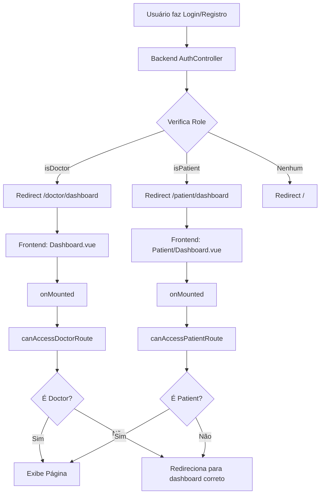

# Sistema de Roteamento e Redirecionamento Frontend - TelemedicinaParaTodos

## Visão Geral

Este documento descreve como o sistema de autenticação e controle de acesso funciona no frontend (Vue.js/Inertia.js), incluindo redirecionamento automático, proteção de rotas e navegação dinâmica baseada em roles.

**Documentação relacionada:**
- [Sistema de Controle de Acesso Backend](./RoleBasedAccess.md)
- [Lógica de Registro](./RegistrationLogic.md)

---

## Arquitetura Frontend

### Composables de Autenticação

Todos os composables de autenticação estão organizados em `resources/js/composables/auth/`:

```
resources/js/composables/auth/
├── index.ts              # Exportações centralizadas
├── useAuth.ts            # Gerenciamento de autenticação
├── useRoleRoutes.ts      # Rotas dinâmicas por role
└── useRouteGuard.ts      # Proteção e redirecionamento
```

---

## Composables

### 1. useAuth

**Arquivo:** `resources/js/composables/auth/useAuth.ts`

Gerencia autenticação e informações do usuário.

#### Propriedades Disponíveis

```typescript
const {
    // Dados do usuário
    user,           // AuthUser | null
    userName,       // string (com fallback 'Usuário')
    userEmail,      // string
    
    // Verificações de tipo
    isDoctor,       // boolean
    isPatient,      // boolean
    isAuthenticated, // boolean
    
    // Role
    role,           // 'doctor' | 'patient' | 'user' | null
    
    // Perfil específico (Doctor ou Patient)
    profile,        // AuthProfile | null
    
    // Métodos utilitários
    canAccess,      // (role: string) => boolean
    canAccessAny,   // (roles: string[]) => boolean
    isRole,         // (role: string) => boolean
} = useAuth();
```

#### Métodos Escaláveis

##### canAccess(role)
Verifica se o usuário tem um role específico de forma limpa e escalável.

```vue
<script setup>
import { useAuth } from '@/composables/auth';

const { canAccess } = useAuth();
</script>

<template>
    <!-- Mostrar apenas para médicos -->
    <button v-if="canAccess('doctor')">
        Gerenciar Consultas
    </button>
    
    <!-- Mostrar apenas para pacientes -->
    <button v-if="canAccess('patient')">
        Agendar Consulta
    </button>
</template>
```

##### canAccessAny(roles)
Verifica se o usuário tem um dos roles especificados.

```vue
<template>
    <!-- Mostrar para médicos ou admins -->
    <div v-if="canAccessAny(['doctor', 'admin'])">
        Painel Administrativo
    </div>
</template>
```

#### Uso Básico

```vue
<script setup lang="ts">
import { useAuth } from '@/composables/auth';

const { user, isDoctor, isPatient, role, canAccess } = useAuth();
</script>

<template>
    <div>
        <h1>Bem-vindo, {{ user?.name }}</h1>
        
        <!-- Conteúdo específico por role -->
        <div v-if="isDoctor">Área do médico</div>
        <div v-if="isPatient">Área do paciente</div>
        
        <!-- Usando canAccess (mais escalável) -->
        <button v-if="canAccess('doctor')">Funcionalidade Médico</button>
    </div>
</template>
```

---

### 2. useRoleRoutes

**Arquivo:** `resources/js/composables/auth/useRoleRoutes.ts`

Gerencia rotas de forma dinâmica e escalável baseado no tipo de usuário.

#### Mapeamento de Rotas

Internamente, usa um objeto mapeado para reduzir duplicação:

```typescript
const routesByRole = {
    doctor: doctorRoutes,    // /doctor/*
    patient: patientRoutes,  // /patient/*
    user: {},                // Fallback
};
```

#### Propriedades Disponíveis

```typescript
const {
    // Rotas individuais (backward compatibility)
    dashboardRoute,      // () => RouteDefinition
    appointmentsRoute,   // () => RouteDefinition | null
    consultationsRoute,  // () => RouteDefinition | null
    healthRecordsRoute,  // () => RouteDefinition | null
    
    // Acesso direto ao namespace (RECOMENDADO)
    routes,              // Namespace completo de rotas
    getRoutes,           // () => Namespace de rotas
    
    // Informações do usuário
    role,
    isDoctor,
    isPatient,
} = useRoleRoutes();
```

#### Uso Recomendado

**Método 1: Acesso direto ao namespace** (Mais limpo e escalável)

```vue
<script setup>
import { useRoleRoutes } from '@/composables/auth';
import { Link } from '@inertiajs/vue3';

const { routes } = useRoleRoutes();
</script>

<template>
    <nav>
        <Link :href="routes.dashboard()">Dashboard</Link>
        <Link :href="routes.searchConsultations()">Search Consultations</Link>
        <!-- Qualquer nova rota funciona automaticamente! -->
        <Link :href="routes.newFeature()">New Feature</Link>
    </nav>
</template>
```

**Método 2: Rotas individuais** (Backward compatibility)

```vue
<script setup>
const { dashboardRoute, appointmentsRoute } = useRoleRoutes();
</script>

<template>
    <Link :href="dashboardRoute()">Dashboard</Link>
    <Link :href="appointmentsRoute()">Appointments</Link>
</template>
```

#### Escalabilidade

Para adicionar um novo role (ex: `admin`):

1. Adicionar rotas em `resources/js/routes/admin/index.ts`
2. Atualizar o mapeamento:

```typescript
const routesByRole = {
    doctor: doctorRoutes,
    patient: patientRoutes,
    admin: adminRoutes,  // ← Adicionar apenas esta linha!
    user: {},
};
```

**Todo o resto funciona automaticamente!**

---

### 3. useRouteGuard

**Arquivo:** `resources/js/composables/auth/useRouteGuard.ts`

Protege rotas e redireciona automaticamente usuários não autorizados.

#### Métodos Disponíveis

```typescript
const {
    // Redirecionamento automático
    canAccessDoctorRoute,    // Verifica + redireciona
    canAccessPatientRoute,   // Verifica + redireciona
    ensureCorrectDashboard,  // Redireciona se dashboard errado
    requireAuth,             // Redireciona para login se não autenticado
    
    // Verificação sem redirecionamento
    hasPermission,           // (role) => boolean
    
    // Informações
    role,
    isAuthenticated,
    isDoctor,
    isPatient,
} = useRouteGuard();
```

#### Uso em Páginas

Todas as páginas protegidas devem usar o RouteGuard:

**Exemplo: Página de Médico**
```vue
<script setup lang="ts">
import { onMounted } from 'vue';
import { useRouteGuard } from '@/composables/auth';

const { canAccessDoctorRoute } = useRouteGuard();

// Proteger a página ao montar
onMounted(() => {
    canAccessDoctorRoute(); // Redireciona automaticamente se não autorizado
});
</script>
```

**Exemplo: Página de Paciente**
```vue
<script setup lang="ts">
import { onMounted } from 'vue';
import { useRouteGuard } from '@/composables/auth';

const { canAccessPatientRoute } = useRouteGuard();

onMounted(() => {
    canAccessPatientRoute();
});
</script>
```

---

## Fluxo de Redirecionamento

### 1. Login e Registro



### 2. Acesso Direto a URL

Quando um usuário tenta acessar uma URL diretamente:

```
Usuário acessa: /doctor/dashboard
         ↓
Backend: Middleware 'doctor' verifica
         ↓
    É médico? → Sim → Retorna página
         ↓
    Não → 403 Forbidden (Backend bloqueia)
```

**E no frontend:**

```
Página carrega: Dashboard.vue
         ↓
onMounted() executa
         ↓
canAccessDoctorRoute() verifica
         ↓
    É médico? → Sim → Mantém na página
         ↓
    Não → Redireciona para /patient/dashboard ou /
```

### 3. Proteção em Camadas

O sistema tem **proteção dupla**:

1. **Backend (Middleware):** Bloqueia acesso não autorizado (403)
2. **Frontend (RouteGuard):** Redireciona para página correta

```
┌──────────────────────────────────────────────────────┐
│ Camada 1: Backend Middleware                         │
│ ✅ Verifica autenticação                             │
│ ✅ Verifica role correto                             │
│ ✅ Retorna 403 se não autorizado                     │
└──────────────────────────────────────────────────────┘
                      ↓ (Se autorizado)
┌──────────────────────────────────────────────────────┐
│ Camada 2: Frontend RouteGuard                        │
│ ✅ Verificação adicional em onMounted()              │
│ ✅ Redireciona para dashboard correto                │
│ ✅ Melhora UX (evita mostrar 403)                    │
└──────────────────────────────────────────────────────┘
```

---

## Estrutura de Rotas Frontend

### Rotas Geradas (Wayfinder)

O sistema usa **Laravel Wayfinder** para gerar rotas TypeScript automaticamente:

```
resources/js/routes/
├── index.ts              # Rotas públicas (login, register, etc)
├── doctor/
│   ├── index.ts          # Rotas de médicos
│   └── video-call/
│       └── index.ts
├── patient/
│   ├── index.ts          # Rotas de pacientes
│   └── video-call/
│       └── index.ts
└── ...
```

#### Rotas de Médicos

**Namespace:** `@/routes/doctor`

```typescript
import * as doctorRoutes from '@/routes/doctor';

doctorRoutes.dashboard();      // /doctor/dashboard
doctorRoutes.appointments();   // /doctor/appointments
doctorRoutes.consultations();  // /doctor/consultations
```

#### Rotas de Pacientes

**Namespace:** `@/routes/patient`

```typescript
import * as patientRoutes from '@/routes/patient';

patientRoutes.dashboard();      // /patient/dashboard
patientRoutes.searchConsultations();   // /patient/search-consultations
patientRoutes.healthRecords();  // /patient/health-records
```

---

## Navegação Dinâmica

### AppSidebar (Navegação Principal)

O componente `AppSidebar.vue` adapta automaticamente os links baseado no role:

```vue
<script setup>
import { useAuth } from '@/composables/auth';
import * as doctorRoutes from '@/routes/doctor';
import * as patientRoutes from '@/routes/patient';

const { isDoctor, isPatient } = useAuth();

// Navegação para Médicos
const doctorNavItems = computed(() => [
    { title: 'Dashboard', href: doctorRoutes.dashboard(), icon: Home },
    { title: 'Agenda', href: doctorRoutes.appointments(), icon: Calendar },
    { title: 'Consultas', href: doctorRoutes.consultations(), icon: Monitor },
]);

// Navegação para Pacientes
const patientNavItems = computed(() => [
    { title: 'Dashboard', href: patientRoutes.dashboard(), icon: Home },
    { title: 'Pesquisar Médicos', href: patientRoutes.searchConsultations(), icon: Stethoscope },
    { title: 'Prontuário', href: patientRoutes.healthRecords(), icon: Activity },
]);

// Seleção automática baseada no role
const mainNavItems = computed(() => {
    if (isDoctor.value) return doctorNavItems.value;
    if (isPatient.value) return patientNavItems.value;
    return [];
});
</script>
```

**O que o usuário vê:**

| Role | Menu Lateral |
|------|--------------|
| Médico | Dashboard, Agenda, Consultas |
| Paciente | Dashboard, Agendamentos, Prontuário |

---

## Compartilhamento de Dados (Backend → Frontend)

### HandleInertiaRequests Middleware

O backend compartilha dados de autenticação via `HandleInertiaRequests`:

```php
// app/Http/Middleware/HandleInertiaRequests.php
'auth' => [
    'user' => $request->user(),
    'role' => $request->user()?->getRole(),
    'isDoctor' => $request->user()?->isDoctor() ?? false,
    'isPatient' => $request->user()?->isPatient() ?? false,
    'profile' => $request->user()?->doctor ?? $request->user()?->patient,
],
```

### Acesso no Frontend

```vue
<script setup>
import { usePage } from '@inertiajs/vue3';

const page = usePage();
const auth = page.props.auth;

// Ou usando o composable (RECOMENDADO)
import { useAuth } from '@/composables/auth';
const { user, role, isDoctor, isPatient, profile } = useAuth();
</script>
```

---

## Proteção de Páginas

### Páginas que Requerem Proteção

Todas as páginas dentro de rotas protegidas devem usar `useRouteGuard`:

#### Páginas de Médicos

```
resources/js/pages/
├── Dashboard.vue              # → canAccessDoctorRoute()
└── Doctor/
    ├── ScheduleManagement.vue # → canAccessDoctorRoute()
    └── ...
```

#### Páginas de Pacientes

```
resources/js/pages/Patient/
├── Dashboard.vue              # → canAccessPatientRoute()
├── SearchConsultations.vue           # → canAccessPatientRoute()
└── ...
```

### Implementação

```vue
<script setup lang="ts">
import { onMounted } from 'vue';
import { useRouteGuard } from '@/composables/auth';

const { canAccessDoctorRoute } = useRouteGuard();

// Verificar e redirecionar ao montar o componente
onMounted(() => {
    canAccessDoctorRoute();
});
</script>
```

---

## Cenários de Redirecionamento

### Cenário 1: Paciente tenta acessar rota de médico

```
1. Paciente digita: /doctor/dashboard
         ↓
2. Backend: Middleware 'doctor' verifica
         ↓
3. Backend: isDoctor() = false
         ↓
4. Backend: abort(403, 'Acesso restrito a médicos.')
         ↓
5. Usuário vê: Erro 403
```

**Com RouteGuard adicional (se conseguir carregar a página):**

```
1. Página Dashboard.vue carrega
         ↓
2. onMounted() executa
         ↓
3. canAccessDoctorRoute() verifica
         ↓
4. isDoctor = false, isPatient = true
         ↓
5. Redireciona automaticamente para: /patient/dashboard
```

### Cenário 2: Usuário não autenticado

```
1. Visitante acessa: /doctor/dashboard
         ↓
2. Backend: Middleware 'auth' verifica
         ↓
3. Backend: Não autenticado
         ↓
4. Backend: Redireciona para /login
```

### Cenário 3: Login com sucesso

```
1. Médico faz login
         ↓
2. Backend: AuthenticatedSessionController
         ↓
3. Verifica: $user->isDoctor() = true
         ↓
4. Redireciona para: /doctor/dashboard
         ↓
5. Frontend: Dashboard.vue carrega
         ↓
6. useRouteGuard() confirma acesso
         ↓
7. Página exibida com sucesso
```

---

## Boas Práticas

### 1. Sempre usar composables em vez de importações diretas

**❌ Não recomendado:**
```vue
<script setup>
import { usePage } from '@inertiajs/vue3';

const page = usePage();
const isDoctor = page.props.auth?.isDoctor;
</script>
```

**✅ Recomendado:**
```vue
<script setup>
import { useAuth } from '@/composables/auth';

const { isDoctor } = useAuth();
</script>
```

### 2. Usar `canAccess` para verificações de role

**❌ Não escalável:**
```vue
<div v-if="isDoctor">...</div>
<div v-if="isPatient">...</div>
<!-- Difícil adicionar novos roles -->
```

**✅ Escalável:**
```vue
<div v-if="canAccess('doctor')">...</div>
<div v-if="canAccess('patient')">...</div>
<!-- Fácil adicionar: canAccess('admin') -->
```

### 3. Usar namespace `routes` em vez de métodos individuais

**❌ Verboso:**
```vue
const { dashboardRoute, appointmentsRoute, consultationsRoute } = useRoleRoutes();

<Link :href="dashboardRoute()">Dashboard</Link>
<Link :href="appointmentsRoute()">Appointments</Link>
<Link :href="consultationsRoute()">Consultations</Link>
```

**✅ Limpo:**
```vue
const { routes } = useRoleRoutes();

<Link :href="routes.dashboard()">Dashboard</Link>
<Link :href="routes.searchConsultations()">Search Consultations</Link>
<Link :href="routes.consultations()">Consultations</Link>
```

### 4. Sempre proteger páginas sensíveis

```vue
<script setup>
import { onMounted } from 'vue';
import { useRouteGuard } from '@/composables/auth';

const { canAccessDoctorRoute } = useRouteGuard();

onMounted(() => {
    canAccessDoctorRoute(); // SEMPRE adicionar em páginas protegidas
});
</script>
```

---

## Componentes que Usam Sistema de Roles

### Componentes Atualizados

| Componente | Composable Usado | Função |
|------------|------------------|--------|
| `AppSidebar.vue` | `useAuth` | Navegação dinâmica por role |
| `AppHeader.vue` | `useRoleRoutes` | Logo redireciona para dashboard correto |
| `Dashboard.vue` | `useRouteGuard` | Proteção de acesso (médicos) |
| `Patient/Dashboard.vue` | `useRouteGuard` | Proteção de acesso (pacientes) |
| `Patient/SearchConsultations.vue` | `useRouteGuard` | Proteção de acesso |
| `Welcome.vue` | `useRoleRoutes` | Link dinâmico para dashboard |

---

## Importações Centralizadas

Todos os composables podem ser importados de um único local:

```typescript
// Importação individual
import { useAuth } from '@/composables/auth/useAuth';
import { useRoleRoutes } from '@/composables/auth/useRoleRoutes';
import { useRouteGuard } from '@/composables/auth/useRouteGuard';

// Importação centralizada (RECOMENDADO)
import { useAuth, useRoleRoutes, useRouteGuard } from '@/composables/auth';

// Importar tipos
import type { AuthUser, AuthProfile, AuthData } from '@/composables/auth';
```

---

## Exemplos Práticos

### Exemplo 1: Menu Dinâmico Completo

```vue
<script setup lang="ts">
import { useAuth } from '@/composables/auth';
import { useRoleRoutes } from '@/composables/auth';
import { Link } from '@inertiajs/vue3';
import { computed } from 'vue';

const { canAccess } = useAuth();
const { routes } = useRoleRoutes();

const menuItems = computed(() => {
    if (canAccess('doctor')) {
        return [
            { label: 'Dashboard', href: routes.dashboard() },
            { label: 'Agenda', href: routes.appointments() },
            { label: 'Consultas', href: routes.consultations() },
        ];
    }
    
    if (canAccess('patient')) {
        return [
            { label: 'Meu Painel', href: routes.dashboard() },
            { label: 'Pesquisar Médicos', href: routes.searchConsultations() },
            { label: 'Prontuário', href: routes.healthRecords() },
        ];
    }
    
    return [];
});
</script>

<template>
    <nav>
        <Link v-for="item in menuItems" :key="item.label" :href="item.href">
            {{ item.label }}
        </Link>
    </nav>
</template>
```

### Exemplo 2: Botão Condicional por Role

```vue
<script setup>
import { useAuth } from '@/composables/auth';

const { canAccess, canAccessAny } = useAuth();
</script>

<template>
    <!-- Apenas médicos -->
    <button v-if="canAccess('doctor')">
        Gerenciar Pacientes
    </button>
    
    <!-- Médicos ou Admins -->
    <button v-if="canAccessAny(['doctor', 'admin'])">
        Painel Administrativo
    </button>
    
    <!-- Apenas pacientes -->
    <button v-if="canAccess('patient')">
        Agendar Consulta
    </button>
</template>
```

### Exemplo 3: Página Protegida Completa

```vue
<script setup lang="ts">
import AppLayout from '@/layouts/AppLayout.vue';
import { Head } from '@inertiajs/vue3';
import { onMounted } from 'vue';
import { useAuth, useRouteGuard } from '@/composables/auth';
import * as doctorRoutes from '@/routes/doctor';

// Dados de autenticação
const { user, profile } = useAuth();

// Proteção de rota
const { canAccessDoctorRoute } = useRouteGuard();

onMounted(() => {
    canAccessDoctorRoute(); // Protege a página
});

// Resto da lógica do componente...
</script>

<template>
    <Head title="Página de Médico" />
    
    <AppLayout>
        <div>
            <h1>Bem-vindo, Dr. {{ user?.name }}</h1>
            <!-- Conteúdo específico de médico -->
        </div>
    </AppLayout>
</template>
```

---

## Integração Backend ↔ Frontend

### Fluxo Completo

```
┌─────────────────────────────────────────────────────────────┐
│ 1. BACKEND: Compartilha Dados                               │
│    HandleInertiaRequests → Inertia Props                    │
│    {                                                         │
│      auth: {                                                 │
│        user, role, isDoctor, isPatient, profile             │
│      }                                                       │
│    }                                                         │
└─────────────────────────────────────────────────────────────┘
                          ↓
┌─────────────────────────────────────────────────────────────┐
│ 2. FRONTEND: Recebe via Inertia                             │
│    usePage().props.auth                                     │
└─────────────────────────────────────────────────────────────┘
                          ↓
┌─────────────────────────────────────────────────────────────┐
│ 3. COMPOSABLES: Processam e Disponibilizam                  │
│    useAuth() → Métodos utilitários                          │
│    useRoleRoutes() → Rotas dinâmicas                        │
│    useRouteGuard() → Proteção de acesso                     │
└─────────────────────────────────────────────────────────────┘
                          ↓
┌─────────────────────────────────────────────────────────────┐
│ 4. COMPONENTES: Consomem Dados                              │
│    Navegação adaptável                                      │
│    Rotas protegidas                                         │
│    UI personalizada por role                                │
└─────────────────────────────────────────────────────────────┘
```

---

## Troubleshooting

### Erro: "The requested module does not provide an export named 'dashboard'"

**Causa:** Importação de rota antiga que não existe mais.

**Solução:** Usar `useRoleRoutes`:
```typescript
// ❌ Antes
import { dashboard } from '@/routes';

// ✅ Agora
import { useRoleRoutes } from '@/composables/auth';
const { dashboardRoute } = useRoleRoutes();
```

### Página carrega mas depois redireciona

**Causa:** Backend permite acesso mas frontend detecta role incorreto.

**Solução:** Verificar se backend e frontend estão sincronizados. Backend deve sempre bloquear primeiro.

### canAccess retorna sempre false

**Causa:** Dados de autenticação não estão sendo compartilhados corretamente.

**Solução:** Verificar `HandleInertiaRequests` no backend e garantir que está compartilhando `role`, `isDoctor`, `isPatient`.

### Rotas não funcionam após adicionar novo role

**Causa:** Esqueceu de adicionar ao mapeamento `routesByRole`.

**Solução:** Adicionar no `useRoleRoutes.ts`:
```typescript
const routesByRole = {
    doctor: doctorRoutes,
    patient: patientRoutes,
    admin: adminRoutes, // ← Adicionar novo role
};
```

---

## Adicionando Novos Roles

### Passo a Passo Frontend

Quando adicionar um novo tipo de usuário (ex: `admin`):

#### 1. Criar rotas

```bash
# Criar estrutura de rotas
resources/js/routes/admin/index.ts
```

#### 2. Atualizar useRoleRoutes

```typescript
// resources/js/composables/auth/useRoleRoutes.ts
import * as adminRoutes from '@/routes/admin';

const routesByRole = {
    doctor: doctorRoutes,
    patient: patientRoutes,
    admin: adminRoutes, // ← Adicionar
    user: {},
};
```

#### 3. Atualizar tipos

```typescript
// resources/js/composables/auth/useAuth.ts
export interface AuthData {
    role: 'doctor' | 'patient' | 'admin' | 'user' | null; // ← Adicionar 'admin'
    // ...
}
```

#### 4. Criar middleware frontend (opcional)

```typescript
// resources/js/composables/auth/useRouteGuard.ts
const canAccessAdminRoute = (): boolean => {
    if (!isAuthenticated.value) {
        router.visit(login().url, { replace: true });
        return false;
    }
    
    if (!isAdmin.value) {
        // Redirecionar para dashboard apropriado
        router.visit(dashboardRoute().url, { replace: true });
        return false;
    }
    
    return true;
};
```

#### 5. Atualizar navegação

```typescript
// AppSidebar.vue
const adminNavItems = computed(() => [
    { title: 'Admin Dashboard', href: adminRoutes.dashboard() },
    { title: 'Users', href: adminRoutes.users() },
    { title: 'Settings', href: adminRoutes.settings() },
]);

const mainNavItems = computed(() => {
    if (canAccess('admin')) return adminNavItems.value;
    if (canAccess('doctor')) return doctorNavItems.value;
    if (canAccess('patient')) return patientNavItems.value;
    return [];
});
```

**Todo o resto funciona automaticamente!**

---

## Performance

### Otimizações Implementadas

1. **Computed Values:** Dados reativos são cacheados
2. **Replace: true:** Redirecionamentos não poluem histórico do navegador
3. **Lazy Loading:** Componentes carregados sob demanda
4. **Type Safety:** TypeScript previne erros em tempo de compilação

### Evitar N+1 Queries

```vue
<script setup>
// ✅ Correto - buscar dados com eager loading
const { profile } = useAuth();
// Backend já carrega: $user->doctor ou $user->patient

// ❌ Incorreto - múltiplas requisições
const doctor = await axios.get(`/api/doctors/${user.id}`);
</script>
```

---

## Segurança

### Camadas de Segurança

1. **Backend Middleware** (Primária)
   - Autenticação via sessão Laravel
   - Verificação de role
   - Bloqueio com 403 Forbidden

2. **Frontend RouteGuard** (Secundária)
   - Melhora UX
   - Redirecionamento automático
   - Validação adicional

**IMPORTANTE:** Nunca confie apenas no frontend. Backend deve sempre validar!

### Princípios

- ✅ Backend sempre valida primeiro
- ✅ Frontend melhora experiência do usuário
- ✅ Dados sensíveis nunca expostos no frontend
- ✅ Redirecionamentos usam `replace: true` para segurança

---

## Testando o Sistema

### Teste Manual

1. **Como Médico:**
```
- Login com conta de médico
- Deve ir para: /doctor/dashboard
- Tentar acessar: /patient/dashboard → Bloqueado (403)
- Menu lateral mostra: Dashboard, Agenda, Consultas
```

2. **Como Paciente:**
```
- Login com conta de paciente
- Deve ir para: /patient/dashboard
- Tentar acessar: /doctor/dashboard → Bloqueado (403)
- Menu lateral mostra: Dashboard, Agendamentos, Prontuário
```

3. **Não Autenticado:**
```
- Acessar qualquer rota protegida
- Deve redirecionar para: /login
```

### Teste de Navegação

```
1. Fazer login como médico
2. Clicar no logo → Vai para /doctor/dashboard
3. Clicar em "Agenda" → Vai para /doctor/appointments
4. Logout e login como paciente
5. Clicar no logo → Vai para /patient/dashboard (diferente!)
6. Menu mostra itens diferentes
```

---

## Estrutura de Arquivos

```
resources/js/
├── composables/
│   └── auth/
│       ├── index.ts              # Exportações centralizadas
│       ├── useAuth.ts            # Autenticação e verificação
│       ├── useRoleRoutes.ts      # Rotas dinâmicas
│       └── useRouteGuard.ts      # Proteção de rotas
├── components/
│   ├── AppSidebar.vue            # Usa: useAuth
│   └── AppHeader.vue             # Usa: useRoleRoutes
├── pages/
│   ├── Dashboard.vue             # Médico - Usa: useRouteGuard
│   ├── Doctor/
│   │   └── ScheduleManagement.vue
│   └── Patient/
│       ├── Dashboard.vue         # Usa: useRouteGuard
│       └── SearchConsultations.vue      # Usa: useRouteGuard
└── routes/
    ├── doctor/
    │   └── index.ts              # Rotas de médicos
    └── patient/
        └── index.ts              # Rotas de pacientes
```

---

## Documentação Relacionada

- **[Sistema de Controle de Acesso Backend](./RoleBasedAccess.md)** - Middlewares, controllers e autenticação no backend
- **[Lógica de Registro](./RegistrationLogic.md)** - Fluxo de registro de usuários
- **[Arquitetura do Sistema](../../Architecture/Arquitetura.md)** - Visão geral da arquitetura
- **[Diagrama de Banco de Dados](../../database/README.md)** - Estrutura de dados

---

## Referências Técnicas

### Laravel Inertia.js
- [Shared Data](https://inertiajs.com/shared-data)
- [Manual Visits](https://inertiajs.com/manual-visits)

### Vue 3 Composition API
- [Composables](https://vuejs.org/guide/reusability/composables.html)
- [Computed Properties](https://vuejs.org/guide/essentials/computed.html)

### TypeScript
- [Type Inference](https://www.typescriptlang.org/docs/handbook/type-inference.html)
- [Mapped Types](https://www.typescriptlang.org/docs/handbook/2/mapped-types.html)

