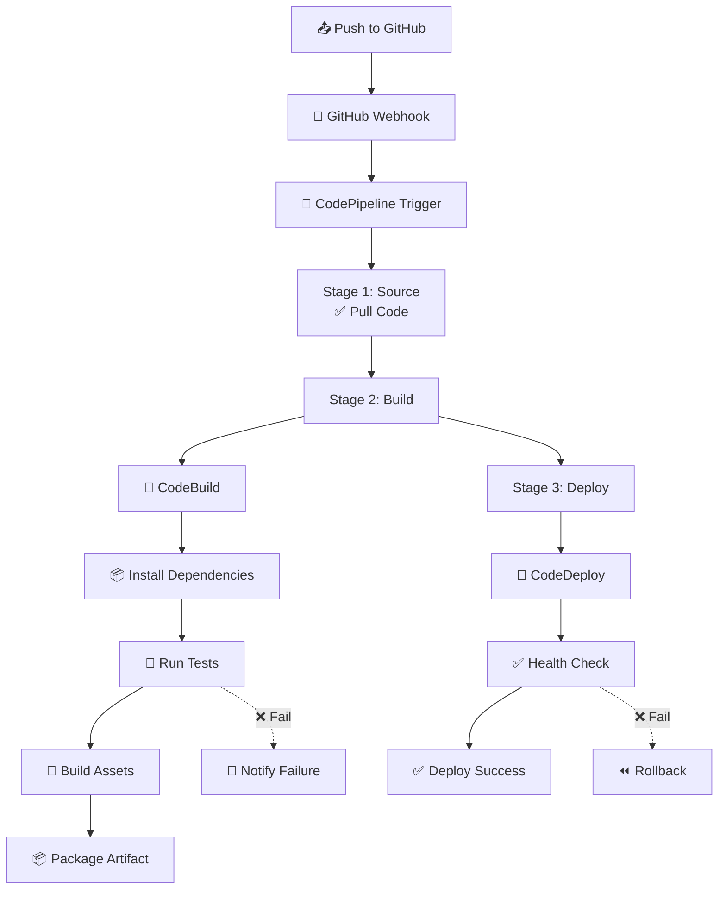

# 🚀 Estratégia Avançada de Migração AWS - Telemedicina Para Todos

## 📋 Sobre Este Documento

Este documento apresenta uma **estratégia avançada e estruturada** para preparar e migrar o projeto Telemedicina Para Todos para a AWS Cloud. Foco em **arquitetura híbrida escalável**, começando como monolito em EC2 e evoluindo para serverless conforme a demanda cresce.

### 📑 Sumário Navegável
- [📋 Sobre Este Documento](#-sobre-este-documento)
- [🎯 Visão Geral da Arquitetura](#-visão-geral-da-arquitetura)
- [🏗️ Arquitetura Híbrida Proposta](#️-arquitetura-híbrida-proposta)
- [📊 Diagramas de Arquitetura](#-diagramas-de-arquitetura)
- [🔧 Preparação Local do Projeto](#-preparação-local-do-projeto)
- [☁️ Infraestrutura AWS](#️-infraestrutura-aws)
  - [Tabela de Portas](#tabela-de-portas)
  - [Security Groups por Camada](#security-groups-por-camada)
  - [RTO/RPO e Matriz de Criticidade](#rtorpo-e-matriz-de-criticidade)
  - [Estratégia de Assets](#️-estratégia-de-assets-versioning--headers)
  - [Estratégia de Filas](#️-estratégia-de-filas-queue-strategy)
- [🔄 Pipeline CI/CD](#-pipeline-cicd)
  - [CodeBuild Specification](#3-codebuild-specification)
  - [CodeDeploy AppSpec](#4-codedeploy-appspec)
- [📹 Sistema de Videoconsultas na AWS](#-sistema-de-videoconsultas-na-aws)
  - [WebRTC em Produção - Checklist](#5-webrtc-em-produção---checklist)
- [🔒 Segurança e Compliance](#-segurança-e-compliance)
  - [Métricas e Alarmes por Serviço](#️-métricas-e-alarmes-por-serviço)
  - [Política de Retenção de Logs](#️-política-de-retenção-de-logs-e-classificação-lgpd)
  - [Runbooks Operacionais](#5-runbooks-operacionais)
  - [Cheatsheet de Deploy](#6-cheatsheet-de-deploy-ec2--codedeploy)
- [📈 Estratégia de Escalabilidade](#-estratégia-de-escalabilidade)
- [💰 Otimização de Custos](#-otimização-de-custos)
- [🎯 Roadmap de Implementação](#-roadmap-de-implementação)
- [📚 Referências e Recursos](#-referências-e-recursos)

---

## 🎯 Visão Geral da Arquitetura

### **Filosofia: Evolução Gradual**
A estratégia adotada é uma **arquitetura híbrida** que começa simples (monolito em EC2) e escala para serverless conforme a demanda cresce. Isso permite:

- **Baixo risco** na migração inicial
- **Custos controlados** no início
- **Escalabilidade automática** quando necessário
- **Flexibilidade** para adotar novas tecnologias

### **Estágios de Evolução**

#### **Fase 1: Monolito em EC2 (Inicial)**
Código atual migrado "lift-and-shift" para EC2, mantendo a mesma arquitetura local mas na nuvem.

#### **Fase 2: Serviços Gerenciados (Intermediário)**
Separação de responsabilidades usando RDS, ElastiCache, S3 e CloudFront.

#### **Fase 3: Serverless Parcial (Avançado)**
Migração de funcionalidades específicas para Lambda, mantendo núcleo em EC2.

#### **Fase 4: Full Serverless (Futuro)**
Microserviços completamente serverless com API Gateway e Lambda.

---

## 🏗️ Arquitetura Híbrida Proposta

### **Fluxo de Requisições**

```
Usuário (Browser/Mobile)
    ↓
CloudFront (CDN + SSL)
    ↓
Application Load Balancer (HTTPS/WebSocket)
    ↓
EC2 Auto Scaling Group (Laravel App + Reverb)
    ↓
    ├── RDS PostgreSQL (Multi-AZ)
    ├── ElastiCache Redis (Cluster Mode)
    └── S3 (Arquivos, Logs, Backups)
```

### **Componentes Específicos**

#### **1. Frontend (CloudFront + S3)**
- **CloudFront**: Distribuição global de assets estáticos
- **S3**: Armazenamento de assets compilados (JS, CSS, imagens)
- **SSL/TLS**: Certificado via ACM (AWS Certificate Manager)
- **Compressão**: Gzip/Brotli automático

#### **2. Load Balancer**
- **Application Load Balancer (ALB)**: Roteamento HTTP/HTTPS
- **Sticky Sessions**: Necessário para Laravel Reverb (WebSocket)
- **Health Checks**: Monitoramento de instâncias EC2
- **SSL Termination**: Reduz carga no backend

#### **3. Application Layer**
- **EC2 Auto Scaling**: Múltiplas instâncias baseadas em demanda
- **Laravel 12**: Framework PHP principal
- **Laravel Reverb**: Servidor WebSocket integrado
- **Inertia.js**: Renderização SPA sem APIs REST separadas

#### **4. Data Layer**
- **RDS PostgreSQL**: Banco de dados principal (Multi-AZ para HA)
- **ElastiCache Redis**: Cache e sessões (Cluster mode para escalabilidade)
- **S3**: Storage de arquivos, logs, backups

#### **5. WebSocket Communication**
- **Laravel Reverb**: Servidor WebSocket nativo
- **Horizontal Scaling**: Via Redis Pub/Sub
- **Connection Pooling**: Gerenciado pelo ALB
- **Health Monitoring**: Via CloudWatch

#### **6. Video Conferencing (WebRTC)**
- **Peer-to-Peer**: Conexão direta entre usuários
- **Laravel Reverb**: Canal de sinalização WebSocket
- **STUN/TURN**: Servidor para NAT traversal (AWS EC2 ou serviço externo)
- **PeerJS**: Biblioteca frontend simplificando WebRTC

---

## 📊 Diagramas de Arquitetura

### **Diagrama 1: Arquitetura Geral AWS**

```mermaid
graph TB
    User[👤 Usuário] --> CloudFront[☁️ CloudFront<br/>CDN + SSL]

    CloudFront --> ALB[⚖️ Application Load Balancer<br/>HTTPS + WebSocket]

    ALB --> EC2-1[🖥️ EC2 Instance 1<br/>Laravel + Reverb]
    ALB --> EC2-2[🖥️ EC2 Instance 2<br/>Laravel + Reverb]
    ALB --> EC2-N[🖥️ EC2 Instance N<br/>Auto Scaling]

    EC2-1 --> RDS[(🗄️ RDS PostgreSQL<br/>Multi-AZ)]
    EC2-2 --> RDS
    EC2-N --> RDS

    EC2-1 --> Redis[(⚡ ElastiCache Redis<br/>Cluster Mode)]
    EC2-2 --> Redis
    EC2-N --> Redis

    EC2-1 --> S3[📦 S3 Buckets<br/>Assets + Logs + Backups]
    EC2-2 --> S3
    EC2-N --> S3

    RDS --> RDS-Backup[💾 RDS Automated Backups]
    S3 --> S3-Log[📋 CloudWatch Logs]

    ALB --> CW[📊 CloudWatch<br/>Monitoring + Alerts]

    style CloudFront fill:#FF9900
    style ALB fill:#FF9900
    style EC2-1 fill:#232F3E
    style EC2-2 fill:#232F3E
    style EC2-N fill:#232F3E
    style RDS fill:#3F48CC
    style Redis fill:#DC143C
    style S3 fill:#569A31
    style CW fill:#FF4D00
```



### **Diagrama 2: Fluxo de Videoconsulta (WebRTC)**

```mermaid
sequenceDiagram
    participant Patient as 🏥 Paciente
    participant Doctor as 👨‍⚕️ Médico
    participant Laravel as Laravel Backend
    participant Reverb as Reverb WebSocket
    participant PeerJS as PeerJS + WebRTC
    
    Patient->>Laravel: POST /video-call/request/{doctor_id}
    Laravel->>Reverb: Broadcast RequestVideoCall event
    Reverb->>Doctor: WebSocket: Recebe convite
    Doctor->>Doctor: Exibe notificação e aceita
    
    Doctor->>Laravel: POST /video-call/request/status/{patient_id}
    Laravel->>Reverb: Broadcast RequestVideoCallStatus event
    Reverb->>Patient: WebSocket: Médico aceitou
    
    Patient->>PeerJS: Inicia conexão P2P
    PeerJS->>PeerJS: Usa Reverb como canal de sinalização
    PeerJS->>PeerJS: Estabelece conexão STUN/TURN
    
    Doctor->>PeerJS: Inicia conexão P2P
    PeerJS->>PeerJS: Usa Reverb como canal de sinalização
    
    PeerJS<->>PeerJS: Conexão P2P estabelecida<br/>Fluxo de vídeo/áudio direto
    
    Patient->>Laravel: Encerra consulta
    Doctor->>Laravel: Encerra consulta
    Laravel->>Laravel: Salva logs e duração
```

### **Diagrama 3: Pipeline CI/CD**

```mermaid
graph LR
    Dev[💻 Desenvolvedor] --> Git[📦 GitHub Repository]

    Git --> CodePipeline[🔄 AWS CodePipeline]

    CodePipeline --> CodeBuild[🔨 AWS CodeBuild]
    CodeBuild --> Test[🧪 PHPUnit Tests]
    CodeBuild --> Build[📦 Build Assets]
    CodeBuild --> Env[🔐 Set Environment Variables]

    Test -->|Success| Build
    Build -->|Success| Env
    Env --> CodeDeploy[🚀 AWS CodeDeploy]

    CodeDeploy --> ALB[⚖️ Application Load Balancer]
    ALB --> BlueGreen[🔄 Blue-Green Deployment]

    BlueGreen --> Prod-New[🌟 Nova Versão<br/>EC2 Instances]
    BlueGreen --> Prod-Old[📦 Versão Antiga<br/>EC2 Instances]

    Prod-New --> Health[✅ Health Check]
    Health -->|Pass| Prod-Old[🗑️ Terminate Old]
    Health -->|Fail| Prod-New[⏪ Rollback]

    style Git fill:#181717
    style CodePipeline fill:#FF9900
    style CodeBuild fill:#FF9900
    style CodeDeploy fill:#FF9900
    style Health fill:#90EE90
```



---

## 🔧 Preparação Local do Projeto

### **1. Organização do Código**

#### **Variáveis de Ambiente**
Todo projeto deve usar variáveis de ambiente para configuração. **NUNCA** hardcode valores sensíveis:

**`.env` para Desenvolvimento Local:**
```env
APP_NAME="Telemedicina Para Todos"
APP_ENV=local
APP_DEBUG=true
APP_URL=http://localhost:8000

# Database
DB_CONNECTION=pgsql
DB_HOST=localhost
DB_PORT=5432
DB_DATABASE=telemedicina
DB_USERNAME=postgres
DB_PASSWORD=secret

# Cache
CACHE_DRIVER=redis
REDIS_HOST=localhost
REDIS_PASSWORD=null
REDIS_PORT=6379

# Queue
QUEUE_CONNECTION=redis

# Broadcasting
BROADCAST_CONNECTION=reverb
REVERB_APP_ID=local-app-id
REVERB_APP_KEY=local-app-key
REVERB_APP_SECRET=local-app-secret
REVERB_HOST=localhost
REVERB_PORT=8080
REVERB_SCHEME=http

# Filesystem
FILESYSTEM_DISK=local
```

**`.env` para Produção AWS:**
```env
APP_NAME="Telemedicina Para Todos"
APP_ENV=production
APP_DEBUG=false
APP_URL=https://telemedicina.example.com

# Database - RDS
DB_CONNECTION=pgsql
DB_HOST=telemedicina-db.xxxxx.us-east-1.rds.amazonaws.com
DB_PORT=5432
DB_DATABASE=telemedicina_prod
DB_USERNAME=${DB_USERNAME}
DB_PASSWORD=${DB_PASSWORD}

# Cache - ElastiCache
CACHE_DRIVER=redis
REDIS_HOST=telemedicina-cache.xxxxx.0001.use1.cache.amazonaws.com
REDIS_PASSWORD=${REDIS_PASSWORD}
REDIS_PORT=6379

# Queue - ElastiCache
QUEUE_CONNECTION=redis

# Broadcasting - Reverb
BROADCAST_CONNECTION=reverb
REVERB_APP_ID=${REVERB_APP_ID}
REVERB_APP_KEY=${REVERB_APP_KEY}
REVERB_APP_SECRET=${REVERB_APP_SECRET}
REVERB_HOST=telemedicina.example.com
REVERB_PORT=443
REVERB_SCHEME=https

# Filesystem - S3
FILESYSTEM_DISK=s3
AWS_ACCESS_KEY_ID=${AWS_ACCESS_KEY_ID}
AWS_SECRET_ACCESS_KEY=${AWS_SECRET_ACCESS_KEY}
AWS_DEFAULT_REGION=us-east-1
AWS_BUCKET=telemedicina-files-prod
AWS_USE_PATH_STYLE_ENDPOINT=false

# CloudFront
CLOUDFRONT_URL=https://xxxxx.cloudfront.net

# Monitoring
LOG_CHANNEL=cloudwatch
```

#### **Evitar Dependências Locais Fixas**
- **NUNCA** use caminhos absolutos como `/var/www/html` ou `C:\Users\...`
- Use funções do Laravel: `storage_path()`, `base_path()`, `public_path()`
- Use helper `asset()` para URLs de assets
- Configure `APP_URL` corretamente em cada ambiente

### **2. Simulação de Ambiente Produtivo Localmente**

#### **Opção 1: Docker Compose (Recomendado)**
Crie um arquivo `docker-compose.yml` para rodar PostgreSQL, Redis e aplicação juntos:

```yaml
version: '3.8'

services:
  app:
    image: php:8.2-fpm-alpine
    volumes:
      - .:/var/www/html
    working_dir: /var/www/html
    depends_on:
      - postgres
      - redis
    environment:
      - APP_ENV=local
      - DB_HOST=postgres
      - REDIS_HOST=redis

  postgres:
    image: postgres:16-alpine
    environment:
      POSTGRES_DB: telemedicina
      POSTGRES_USER: postgres
      POSTGRES_PASSWORD: secret
    ports:
      - "5432:5432"
    volumes:
      - postgres_data:/var/lib/postgresql/data

  redis:
    image: redis:7-alpine
    ports:
      - "6379:6379"
    volumes:
      - redis_data:/data

volumes:
  postgres_data:
  redis_data:
```

#### **Opção 2: Laravel Sail**
Já incluído no projeto, execute:
```bash
./vendor/bin/sail up -d
./vendor/bin/sail composer install
./vendor/bin/sail npm install
./vendor/bin/sail artisan migrate
```

### **3. Pipeline de Build Local (Pré-CI/CD)**

#### **Script de Build Automatizado**
Crie scripts para automatizar o build e deploy:

**`scripts/build.sh` (Linux/Mac):**
```bash
#!/bin/bash
set -e

echo "🔨 Building Telemedicina Para Todos..."

# Install Composer dependencies
echo "📦 Installing Composer dependencies..."
composer install --no-dev --optimize-autoloader

# Install NPM dependencies
echo "📦 Installing NPM dependencies..."
npm ci

# Build frontend assets
echo "🎨 Building frontend assets..."
npm run build

# Run tests
echo "🧪 Running tests..."
php artisan test

# Optimize Laravel
echo "⚡ Optimizing Laravel..."
php artisan config:cache
php artisan route:cache
php artisan view:cache
php artisan event:cache

# Clear caches
echo "🧹 Clearing caches..."
php artisan cache:clear
php artisan config:clear

echo "✅ Build completed successfully!"
```

**`scripts/build.bat` (Windows):**
```batch
@echo off
echo 🔨 Building Telemedicina Para Todos...

echo 📦 Installing Composer dependencies...
composer install --no-dev --optimize-autoloader

echo 📦 Installing NPM dependencies...
call npm ci

echo 🎨 Building frontend assets...
call npm run build

echo 🧪 Running tests...
php artisan test

echo ⚡ Optimizing Laravel...
php artisan config:cache
php artisan route:cache
php artisan view:cache
php artisan event:cache

echo ✅ Build completed successfully!
```

### **4. Testes e Qualidade de Código**

#### **PHPUnit Tests**
Execute regularmente:
```bash
php artisan test
# ou para cobertura de código
php artisan test --coverage
```

#### **Linting e Formatação**
```bash
# PHP
./vendor/bin/pint

# JavaScript/TypeScript
npm run lint
npm run format:check
```

---

## ☁️ Infraestrutura AWS

### **1. Configuração de Serviços Principais**

#### **VPC e Networking**
- **VPC**: Rede privada isolada
- **Subnets Públicas**: Para Load Balancer e NAT Gateway
- **Subnets Privadas**: Para EC2, RDS, ElastiCache
- **Internet Gateway**: Acesso à internet para subnets públicas
- **NAT Gateway**: Acesso à internet para recursos privados
- **Security Groups**: Firewall por instância
- **Route Tables**: Roteamento de tráfego

#### **Tabela de Portas**

| Serviço | Protocolo | Porta | Origem | Destino | Observações |
|---------|-----------|-------|--------|---------|-------------|
| **ALB** | HTTP | 80 | 0.0.0.0/0 | ALB | Redireciona para HTTPS |
| **ALB** | HTTPS | 443 | 0.0.0.0/0 | ALB | SSL/TLS terminado no ALB |
| **ALB** | WebSocket | 443 | 0.0.0.0/0 | ALB | Upgrade HTTP para WS |
| **EC2** | HTTP | 8080 | ALB SG | EC2 SG | Internal app |
| **EC2** | TCP | 22 | Admin IP | EC2 SG | SSH para admin |
| **RDS** | PostgreSQL | 5432 | EC2 SG | RDS SG | Database |
| **Redis** | Redis | 6379 | EC2 SG | Redis SG | Cache e Queue |
| **TURN/STUN** | UDP | 3478 | Internet | TURN SG | CoTurn STUN/TURN |
| **TURN/STUN** | TCP | 5349 | Internet | TURN SG | CoTurn TLS |
| **TURN/STUN** | UDP | 49152-65535 | Internet | TURN SG | RTP/RTCP range |
| **Health Check** | HTTP | 8080 | ALB | EC2 SG | Endpoint /health |

#### **Security Groups por Camada**

**ALB Security Group:**
```yaml
Inbound:
  - Type: HTTP
    Port: 80
    Source: 0.0.0.0/0
    Purpose: Redirect to HTTPS
  - Type: HTTPS
    Port: 443
    Source: 0.0.0.0/0
    Purpose: Application traffic

Outbound:
  - Type: ALL
    Port: ALL
    Destination: EC2 Security Group
    Purpose: Forward to EC2
```

**EC2 Security Group:**
```yaml
Inbound:
  - Type: HTTP
    Port: 8080
    Source: ALB Security Group
    Purpose: Application traffic from ALB
  - Type: TCP
    Port: 22
    Source: Admin IP (CIDR específico)
    Purpose: SSH administration

Outbound:
  - Type: PostgreSQL
    Port: 5432
    Destination: RDS Security Group
    Purpose: Database access
  - Type: Redis
    Port: 6379
    Destination: Redis Security Group
    Purpose: Cache access
  - Type: HTTPS
    Port: 443
    Destination: 0.0.0.0/0
    Purpose: External API calls
  - Type: HTTPS
    Port: 443
    Destination: 0.0.0.0/0
    Purpose: S3 access
```

**RDS Security Group:**
```yaml
Inbound:
  - Type: PostgreSQL
    Port: 5432
    Source: EC2 Security Group
    Purpose: Database access from app

Outbound:
  - Type: ALL
    Port: ALL
    Destination: EC2 Security Group
    Purpose: Query responses
```

**Redis Security Group:**
```yaml
Inbound:
  - Type: Redis
    Port: 6379
    Source: EC2 Security Group
    Purpose: Cache access from app

Outbound:
  - Type: ALL
    Port: ALL
    Destination: EC2 Security Group
    Purpose: Cache responses
```

**TURN Security Group:**
```yaml
Inbound:
  - Type: UDP
    Port: 3478
    Source: 0.0.0.0/0
    Purpose: STUN/TURN requests
  - Type: TCP
    Port: 5349
    Source: 0.0.0.0/0
    Purpose: STUN/TURN over TLS
  - Type: UDP
    Port: 49152-65535
    Source: 0.0.0.0/0
    Purpose: RTP/RTCP media stream

Outbound:
  - Type: ALL
    Port: ALL
    Destination: 0.0.0.0/0
    Purpose: TURN relay traffic
```

#### **NACL (Network ACL) - Regras por Subnet**

**Public Subnet NACL (ALB e NAT Gateway):**
```yaml
Inbound Rules:
  - Rule 100: Allow HTTP from anywhere
  - Rule 110: Allow HTTPS from anywhere
  - Rule 120: Allow ephemeral ports for responses

Outbound Rules:
  - Rule 100: Allow HTTP to internet
  - Rule 110: Allow HTTPS to internet
```

**Private Subnet NACL (EC2, RDS, Redis):**
```yaml
Inbound Rules:
  - Rule 100: Allow from ALB subnet
  - Rule 110: Allow from NAT Gateway subnet
  - Rule 120: Allow internal subnet communication

Outbound Rules:
  - Rule 100: Allow to NAT Gateway
  - Rule 110: Allow to internal subnets
```

#### **EC2 (Elastic Compute Cloud)**
- **Instance Type**: `t3.medium` ou `t3.large` (início)
- **AMI**: Amazon Linux 2023 ou Ubuntu 22.04
- **Storage**: 30GB SSD gp3 (raiz) + 100GB para dados
- **Security Group**: Portas 80, 443, 8080 (Reverb)
- **Key Pair**: SSH para administração

**Softwares Instalados:**
- PHP 8.2+ com FPM
- Nginx como reverse proxy
- Composer para dependências PHP
- Node.js 20+ para builds frontend
- Supervisor para manter processos ativos
- CloudWatch Agent para métricas

#### **RDS PostgreSQL**
- **Instance Class**: `db.t3.medium` (Multi-AZ para HA)
- **Engine Version**: PostgreSQL 16
- **Storage**: 100GB gp3 (Auto-scaling habilitado)
- **Backup Retention**: 7 dias
- **Performance Insights**: Habilitado
- **Parameter Group**: Otimizado para Laravel

#### **ElastiCache Redis**
- **Node Type**: `cache.t3.medium`
- **Cluster Mode**: Habilitado (para escalabilidade horizontal)
- **Num. Shards**: 2 shards (início)
- **Num. Replicas**: 1 por shard
- **Auth Token**: Habilitado para segurança

#### **S3 Buckets**
- **`telemedicina-assets-prod`**: Assets estáticos (CSS, JS, imagens)
- **`telemedicina-uploads-prod`**: Uploads de usuários (documentos, fotos)
- **`telemedicina-logs-prod`**: Logs da aplicação
- **`telemedicina-backups-prod`**: Backups do RDS

**Configurações de Bucket:**
- **Versioning**: Habilitado
- **Encryption**: Server-side encryption (SSE-S3)
- **Lifecycle Rules**: Expiração de logs após 90 dias
- **CORS**: Configurado para CloudFront
- **Access Control**: IAM roles

#### **CloudFront Distribution**
- **Origin Domain**: S3 bucket `telemedicina-assets-prod`
- **SSL Certificate**: Via ACM (AWS Certificate Manager)
- **Caching**: Otimizado para assets estáticos
- **Compression**: Gzip e Brotli habilitados
- **Custom Headers**: Security headers (CSP, HSTS)

#### **Estratégia de Assets (Versioning + Headers)**

**Versionamento de Assets:**
- Assets estáticos versionados via Laravel Mix/Vite
- Nomes como `app-abc123.js` para cache busting
- Upload automático para S3 durante deploy

**CloudFront Headers:**
```yaml
Security Headers:
  - X-Frame-Options: DENY
  - X-Content-Type-Options: nosniff
  - X-XSS-Protection: 1; mode=block
  - Strict-Transport-Security: max-age=31536000; includeSubDomains
  - Content-Security-Policy: default-src 'self'

Cache Headers:
  - Cache-Control: public, max-age=31536000, immutable
  - ETag: enabled
  - Compression: Gzip + Brotli

CORS Headers (para API):
  - Access-Control-Allow-Origin: https://telemedicina.example.com
  - Access-Control-Allow-Methods: GET, POST, PUT, DELETE, OPTIONS
```

**ETags e Cache-Control:**
- Assets imutáveis: `max-age=1 year, immutable`
- Assets dinâmicos: `max-age=5 minutes, must-revalidate`
- API responses: `no-cache, no-store`

#### **Estratégia de Filas (Queue Strategy)**

**Fase Atual (Redis):**
```env
QUEUE_CONNECTION=redis
REDIS_HOST=telemedicina-cache.xxxxx.cache.amazonaws.com
```

**Jobs em Redis:**
- Email notifications
- Relatórios
- Exports
- Backups

**Fase Futura (SQS - Fase 3/4):**
- Migração gradual de jobs críticos para SQS
- Dead Letter Queue (DLQ) para jobs falhos
- Parallel processing com workers dedicados

**Configuração Inicial:**
```bash
# Supervisord para workers
[program:laravel-worker]
process_name=%(program_name)s_%(process_num)02d
command=php /var/www/html/artisan queue:work redis --sleep=3 --tries=3 --max-time=3600
autostart=true
autorestart=true
user=nginx
numprocs=4
redirect_stderr=true
stdout_logfile=/var/www/html/storage/logs/worker.log
```

#### **Application Load Balancer**
- **Scheme**: Internet-facing
- **Type**: Application Load Balancer (Layer 7)
- **Availability Zones**: Múltiplas AZs para HA
- **Target Groups**: EC2 instances
- **Health Checks**: HTTP 200 em `/health`
- **Sticky Sessions**: Cookie-based (necessário para Reverb)
- **SSL Certificates**: Via ACM

### **2. IAM (Identity and Access Management)**

#### **Policies Principais**
- **EC2 Instance Role**: Permissões para acessar S3, CloudWatch
- **CodeDeploy Role**: Permissões para deploy em EC2
- **Lambda Execution Role**: Para funções serverless futuras

#### **Princípio do Menor Privilégio**
Cada role tem **apenas** as permissões necessárias para sua função.

#### **Padrões de Naming e Tagging**

**Convenção de Naming:**
```
{project}-{environment}-{resource-type}-{region}
```

**Exemplos:**
- VPC: `telemedicina-prod-vpc-us-east-1`
- EC2: `telemedicina-prod-ec2-app-01`
- RDS: `telemedicina-prod-rds-primary`
- ALB: `telemedicina-prod-alb-main`
- S3 Bucket: `telemedicina-prod-assets`
- Redis: `telemedicina-prod-redis-cluster`

**Tags Obrigatórias:**
```yaml
Owner: devops-team@company.com
Environment: production|staging|development
CostCenter: telemedicina
Project: TelemedicinaParaTodos
ManagedBy: infrastructure-as-code
Backup: true|false
```

**Tags Opcionais:**
```yaml
Version: 1.0.0
Tier: frontend|backend|database
DataClassification: sensitive|confidential|public
```

### **3. RTO/RPO e Matriz de Criticidade**

**RTO (Recovery Time Objective)** = Tempo máximo aceitável de indisponibilidade  
**RPO (Recovery Point Objective)** = Perda máxima aceitável de dados

| Componente | Crítico | RTO | RPO | Backup Strategy | HA Strategy |
|------------|---------|-----|-----|-----------------|-------------|
| **Laravel App** | Alto | 15 min | 0 (realtime) | Code artifact em S3 | Multi-AZ + Auto Scaling |
| **RDS Database** | Crítico | 5 min | 5 min | Automated daily + Snapshots | Multi-AZ + Read Replicas |
| **appointment_logs** | Crítico | 5 min | 5 min | Incluído em RDS backups + Exportação mensal S3 | Multi-AZ + S3 Cross-region |
| **Uploads (S3)** | Alto | 15 min | 1 hora | Versioning + Cross-region replication | S3 Cross-region |
| **Redis Cache** | Baixo | 30 min | N/A (cache-only) | ElastiCache Backup diário | Redis Cluster |
| **Session Data** | Médio | 15 min | N/A | ElastiCache Backup | Redis Replicas |
| **Logs** | Baixo | 1 hora | 24 horas | S3 + Glacier | CloudWatch Logs retention |
| **TURN/STUN** | Alto | 15 min | N/A | Image snapshot | Multi-AZ |
| **WebSocket (Reverb)** | Alto | 10 min | 0 (realtime) | Code artifact | Redis Pub/Sub scaling |

**Matriz de Criticidade:**
- **Crítico**: Impacto direto na operação médica (RDS, appointment_logs, Core App)
- **Alto**: Impacta experiência do usuário (App, TURN, Uploads)
- **Médio**: Funcionalidade auxiliar (Session, Cache)
- **Baixo**: Observabilidade e analytics (Logs gerais, Metrics)

---

## 🔄 Pipeline CI/CD

### **1. Estrutura do Pipeline**



### **2. GitHub Actions (Alternativa)**

**`.github/workflows/deploy.yml`:**
```yaml
name: Deploy to AWS

on:
  push:
    branches: [main]

jobs:
  test:
    runs-on: ubuntu-latest
    steps:
      - uses: actions/checkout@v3
      - name: Setup PHP
        uses: shivammathur/setup-php@v2
        with:
          php-version: '8.2'
      - name: Run Tests
        run: |
          composer install
          php artisan test
  deploy:
    needs: test
    runs-on: ubuntu-latest
    steps:
      - uses: actions/checkout@v3
      - name: Configure AWS Credentials
        uses: aws-actions/configure-aws-credentials@v2
        with:
          aws-access-key-id: ${{ secrets.AWS_ACCESS_KEY_ID }}
          aws-secret-access-key: ${{ secrets.AWS_SECRET_ACCESS_KEY }}
          aws-region: us-east-1
      - name: Deploy to CodeDeploy
        run: |
          aws deploy create-deployment \
            --application-name telemedicina \
            --deployment-group-name production \
            --s3-location bucket=telemedicina-deployments,key=latest.zip
```

### **3. CodeBuild Specification**

**`buildspec.yml`:**
```yaml
version: 0.2

phases:
  pre_build:
    commands:
      - echo Build started on `date`
      - echo Installing Node.js...
      - curl -sL https://deb.nodesource.com/setup_20.x | bash -
      - apt-get install -y nodejs
      - echo "Node version:"
      - node -v
      - echo "NPM version:"
      - npm -v
  build:
    commands:
      - echo Installing Composer dependencies...
      - composer install --no-dev --optimize-autoloader
      - echo Installing NPM dependencies...
      - npm ci
      - echo Building frontend assets...
      - npm run build
      - echo Running PHPUnit tests...
      - php artisan test
      - echo Optimizing Laravel...
      - php artisan config:cache
      - php artisan route:cache
      - php artisan view:cache
  post_build:
    commands:
      - echo Build completed on `date`
      - echo Creating deployment package...
      - zip -r deploy.zip . -x "node_modules/*" ".git/*" "tests/*" ".env.example"
artifacts:
  files:
    - deploy.zip
  name: deployment-artifact
```

### **4. CodeDeploy AppSpec**

**`appspec.yml`:**
```yaml
version: 0.0
os: linux

files:
  - source: /
    destination: /var/www/html

permissions:
  - object: /var/www/html
    owner: nginx
    group: nginx
    mode: 755
  - object: /var/www/html/storage
    owner: nginx
    group: nginx
    mode: 775
  - object: /var/www/html/bootstrap/cache
    owner: nginx
    group: nginx
    mode: 775

hooks:
  ApplicationStop:
    - location: scripts/application_stop.sh
      timeout: 300
      runas: root
  BeforeInstall:
    - location: scripts/before_install.sh
      timeout: 300
      runas: root
  AfterInstall:
    - location: scripts/after_install.sh
      timeout: 600
      runas: root
  ApplicationStart:
    - location: scripts/application_start.sh
      timeout: 300
      runas: root
  ValidateService:
    - location: scripts/validate_service.sh
      timeout: 300
      runas: root
```

**Scripts de Deploy:**

**`scripts/application_stop.sh`** (Parar serviços):
```bash
#!/bin/bash
set -e

echo "🛑 Stopping application services..."

# Parar filas de processos
supervisorctl stop laravel-worker:* || true

# Parar Reverb WebSocket
supervisorctl stop laravel-reverb:* || true

# Reload nginx (graceful)
systemctl reload nginx || true

# Parar PHP-FPM (será reiniciado pelo supervisor)
systemctl stop php-fpm || true

echo "✅ Application stopped successfully"
```

**`scripts/before_install.sh`** (Backup e preparação):
```bash
#!/bin/bash
set -e

echo "📋 Preparing installation..."

# Backup .env atual
if [ -f /var/www/html/.env ]; then
    cp /var/www/html/.env /var/www/html/.env.backup.$(date +%Y%m%d_%H%M%S)
    echo "✅ .env backed up"
fi

# Limpar diretório de cache
rm -rf /var/www/html/bootstrap/cache/* || true
rm -rf /var/www/html/storage/framework/cache/* || true
rm -rf /var/www/html/storage/framework/sessions/* || true
rm -rf /var/www/html/storage/framework/views/* || true

echo "✅ Pre-installation completed"
```

**`scripts/after_install.sh`** (Instalação e otimização):
```bash
#!/bin/bash
set -e

echo "📦 Installing application..."

cd /var/www/html

# Restaurar .env do backup ou usar novo
if [ -f .env.backup.* ]; then
    LATEST_BACKUP=$(ls -t .env.backup.* | head -1)
    cp "$LATEST_BACKUP" .env
    echo "✅ .env restored from backup"
fi

# Configurar permissões
chown -R nginx:nginx /var/www/html
chmod -R 755 /var/www/html
chmod -R 775 /var/www/html/storage
chmod -R 775 /var/www/html/bootstrap/cache

# Rodar migrations (forçar para produção)
php artisan migrate --force || echo "⚠️ Migration failed, continuing..."

# Otimizar Laravel
php artisan config:cache
php artisan route:cache
php artisan view:cache
php artisan event:cache
php artisan optimize

# Limpar caches antigos
php artisan cache:clear
php artisan config:clear
php artisan route:clear

# Recriar cache otimizado
php artisan config:cache
php artisan route:cache

echo "✅ Post-installation completed"
```

**`scripts/application_start.sh`** (Iniciar serviços):
```bash
#!/bin/bash
set -e

echo "🚀 Starting application services..."

# Iniciar PHP-FPM
systemctl start php-fpm || systemctl restart php-fpm
systemctl enable php-fpm

# Reload nginx para aplicar configurações
systemctl reload nginx || systemctl restart nginx

# Iniciar filas Laravel
supervisorctl start laravel-worker:* || supervisorctl start all

# Iniciar Reverb WebSocket
supervisorctl start laravel-reverb:* || supervisorctl start all

# Verificar serviços
systemctl is-active --quiet php-fpm && echo "✅ PHP-FPM started"
systemctl is-active --quiet nginx && echo "✅ Nginx started"

echo "✅ Application started successfully"
```

**`scripts/validate_service.sh`** (Validar deploy):
```bash
#!/bin/bash
set -e

echo "🔍 Validating service..."

# Aguardar alguns segundos para serviços iniciarem
sleep 5

# Health check local
LOCAL_HEALTH=$(curl -s -o /dev/null -w "%{http_code}" http://localhost:8080/health || echo "000")

if [ "$LOCAL_HEALTH" = "200" ]; then
    echo "✅ Local health check passed"
else
    echo "❌ Local health check failed (HTTP $LOCAL_HEALTH)"
    exit 1
fi

# Health check no ALB (opcional)
if [ -n "$ALB_TARGET_URL" ]; then
    ALB_HEALTH=$(curl -s -o /dev/null -w "%{http_code}" "$ALB_TARGET_URL/health" || echo "000")
    
    if [ "$ALB_HEALTH" = "200" ]; then
        echo "✅ ALB health check passed"
    else
        echo "⚠️ ALB health check failed (HTTP $ALB_HEALTH)"
    fi
fi

echo "✅ Validation completed successfully"
```

---

## 📹 Sistema de Videoconsultas na AWS

### **1. Arquitetura WebRTC**

O sistema de videoconsulta usa **WebRTC (Web Real-Time Communication)** para conexões P2P entre médico e paciente, com **Laravel Reverb** como servidor de sinalização.

**Componentes:**
- **PeerJS**: Biblioteca frontend simplificando WebRTC
- **Laravel Reverb**: Canal de sinalização WebSocket
- **STUN/TURN**: Servidores para NAT traversal (necessários para conexões P2P)

### **2. Fluxo de Videoconsulta**

#### **Passo 1: Requisição de Chamada**
Paciente solicita videoconsulta via interface → Laravel recebe POST request → Evento `RequestVideoCall` é broadcastado via Reverb → Médico recebe notificação em tempo real.

#### **Passo 2: Aceite da Chamada**
Médico aceita → Evento `RequestVideoCallStatus` é broadcastado → Paciente recebe confirmação.

#### **Passo 3: Estabelecimento P2P**
Ambos os usuários carregam a página de vídeo → PeerJS gera IDs únicos → Conexão P2P é estabelecida usando Reverb como canal de sinalização → Fluxo de vídeo/áudio inicia.

#### **Passo 4: Encerramento**
Qualquer usuário encerra → Evento de encerramento → Conexão P2P é fechada → Logs são salvos no banco.

### **3. Configuração STUN/TURN**

**STUN (Session Traversal Utilities for NAT):**
- Permite descobrir endereço IP público
- Gratuito e disponível via serviços públicos

**TURN (Traversal Using Relays around NAT):**
- Servidor de relay para conexões que STUN não consegue estabelecer
- Requer infraestrutura própria ou serviço pago

**Opções AWS:**
- **EC2 Instance**: Configurar TURN server (ex: Coturn) em instância EC2
- **Third-party**: Serviços como Twilio, Vonage, Agora.io

### **4. Escalabilidade de WebSockets**

**Laravel Reverb Scaling:**
- **Redis Pub/Sub**: Permite múltiplas instâncias EC2 compartilharem conexões WebSocket
- **Horizontal Scaling**: Novas instâncias EC2 podem ser adicionadas automaticamente
- **Connection Pooling**: ALB gerencia distribuição de conexões

**Configuração:**
```env
REVERB_SCALING_ENABLED=true
REVERB_SCALING_CHANNEL=reverb
REDIS_URL=redis://telemedicina-cache.xxxxx.cache.amazonaws.com:6379
```

### **5. WebRTC em Produção - Checklist**

**CoTurn Configuration:**
```bash
# /etc/turnserver.conf
listening-port=3478
tls-listening-port=5349
listening-ip=0.0.0.0
external-ip=PRIVATE_IP/PUBLIC_IP

# Credentials (geradas dinamicamente pelo Laravel, TTL 1h)
static-auth-secret=YOUR_SECRET
lt-cred-mech
use-auth-secret
realm=telemedicina.example.com

# Security
fingerprint
cert=/etc/turnserver/cert.pem
pkey=/etc/turnserver/key.pem

# RTP port range
min-port=49152
max-port=65535
```

**Security Groups:**
- ✅ UDP 3478: STUN/TURN
- ✅ TCP 5349: STUN/TURN over TLS
- ✅ UDP 49152-65535: RTP/RTCP stream

**Credenciais Dinâmicas:**
```php
// No Laravel, gerar TURN credentials com TTL de 1h
function generateTurnCredentials(): array {
    $username = bin2hex(random_bytes(16));
    $password = bin2hex(random_bytes(16));
    $ttl = 3600; // 1 hora
    $timestamp = time() + $ttl;
    $credential = hash_hmac('sha1', $username . ':' . $timestamp, config('app.turn_secret'));
    
    return [
        'urls' => ['turn:telemedicina.example.com:3478'],
        'username' => $timestamp . ':' . $username,
        'credential' => $credential,
    ];
}
```

**Monitoramento:**
- ✅ TURN Request Rate: Taxa de requisições STUN/TURN
- ✅ TURN Failure Rate: % de falhas
- ✅ Fallback Rate: Quanto maior, mais custo de bandwidth
- ✅ Relay Bandwidth: Monitorar uso de relay

**Checklist de Produção:**
```yaml
Configuração:
  ✅ CoTurn instalado e rodando
  ✅ Certificados TLS configurados (porta 5349)
  ✅ UDP 3478 acessível publicamente
  ✅ RTP port range 49152-65535 aberto
  ✅ Security group permitindo tráfego

Credentials:
  ✅ Credenciais giradas automaticamente
  ✅ TTL de 1 hora para segurança
  ✅ Método lt-cred-mech habilitado
  ✅ Realm configurado

Segurança:
  ✅ Fingerprint habilitado
  ✅ TLS obrigatório (porta 5349)
  ✅ Secrets rotacionados periodicamente

Monitoramento:
  ✅ Taxa de fallback monitorada
  ✅ Alarmes para alta falha rate
  ✅ Bandwidth monitorado
```

---

## 🔒 Segurança e Compliance

### **1. Segurança em Camadas**

#### **Camada 1: Rede**
- **VPC**: Isolamento de rede lógica
- **Security Groups**: Firewall por instância
- **NACL**: Firewall adicional por subnet
- **Private Subnets**: RDS e ElastiCache não acessíveis diretamente da internet

#### **Camada 2: Aplicação**
- **HTTPS**: SSL/TLS obrigatório (forçado via CloudFront e ALB)
- **HSTS**: HTTP Strict Transport Security habilitado
- **CORS**: Configurado para domínios específicos
- **Rate Limiting**: Proteção contra brute force

#### **Camada 3: Dados**
- **Encryption at Rest**: RDS, S3 e ElastiCache criptografados
- **Encryption in Transit**: TLS para todas as conexões
- **Secrets Management**: AWS Secrets Manager para credenciais

#### **Camada 4: Autenticação**
- **Laravel Authentication**: Sistema de autenticação robusto
- **Password Hashing**: Bcrypt com alto custo
- **2FA**: Opcional via SMS ou TOTP
- **Session Management**: Tokens JWT ou sessions seguras

### **2. Compliance com LGPD**

#### **Princípios de Proteção de Dados**

**1. Finalidade:**
- Coleta de dados apenas para finalidades específicas e legítimas (telemedicina)
- Consentimento explícito do usuário

**2. Adequação:**
- Dados coletados são compatíveis com a finalidade
- Não coleta dados desnecessários

**3. Necessidade:**
- Coleta apenas dados mínimos necessários
- Evitar coleta de dados sensíveis não essenciais

**4. Transparência:**
- Informações claras sobre coleta e uso de dados
- Política de privacidade acessível

**5. Segurança:**
- Medidas técnicas e organizacionais adequadas
- Criptografia, backups, controle de acesso

**6. Prevenção:**
- Medidas para prevenir danos
- Monitoramento contínuo de vulnerabilidades

**7. Não Discriminação:**
- Tratamento isonômico dos dados pessoais

**8. Responsabilização:**
- Demonstrar conformidade com LGPD
- Auditorias regulares

#### **Implementações Práticas**

**Logs e Rastreabilidade:**
- **CloudWatch Logs**: Registro de todas as ações médicas
- **Laravel Audit Log**: Tabela `appointment_logs` registra mudanças em agendamentos
- **Retenção**: Logs mantidos por período legal (mínimo 5 anos para dados médicos)

**Anonimização de Dados:**
- Dados antigos (> 7 anos) podem ser anonimizados
- Processo automatizado via Lambda ou cron jobs

**Controle de Acesso:**
- **IAM Roles**: Permissões baseadas em princípio do menor privilégio
- **Laravel Policies**: Autorização granular por recurso
- **Auditoria de Acesso**: Logs de quem acessou quais dados

**Backup e Recuperação:**
- **RDS Automated Backups**: Backups diários com retenção de 7 dias
- **S3 Versioning**: Histórico completo de alterações em arquivos
- **Disaster Recovery**: Teste de recuperação trimestral

**Notificação de Incidentes:**
- Processo automatizado de notificação em caso de vazamento de dados
- Comunicação com ANPD (Autoridade Nacional de Proteção de Dados) em até 72 horas

### **3. Monitoramento e Alertas**

#### **Métricas e Alarmes por Serviço**

**EC2 Instances:**
```yaml
Métricas:
  - CPUUtilization (p95 > 80%)
  - NetworkIn/Out
  - StatusCheckFailed
  - DiskReadOps, DiskWriteOps

Alarmes:
  - CPU > 80% por 5 minutos: Alertar equipe
  - CPU > 90% por 3 minutos: Auto Scaling out
  - StatusCheckFailed: Auto replace instance
  - Disk > 80%: Alertar para limpeza
```

**PHP-FPM:**
```yaml
Métricas via CloudWatch Agent:
  - ActiveProcesses
  - IdleProcesses
  - MaxActiveProcesses
  - SlowRequests (> 5s)

Alarmes:
  - SlowRequests > 10/min: Performance alert
  - ActiveProcesses = MaxActiveProcesses: Pool exhaustion
```

**Laravel Queue:**
```yaml
Métricas:
  - FailedJobs (rate)
  - QueueDepth
  - JobDuration (avg)

Alarmes:
  - FailedJobs > 50/min: Queue troubleshooting
  - QueueDepth > 1000: Scale workers
  - JobDuration > 5min (avg): Optimize jobs
```

**RDS PostgreSQL:**
```yaml
Métricas:
  - CPUUtilization
  - DatabaseConnections
  - ReadLatency, WriteLatency (p95/p99)
  - FreeStorageSpace

Alarmes:
  - CPU > 75%: Monitor queries
  - DatabaseConnections > 80% of max: Connection pool alert
  - Latency p99 > 1s: Query optimization
  - FreeStorageSpace < 10GB: Storage alert
```

**ElastiCache Redis:**
```yaml
Métricas:
  - CPUUtilization
  - NetworkBytesIn/Out
  - Evictions
  - CacheHits/Misses

Alarmes:
  - CPU > 80%: Scale cluster
  - Evictions > 1000/min: Cache pressure
  - CacheHitRate < 80%: Cache efficiency
```

**Application Load Balancer:**
```yaml
Métricas:
  - TargetResponseTime (p95/p99)
  - HTTPCode_Target_5XX_Count
  - UnHealthyHostCount
  - ActiveConnectionCount

Alarmes:
  - 5XX > 10/min: Application errors
  - ResponseTime p99 > 2s: Performance alert
  - UnHealthyHosts > 1: Health check alert
```

**WebSocket (Reverb):**
```yaml
Métricas Customizadas:
  - ActiveConnections
  - ConnectionErrors
  - MessageThroughput

Alarmes:
  - ConnectionErrors > 5/min: Reverb restart
  - ActiveConnections > 95% of limit: Scale Reverb
```

**TURN Server:**
```yaml
Métricas:
  - TURNRequestRate
  - TURNFailureRate
  - TURNRelayBandwidth

Alarmes:
  - TURNFailureRate > 5%: TURN troubleshooting
  - RelayBandwidth > 80%: Scale TURN capacity
  - Monitor fallback rate: High fallback = network issues
```

#### **CloudWatch Logs**
- **Aplicação**: `/var/www/html/storage/logs/laravel.log`
- **Nginx**: `/var/log/nginx/access.log`, `error.log`
- **PHP-FPM**: `/var/log/php-fpm/error.log`
- **Reverb**: `/var/www/html/storage/logs/reverb.log`
- **Workers**: `/var/www/html/storage/logs/worker.log`

**Nota**: Os logs de agendamentos (`appointment_logs`) são armazenados no RDS e exportados para S3/Glacier conforme política de retenção. Métricas e alertas são configurados no CloudWatch (ver seção "Estrutura de Logs de Agendamentos" abaixo).

#### **Política de Retenção de Logs e Classificação LGPD**

**Classificação LGPD:**

**Sensíveis (Dados Pessoais):**
- Logs de autenticação (who logged in)
- Logs de acesso a dados médicos
- **Logs de agendamentos (appointment_logs)**: Registram ciclo de vida completo de consultas médicas (created, started, ended, cancelled, rescheduled, no_show)
- Logs de transações financeiras
- Logs de uploads de documentos
- Retenção: **7 anos** (conforme legislação médica brasileira)
- Encryption: Obrigatória (RDS encryption at rest + TLS in transit)
- Access: Restrito (apenas médicos, pacientes envolvidos e administradores)

**Não Sensíveis:**
- Logs de performance
- Logs de sistema (CPU, memória)
- Logs de infraestrutura
- Retenção: **90 dias**
- Encryption: Recomendada
- Access: Time DevOps

**Retenção por Tipo:**
```yaml
Logs de Aplicação (Laravel):
  - Production: 7 anos (S3 + Glacier)
  - Staging: 90 dias (CloudWatch)
  - Development: 30 dias (local)

Logs de Infraestrutura:
  - CloudWatch Logs: 90 dias
  - S3 Long-term: 1 ano (Glacier)
  
Logs de Segurança:
  - AWS CloudTrail: Indefinido (conforme compliance)
  - WAF Logs: 1 ano
  - VPC Flow Logs: 60 dias

Backups de Banco:
  - RDS Automated: 7 dias (conforme RPO)
  - Snapshots Manuais: 30 dias
  - Cross-region replicas: Indefinido

Logs de Agendamentos (appointment_logs):
  - RDS (ativo): 2 anos (acesso rápido)
  - S3 (arquivo): 5 anos adicionais (total 7 anos)
  - Glacier (long-term): Após 7 anos, arquivar
  - Classificação: Dados Sensíveis (LGPD)
  - Encryption: Obrigatória (at rest e in transit)
```

#### **Estrutura de Logs de Agendamentos (appointment_logs)**

**Tabela `appointment_logs`:**
```sql
CREATE TABLE appointment_logs (
    id UUID PRIMARY KEY,
    appointment_id UUID NOT NULL REFERENCES appointments(id) ON DELETE CASCADE,
    user_id UUID NULLABLE REFERENCES users(id) ON DELETE SET NULL,
    event VARCHAR(255) NOT NULL,  -- created, cancelled, started, ended, rescheduled, no_show, updated, deleted
    payload JSONB NULLABLE,        -- Dados contextuais do evento
    created_at TIMESTAMP NOT NULL,
    updated_at TIMESTAMP NOT NULL,
    
    -- Índices para performance e consultas
    INDEX idx_appointment_id (appointment_id),
    INDEX idx_user_id (user_id),
    INDEX idx_event (event),
    INDEX idx_created_at (created_at),
    INDEX idx_appointment_event (appointment_id, event)
);
```

**Classificação LGPD:**
- **Categoria**: Dados Sensíveis (dados de saúde)
- **Justificativa**: Registram ações médicas e ciclo de vida de consultas
- **Retenção Obrigatória**: **7 anos** (conforme legislação médica brasileira)
- **Encryption**: Obrigatória (RDS encryption at rest + TLS in transit)
- **Acesso**: Restrito a médicos, pacientes envolvidos e administradores

**Estratégia de Armazenamento em Camadas:**

**Camada 1: RDS (Acesso Ativo - 0 a 2 anos)**
- Logs recentes permanecem no RDS para consultas rápidas
- Índices otimizados para queries frequentes
- Backup diário automático incluído
- Performance: Queries em < 100ms

**Camada 2: S3 Standard (Arquivo - 2 a 7 anos)**
- Exportação mensal de logs antigos (> 2 anos) para S3
- Formato: Parquet ou JSON comprimido (gzip)
- Estrutura: `s3://telemedicina-logs-prod/appointment-logs/YYYY/MM/appointment_logs_YYYYMM.json.gz`
- Acesso: Via Athena ou Lambda para consultas históricas
- Custo: ~$0.023/GB/mês

**Camada 3: S3 Glacier (Long-term - Após 7 anos)**
- Após 7 anos, mover para Glacier Deep Archive
- Retenção: Indefinida (compliance médico)
- Acesso: Sob demanda (3-12 horas para restore)
- Custo: ~$0.00099/GB/mês

**Job de Exportação Automática:**
```php
// app/Console/Commands/ExportAppointmentLogs.php
// Executar mensalmente via Laravel Scheduler

public function handle()
{
    $twoYearsAgo = now()->subYears(2);
    
    // Exportar logs antigos para S3
    $logs = AppointmentLog::where('created_at', '<', $twoYearsAgo)
        ->whereNull('exported_to_s3_at')
        ->chunk(1000, function ($logs) {
            $json = $logs->toJson();
            $filename = "appointment-logs/" . now()->format('Y/m') . "/logs_" . now()->format('Ymd_His') . ".json.gz";
            
            Storage::disk('s3')->put($filename, gzencode($json));
            
            // Marcar como exportado (adicionar coluna exported_to_s3_at)
            AppointmentLog::whereIn('id', $logs->pluck('id'))
                ->update(['exported_to_s3_at' => now()]);
        });
}
```

**Configuração CloudWatch para appointment_logs:**
```yaml
Métricas Customizadas:
  - AppointmentLogsCreated (count/min)
  - AppointmentLogsByEvent (count by event type)
  - AppointmentLogsSize (bytes)

Alarmes:
  - AppointmentLogsCreated > 1000/min: Pico de atividade
  - AppointmentLogsSize > 10GB: Alertar para exportação
  - ExportJobFailed: Falha na exportação mensal

Dashboards:
  - Taxa de cancelamentos por dia
  - Duração média de consultas
  - Taxa de no-show
  - Eventos por tipo (created, started, ended, cancelled)
```

**Segurança e Acesso:**
- **IAM Policy**: Apenas roles específicas podem acessar logs
- **Auditoria**: CloudTrail registra todas as consultas a logs
- **Anonimização**: Após 7 anos, opção de anonimizar dados pessoais mantendo estatísticas
- **Backup**: Incluído nos backups automáticos do RDS
- **Cross-region Replication**: S3 logs replicados para região secundária

**Integração com Monitoramento:**
- Logs de appointments alimentam dashboards de métricas de negócio
- Alertas baseados em padrões (ex: alta taxa de cancelamento)
- Relatórios automáticos mensais para gestão

#### **AWS X-Ray**
- Rastreamento distribuído de requisições
- Identificação de gargalos
- Análise de latência

#### **Health Checks**
- **ALB Health Checks**: Monitoramento de instâncias EC2
- **Route 53 Health Checks**: Monitoramento de endpoints
- **Self-Healing**: Auto-replacement de instâncias com falha

### **4. Auditoria e Compliance**

#### **AWS Config**
- Inventário contínuo de recursos
- Avaliação de conformidade
- Histórico de mudanças

#### **AWS CloudTrail**
- Registro de todas as chamadas de API
- Auditoria de ações administrativas
- Detecção de atividades suspeitas

#### **Penetration Testing**
- Testes de segurança regulares (trimestral)
- Bug bounty program (opcional)
- Relatórios de vulnerabilidades

### **5. Runbooks Operacionais**

#### **Runbook 1: Deploy em Produção**

**Pré-requisitos:**
- Código validado e testado
- Pipeline CI/CD configurado
- Secrets Manager com variáveis atualizadas

**Comandos:**
```bash
# 1. Trigger manual via AWS Console ou CLI
aws codepipeline start-pipeline-execution --name telemedicina-prod-pipeline

# 2. Monitorar no CodePipeline console
# 3. Verificar health checks após deploy
curl https://telemedicina.example.com/health

# 4. Verificar métricas no CloudWatch
# 5. Smoke tests de funcionalidades críticas
```

**Rollback (se necessário):**
```bash
# 1. Identificar versão anterior no CodeDeploy
aws deploy list-deployments \
  --application-name telemedicina \
  --deployment-group-name production

# 2. Rollback para versão anterior
aws deploy stop-deployment \
  --deployment-id <current-deployment-id>

# 3. Ou redeploy da versão anterior
# 4. Verificar saúde da aplicação
```

**Pós-Deploy:**
- ✅ Verificar logs de erro
- ✅ Monitorar métricas por 30 minutos
- ✅ Validar funcionalidades críticas
- ✅ Notificar equipe de sucesso

#### **Runbook 2: Rollback de Incidente**

**Quando usar:**
- Deploy com falhas críticas
- Erros 5xx > 10/min
- Queda de performance > 50%
- Health check failures

**Passos:**
```bash
# 1. Parar pipeline atual (se em execução)
# 2. Identificar commit anterior funcional
git log --oneline -10

# 3. Criar deployment da versão anterior
aws deploy create-deployment \
  --application-name telemedicina \
  --deployment-group-name production \
  --s3-location bucket=telemedicina-deployments,key=<previous-version>.zip

# 4. Monitorar health checks
# 5. Validar aplicação funcional
```

#### **Runbook 3: Tratamento de Incidente**

**Classificação:**
- **P1 - Crítico**: Aplicação indisponível
- **P2 - Alto**: Funcionalidade principal quebrada
- **P3 - Médio**: Funcionalidade secundária afetada
- **P4 - Baixo**: Melhorias e questionamentos

**Processo:**
```yaml
1. Detecção:
   - CloudWatch Alarms
   - Monitoramento externo (UptimeRobot)
   - Reporte de usuário

2. Análise Rápida:
   - CloudWatch Dashboards
   - Check health endpoint
   - Verificar logs recentes

3. Ação Imediata:
   - P1/P2: Escalar instâncias
   - P1: Rollback automático
   - P3/P4: Investigação assíncrona

4. Comunicação:
   - P1/P2: Slack/Email imediato
   - Criar incident ticket

5. Resolução:
   - Hotfix ou rollback
   - Validar solução
   - Documentar causa raiz
```

**Comandos Úteis:**
```bash
# Check application logs
ssh user@ec2-instance
tail -f /var/www/html/storage/logs/laravel.log

# Check nginx error logs
tail -f /var/log/nginx/error.log

# Check PHP-FPM status
systemctl status php-fpm

# Check queue workers
supervisorctl status laravel-worker:*

# Check RDS connections
aws rds describe-db-instances --db-instance-identifier telemedicina-prod-db

# Check Redis cluster
aws elasticache describe-cache-clusters \
  --cache-cluster-id telemedicina-prod-redis
```

#### **Runbook 4: Restauração de Backup**

**Backup RDS:**
```bash
# 1. Listar backups disponíveis
aws rds describe-db-snapshots \
  --db-instance-identifier telemedicina-prod-db

# 2. Restaurar de snapshot
aws rds restore-db-instance-from-db-snapshot \
  --db-instance-identifier telemedicina-prod-db-restored \
  --db-snapshot-identifier <snapshot-id>

# 3. Ajustar security groups
aws rds modify-db-instance \
  --db-instance-identifier telemedicina-prod-db-restored \
  --vpc-security-group-ids sg-xxxxx

# 4. Atualizar variáveis de ambiente
# 5. Testar conexão
# 6. Validar dados
```

**Backup S3:**
```bash
# Listar versões de arquivos
aws s3api list-object-versions \
  --bucket telemedicina-uploads-prod \
  --prefix documents/

# Restaurar versão específica
aws s3api get-object \
  --bucket telemedicina-uploads-prod \
  --key documents/user-123.pdf \
  --version-id <version-id> \
  restored-file.pdf

# Copiar para production
aws s3 cp restored-file.pdf \
  s3://telemedicina-uploads-prod/documents/user-123.pdf
```

**Disaster Recovery:**
```yaml
RTO Crítico: 5 minutos
RPO Crítico: 5 minutos

Cenário 1: Perda de instância EC2
  - Auto Scaling criar nova instância
  - Código restaurado do S3
  - Tempo estimado: 5 min

Cenário 2: Perda de RDS
  - Restaurar de snapshot
  - Atualizar endpoint em .env
  - Tempo estimado: 30-60 min

Cenário 3: Perda de região AWS
  - Failover para região secundária
  - Restaurar de cross-region backup
  - Tempo estimado: 1-2 horas
```

### **6. Cheatsheet de Deploy (EC2 + CodeDeploy)**

```bash
# ============================================
# DEPLOY MANUAL (Emergência ou Teste)
# ============================================

# 1. Preparar artefato localmente
./scripts/build.sh  # ou build.bat no Windows

# 2. Upload para S3
aws s3 cp deploy.zip s3://telemedicina-deployments/v1.0.0.zip

# 3. Criar deployment via CodeDeploy
aws deploy create-deployment \
  --application-name telemedicina \
  --deployment-group-name production \
  --s3-location bucket=telemedicina-deployments,key=v1.0.0.zip,bundleType=zip

# 4. Monitorar
aws deploy get-deployment --deployment-id <deployment-id>

# ============================================
# DEPLOY AUTOMATIZADO (CI/CD Pipeline)
# ============================================

# 1. Push para branch main
git push origin main

# 2. Pipeline executa automaticamente:
#    - CodeBuild: testes + build
#    - CodeDeploy: deploy
#    - Health checks
#    - Notificação

# 3. Monitorar via AWS Console

# ============================================
# ROLLBACK
# ============================================

# Listar deployments
aws deploy list-deployments \
  --application-name telemedicina \
  --deployment-group-name production

# Rollback para versão anterior
aws deploy stop-deployment --deployment-id <current-id>

# Ou criar redeploy de versão específica
aws deploy create-deployment \
  --application-name telemedicina \
  --deployment-group-name production \
  --s3-location bucket=telemedicina-deployments,key=v0.9.0.zip

# ============================================
# TROUBLESHOOTING
# ============================================

# Verificar status de deployment
aws deploy get-deployment --deployment-id <id>

# Ver logs do CodeDeploy Agent
tail -f /var/log/aws/codedeploy-agent/codedeploy-agent.log

# Verificar scripts de deploy
ls -la /var/www/html/scripts/
chmod +x /var/www/html/scripts/*.sh

# Testar health check
curl http://localhost:8080/health
curl http://localhost:8080/api/health

# Verificar serviços
systemctl status php-fpm
systemctl status nginx
supervisorctl status all

# ============================================
# ATALHOS ÚTEIS
# ============================================

# SSH para instância
ssh -i ~/.ssh/telemedicina.pem ec2-user@<instance-ip>

# Verificar logs
tail -f /var/www/html/storage/logs/laravel.log
tail -f /var/www/html/storage/logs/worker.log

# Clear cache
cd /var/www/html
php artisan cache:clear
php artisan config:clear
php artisan route:clear

# Restart services
sudo systemctl restart php-fpm
sudo systemctl reload nginx
supervisorctl restart all
```

---

## 📈 Estratégia de Escalabilidade

### **1. Escalabilidade Vertical vs Horizontal**

#### **Escalabilidade Vertical (Scale Up)**
- Aumentar tamanho da instância (ex: t3.medium → t3.large)
- **Prós**: Simples, rápido
- **Contras**: Limitado pelo maior tamanho disponível

#### **Escalabilidade Horizontal (Scale Out)**
- Adicionar mais instâncias EC2
- **Prós**: Ilimitado, mais resiliente
- **Contras**: Requer balanceamento de carga, estado compartilhado

**Recomendação**: Começar com **Auto Scaling** para crescer horizontalmente automaticamente.

### **2. Auto Scaling Configuration**

**Auto Scaling Group:**
- **Min Size**: 2 instâncias (para HA)
- **Desired Size**: 3 instâncias (normal)
- **Max Size**: 10 instâncias (pico de tráfego)

**Scaling Policies:**
- **CPU Usage > 70%**: Adicionar instância
- **CPU Usage < 30%**: Remover instância
- **Request Count > 1000/min**: Adicionar instância

**Lifecycle Hooks:**
- **Before Scale Out**: Health check antes de adicionar instância
- **After Scale In**: Cleanup antes de remover instância

### **3. Database Scaling**

#### **Read Replicas**
- **Primary**: RDS Primary (writes)
- **Replicas**: 2-3 Read Replicas (reads)
- **Benefício**: 3-4x mais capacidade de leitura

#### **Connection Pooling**
- **PgBouncer**: Connection pooling para PostgreSQL
- Reduz overhead de conexões
- Recomendado para alta concorrência

#### **Query Optimization**
- Índices otimizados para queries frequentes
- Query analysis com EXPLAIN
- Pagination para grandes result sets

### **4. Caching Strategy**

#### **Application Cache**
- **ElastiCache Redis**: Cache de queries frequentes
- **TTL**: 5-60 minutos dependendo do dado
- **Cache Tags**: Invalidação seletiva

#### **CDN Cache**
- **CloudFront**: Cache de assets estáticos
- **TTL**: 1 ano para assets versionados
- **Cache Invalidation**: On-demand quando necessário


---

## 🎯 Roadmap de Implementação

### **Fase 1: Preparação Local (2-4 semanas)**
- [ ] Configurar Docker Compose com PostgreSQL e Redis
- [ ] Migrar de SQLite para PostgreSQL
- [ ] Configurar variáveis de ambiente
- [ ] Criar scripts de build
- [ ] Testes de integração locais

### **Fase 2: Infraestrutura Básica AWS (2-3 semanas)**
- [ ] Criar conta AWS
- [ ] Configurar VPC, Subnets, Security Groups
- [ ] Criar instância EC2 e instalar Laravel
- [ ] Configurar RDS PostgreSQL
- [ ] Configurar ElastiCache Redis
- [ ] Deploy manual inicial

### **Fase 3: Serviços Adicionais (2-3 semanas)**
- [ ] Configurar S3 buckets
- [ ] Configurar CloudFront
- [ ] Configurar Application Load Balancer
- [ ] Configurar SSL/TLS via ACM
- [ ] Configurar Route 53 (DNS)

### **Fase 4: Escalabilidade (3-4 semanas)**
- [ ] Configurar Auto Scaling Group
- [ ] Configurar ElastiCache cluster mode
- [ ] Implementar connection pooling
- [ ] Otimizar queries de banco
- [ ] Configurar Read Replicas (se necessário)

### **Fase 5: CI/CD (2-3 semanas)**
- [ ] Configurar AWS CodePipeline
- [ ] Configurar AWS CodeBuild
- [ ] Configurar AWS CodeDeploy
- [ ] Implementar blue-green deployment
- [ ] Configurar health checks

### **Fase 6: Monitoramento e Segurança (2-3 semanas)**
- [ ] Configurar CloudWatch
- [ ] Implementar alertas e notificações
- [ ] Configurar AWS WAF
- [ ] Implementar backup automatizado
- [ ] Configurar disaster recovery

### **Fase 7: Otimização (Ongoing)**
- [ ] Análise de custos
- [ ] Otimização de queries
- [ ] Tuning de instâncias
- [ ] Implementação de caching agressivo
- [ ] Contínua melhoria

---

## 📚 Referências e Recursos

### **Documentação AWS**
- [AWS Well-Architected Framework](https://aws.amazon.com/architecture/well-architected/)
- [AWS Documentation](https://docs.aws.amazon.com/)
- [AWS Free Tier](https://aws.amazon.com/free/)
- [AWS CloudFormation](https://aws.amazon.com/cloudformation/)

### **Documentação Laravel**
- [Laravel Documentation](https://laravel.com/docs)
- [Laravel Reverb](https://reverb.laravel.com/)
- [Inertia.js](https://inertiajs.com/)

### **WebRTC e Videoconsultas**
- [WebRTC Documentation](https://webrtc.org/)
- [PeerJS Documentation](https://peerjs.com/)
- [STUN/TURN Servers](https://www.metered.ca/tools/openrelay/)

### **Security e Compliance**
- [LGPD - Lei Geral de Proteção de Dados](https://www.gov.br/cidadania/pt-br/acesso-a-informacao/lgpd)
- [OWASP Top 10](https://owasp.org/www-project-top-ten/)
- [AWS Security Best Practices](https://aws.amazon.com/security/security-resources/)

### **Training e Certificações**
- [AWS Training](https://aws.amazon.com/training/)
- [AWS Certified Solutions Architect](https://aws.amazon.com/certification/certified-solutions-architect-associate/)
- [Laravel Bootcamp](https://bootcamp.laravel.com/)

### **Comunidade**
- [AWS User Groups](https://aws.amazon.com/developer/community/usergroups/)
- [Laravel Community](https://laravel.com/community)
- [Stack Overflow - AWS](https://stackoverflow.com/questions/tagged/amazon-web-services)

---

## 🎓 Conclusão

Esta documentação fornece uma **estratégia completa e estruturada** para migrar o projeto Telemedicina Para Todos para a AWS Cloud. A abordagem de **evolução gradual** permite:

1. **Baixo risco**: Começar simples e escalar conforme necessário
2. **Custos controlados**: Pagar apenas pelo que usar
3. **Alta disponibilidade**: Arquitetura resiliente desde o início
4. **Segurança**: Múltiplas camadas de proteção
5. **Compliance**: Conformidade com LGPD e regulamentações médicas

**Próximos passos:**
1. Revisar este documento com a equipe
2. Ajustar estratégia conforme necessidade específica do projeto
3. Iniciar Fase 1: Preparação Local
4. Seguir roadmap sequencialmente
5. Iterar e melhorar continuamente

**Lembre-se**: A jornada para a nuvem não é uma corrida, mas uma **maratona**. Paciência, planejamento e execução disciplinada são chaves para o sucesso! 🚀

---

*Última atualização: Dezembro 2024*
*Versão da documentação: 2.0*
*Autor: Estratégia Avançada de Migração AWS*
