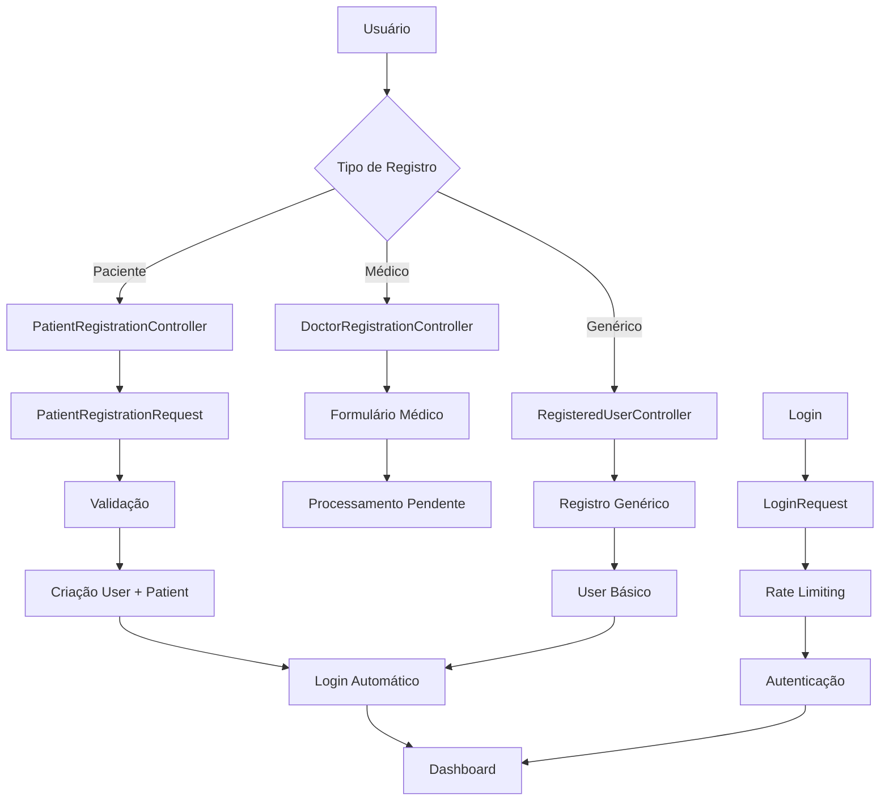

# Lógica de Registro de Usuários - TelemedicinaParaTodos

## Visão Geral

O sistema de registro suporta diferentes tipos de usuários (pacientes e médicos) com perfis específicos, seguindo o padrão MVC do Laravel.

## Estrutura Lógica

### Controllers

#### PatientRegistrationController
- **Responsabilidade**: Gerencia registro de pacientes
- **Métodos**: create() (formulário), store() (processamento)

#### DoctorRegistrationController  
- **Responsabilidade**: Gerencia registro de médicos
- **Status**: Parcialmente implementado (falta store())

#### RegisteredUserController
- **Responsabilidade**: Registro genérico (fallback)
- **Métodos**: create() (seleção), store() (processamento)

### Requests

#### PatientRegistrationRequest
- **Responsabilidade**: Validação de dados de pacientes
- **Campos obrigatórios**: name, email, password, gender, date_of_birth, phone_number
- **Campos opcionais**: emergency_contact, medical_history, allergies, etc.
- **Recursos**: Mensagens em português, validação de unicidade

#### DoctorRegistrationRequest
- **Responsabilidade**: Validação de dados de pacientes
- **Campos obrigatórios**: name, email, password, gender, date_of_birth, phone_number
- **Campos opcionais**: emergency_contact, medical_history, allergies, etc.
- **Recursos**: Mensagens em português, validação de unicidade

#### LoginRequest
- **Responsabilidade**: Validação e autenticação
- **Recursos**: Rate limiting (5 tentativas), proteção contra força bruta

### Models

#### User
- **Responsabilidade**: Modelo base de usuário
- **Relacionamentos**: hasOne(Doctor), hasOne(Patient)
- **Métodos**: isDoctor(), isPatient(), getRole()
- **Campos**: name, email, password

#### Patient
- **Responsabilidade**: Perfil específico de paciente
- **Relacionamento**: belongsTo(User)
- **Campos**: gender, date_of_birth, phone_number, medical_history, etc.
- **Recursos**: Soft deletes, scopes, accessors, mutators

#### Doctor
- **Responsabilidade**: Perfil específico de médico
- **Status**: Modelo existe, implementação pendente

### Rotas

#### Middleware `guest`:
- `/register/select` - Seleção de tipo de registro
- `/register/patient` - Formulário de paciente
- `/register/doctor` - Formulário de médico
- `/register` - Registro genérico

#### Middleware `auth`:
- Verificação de email
- Confirmação de senha  
- Logout

## Fluxo de Registro

### Pacientes
1. **Seleção**: Usuário escolhe tipo de registro
2. **Formulário**: Exibe campos específicos de paciente
3. **Validação**: PatientRegistrationRequest valida dados
4. **Processamento**: Cria User + Patient em transação
5. **Login**: Autenticação automática
6. **Redirecionamento**: Dashboard

### Médicos
- **Status**: Formulário implementado, processamento pendente
- **Necessário**: DoctorRegistrationRequest, método store(), campos específicos

## Diagrama da Estrutura

Frontend (Vue) → Composable → API Call → Laravel Controller → Database
     ↓              ↓           ↓              ↓              ↓
1. Validação    2. Rate      3. POST       4. Validação   5. User + Patient
   Client-side    Limit       /register/    Server-side    Created
                  Check       patient