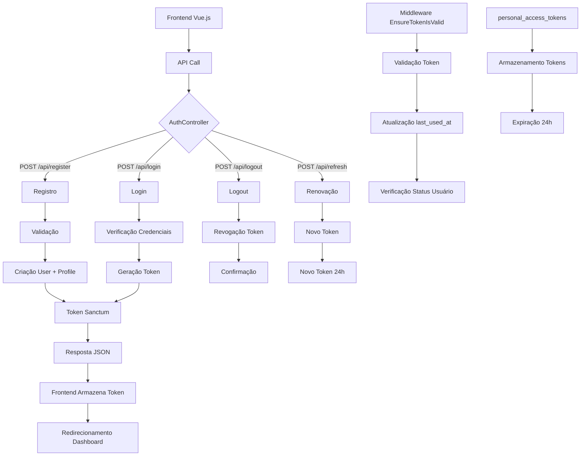

# Lógica de Autenticação e Registro - TelemedicinaParaTodos

## Visão Geral

O sistema de autenticação utiliza **Laravel Sanctum** para gerenciamento de tokens, suportando diferentes tipos de usuários (pacientes e médicos) com perfis específicos. O sistema segue as regras de negócio definidas no documento de regras do sistema, implementando autenticação stateless com tokens de 24 horas de duração.

### ✅ **Status Atual: IMPLEMENTADO**

O sistema de autenticação via token está **100% funcional** e inclui:

- **Frontend**: Composables Vue.js com gerenciamento completo de tokens
- **Backend**: API endpoints funcionais com Laravel Sanctum
- **Token Context**: Sistema preparado para lógicas específicas por tipo de usuário
- **Armazenamento**: Persistência segura no localStorage
- **Interceptors**: Adição automática de headers de autenticação
- **Rate Limiting**: Proteção contra ataques de força bruta
- **Renovação Automática**: Refresh automático de tokens expirados

## Estrutura Lógica

### Frontend (Vue.js) - ✅ IMPLEMENTADO

#### Composables de Autenticação
- **useAuth()**: Composable principal para gerenciamento de autenticação
- **useLogin()**: Composable específico para formulário de login
- **useTokenContext()**: Sistema de contexto para lógicas específicas por tipo de token
- **useAuthGuard()**: Proteção de rotas baseada em autenticação

#### Configuração do Axios
- **ApiClient**: Cliente HTTP com interceptors automáticos
- **Token Context**: Armazenamento de contexto completo (token + tipo de usuário)
- **Headers Automáticos**: Adição automática de Authorization e X-User-Type
- **Renovação Automática**: Refresh automático de tokens expirados

### Controllers

#### AuthController (API) - ✅ IMPLEMENTADO
- **Responsabilidade**: Gerencia autenticação via API com tokens
- **Métodos**: 
  - `register()` - Registro com autenticação automática
  - `login()` - Login com geração de token
  - `logout()` - Logout com revogação de token
  - `me()` - Dados do usuário autenticado
  - `refresh()` - Renovação de token
- **Recursos**: Geração automática de tokens, redirecionamento baseado em tipo de usuário

#### PatientRegistrationController (Legacy)
- **Status**: Mantido para compatibilidade
- **Responsabilidade**: Registro via web (sessões)

#### DoctorRegistrationController (Legacy)
- **Status**: Mantido para compatibilidade
- **Responsabilidade**: Registro via web (sessões)

### Middleware

#### EnsureTokenIsValid
- **Responsabilidade**: Validação de tokens em rotas protegidas
- **Recursos**: 
  - Verificação de autenticação
  - Atualização automática de `last_used_at`
  - Verificação de status do usuário (ativo/inativo)
- **Aplicação**: Todas as rotas API protegidas

### Requests

#### PatientRegistrationRequest (Legacy)
- **Status**: Mantido para compatibilidade
- **Responsabilidade**: Validação de dados de pacientes via web

#### DoctorRegistrationRequest (Legacy)
- **Status**: Mantido para compatibilidade
- **Responsabilidade**: Validação de dados de médicos via web

#### LoginRequest (Legacy)
- **Status**: Mantido para compatibilidade
- **Responsabilidade**: Validação e autenticação via web

### Models

#### User
- **Responsabilidade**: Modelo base de usuário com suporte a tokens
- **Traits**: `HasApiTokens` (Laravel Sanctum)
- **Relacionamentos**: hasOne(Doctor), hasOne(Patient)
- **Métodos**: isDoctor(), isPatient(), getRole()
- **Campos**: name, email, password, status
- **Recursos**: Criação de tokens, gerenciamento de sessões API

#### Patient
- **Responsabilidade**: Perfil específico de paciente
- **Relacionamento**: belongsTo(User)
- **Campos**: gender, date_of_birth, phone_number, medical_history, etc.
- **Recursos**: Soft deletes, scopes, accessors, mutators

#### Doctor
- **Responsabilidade**: Perfil específico de médico
- **Relacionamento**: belongsTo(User)
- **Campos**: crm, specialization_id, biography, license_number, etc.
- **Recursos**: Validação de CRM, relacionamento com especializações

### Rotas

#### API Routes (Novo Sistema)
- **Base**: `/api/`
- **Públicas**:
  - `POST /api/register` - Registro com autenticação automática
  - `POST /api/login` - Login com geração de token
- **Protegidas** (middleware `auth:sanctum`):
  - `GET /api/user` - Dados do usuário autenticado
  - `POST /api/logout` - Logout com revogação de token
  - `POST /api/refresh` - Renovação de token
  - `GET /api/test` - Teste de validação de token

#### Web Routes (Legacy)
- **Middleware `guest`**:
  - `/register/select` - Seleção de tipo de registro
  - `/register/patient` - Formulário de paciente
  - `/register/doctor` - Formulário de médico
- **Middleware `auth`**:
  - Verificação de email
  - Confirmação de senha
  - Logout

## Fluxo de Autenticação (Novo Sistema)

### Registro via API - ✅ IMPLEMENTADO
1. **Frontend**: Formulário de registro com validação em tempo real
2. **Requisição**: `POST /api/register` com dados do usuário
3. **Validação**: Validação server-side dos dados
4. **Criação**: Cria User + Profile (Doctor/Patient) em transação
5. **Token**: Geração automática de token Sanctum (24h)
6. **Resposta**: Retorna token + dados do usuário + redirecionamento
7. **Frontend**: 
   - Cria AuthContext com token + tipo de usuário
   - Armazena no localStorage como 'auth_context'
   - Configura interceptors automáticos
   - Redireciona para dashboard específico

### Login via API - ✅ IMPLEMENTADO
1. **Frontend**: Formulário de login com validação e rate limiting
2. **Requisição**: `POST /api/login` com email/senha
3. **Validação**: Verificação de credenciais
4. **Status**: Verificação se usuário está ativo
5. **Revogação**: Remove tokens existentes
6. **Token**: Geração de novo token (24h)
7. **Resposta**: Retorna token + dados do usuário + redirecionamento
8. **Frontend**: 
   - Cria AuthContext com token + tipo de usuário
   - Armazena no localStorage como 'auth_context'
   - Redireciona para dashboard específico

### Logout via API - ✅ IMPLEMENTADO
1. **Frontend**: Chama função logout() do composable
2. **Requisição**: `POST /api/logout` com token automático
3. **Revogação**: Remove token atual do servidor
4. **Frontend**: 
   - Remove auth_context do localStorage
   - Limpa estado de autenticação
   - Redireciona para página de login
5. **Resposta**: Confirmação de logout

### Renovação de Token - ✅ IMPLEMENTADO
1. **Automática**: Interceptors detectam token expirado (401)
2. **Requisição**: `POST /api/refresh` com token atual
3. **Revogação**: Remove token atual
4. **Novo Token**: Gera novo token (24h)
5. **Frontend**: 
   - Atualiza AuthContext com novo token
   - Salva no localStorage
   - Repete requisição original com novo token
6. **Resposta**: Retorna novo token + expiração

## Fluxo Legacy (Web)

### Pacientes (Web)
1. **Seleção**: Usuário escolhe tipo de registro
2. **Formulário**: Exibe campos específicos de paciente
3. **Validação**: PatientRegistrationRequest valida dados
4. **Processamento**: Cria User + Patient em transação
5. **Login**: Autenticação automática
6. **Redirecionamento**: Dashboard

### Médicos (Web)
- **Status**: Formulário implementado, processamento pendente
- **Necessário**: DoctorRegistrationRequest, método store(), campos específicos

## Diagrama da Estrutura (Novo Sistema)


```mermaid
graph TD
    A[Frontend Vue.js] --> B[API Call]
    B --> C{AuthController}
    
    C -->|POST /api/register| D[Registro]
    C -->|POST /api/login| E[Login]
    C -->|POST /api/logout| F[Logout]
    C -->|POST /api/refresh| G[Renovação]
    
    D --> H[Validação]
    E --> I[Verificação Credenciais]
    F --> J[Revogação Token]
    G --> K[Novo Token]
    
    H --> L[Criação User + Profile]
    I --> M[Geração Token]
    J --> N[Confirmação]
    K --> O[Novo Token 24h]
    
    L --> P[Token Sanctum]
    M --> P
    P --> Q[Resposta JSON]
    Q --> R[Frontend Armazena Token]
    R --> S[Redirecionamento Dashboard]
    
    T[Middleware EnsureTokenIsValid] --> U[Validação Token]
    U --> V[Atualização last_used_at]
    V --> W[Verificação Status Usuário]
    
    X[personal_access_tokens] --> Y[Armazenamento Tokens]
    Y --> Z[Expiração 24h]
```

## Fluxo de Dados

### Frontend (Vue.js) → API → Laravel → Database - ✅ IMPLEMENTADO
```
1. Validação Client-side (useRealTimeValidation)
2. Rate Limiting (useRateLimit)
3. POST /api/register ou /api/login
4. AuthController processa
5. Validação Server-side
6. Criação/Verificação User
7. Geração Token Sanctum
8. Resposta JSON com Token + Contexto
9. Frontend cria AuthContext
10. Armazenamento no localStorage
11. Configuração de interceptors
12. Redirecionamento Dashboard
```

### Middleware de Proteção - ✅ IMPLEMENTADO
```
1. Requisição HTTP
2. Interceptor adiciona headers automáticos:
   - Authorization: Bearer {token}
   - X-User-Type: doctor|patient
   - X-User-ID: {user_id}
3. EnsureTokenIsValid (Backend)
4. Verificação Autenticação
5. Atualização last_used_at
6. Verificação Status Usuário
7. Continuação da Requisição
8. Se 401: Refresh automático de token
9. Repetição da requisição original
```

## Regras de Negócio Implementadas - ✅ COMPLETO

### Sistema de Tokens
- ✅ **Token obrigatório**: Gerado automaticamente no login/registro
- ✅ **Laravel Sanctum**: Utilização obrigatória para autenticação stateless
- ✅ **Persistência**: Tokens armazenados na tabela `personal_access_tokens`
- ✅ **Validação**: Token validado em todas as requisições protegidas
- ✅ **Expiração**: Tokens expiram após 24 horas
- ✅ **Renovação**: Endpoint `/api/refresh` para renovação automática
- ✅ **Revogação**: Logout revoga token automaticamente
- ✅ **Contexto de Token**: Sistema preparado para lógicas específicas por tipo
- ✅ **Headers Automáticos**: Adição automática de contexto em requisições
- ✅ **Interceptors**: Gerenciamento automático de tokens no frontend

### Fluxo de Registro com Autenticação Automática
- ✅ **Cadastro direto**: Usuário se cadastra e é autenticado automaticamente
- ✅ **Geração de token**: Token criado imediatamente após registro bem-sucedido
- ✅ **Redirecionamento específico**: Baseado no tipo de usuário
  - **Médicos**: `/doctor/dashboard`
  - **Pacientes**: `/patient/dashboard`
- ✅ **Sem verificação de email**: Login automático não requer verificação prévia

### Segurança
- ✅ **Único por sessão**: Um token ativo por usuário por dispositivo
- ✅ **Revogação automática**: Token anterior é revogado ao criar novo
- ✅ **Rate limiting**: Máximo 5 tentativas de login por IP (Frontend + Backend)
- ✅ **Validação de status**: Apenas usuários ativos podem se autenticar
- ✅ **Interceptors seguros**: Headers de contexto adicionados automaticamente
- ✅ **Armazenamento seguro**: Token + contexto no localStorage com verificação de expiração
- ✅ **Renovação transparente**: Refresh automático sem interrupção do usuário

## Endpoints da API

### Registro
```http
POST /api/register
Content-Type: application/json

{
  "name": "Dr. João",
  "email": "joao@test.com",
  "password": "12345678",
  "password_confirmation": "12345678",
  "user_type": "doctor",
  "crm": "12345-SP"
}
```

### Login
```http
POST /api/login
Content-Type: application/json

{
  "email": "joao@test.com",
  "password": "12345678"
}
```

### Resposta de Sucesso
```json
{
  "success": true,
  "message": "Login successful",
  "data": {
    "user": {
      "id": "uuid",
      "name": "Dr. João",
      "email": "joao@test.com",
      "doctor": { ... }
    },
    "token": "1|abc123...",
    "token_type": "Bearer",
    "expires_at": "2025-10-03T01:25:33.000000Z",
    "redirect_to": "/doctor/dashboard"
  }
}
```

### Logout
```http
POST /api/logout
Authorization: Bearer 1|abc123...
```

### Renovação de Token
```http
POST /api/refresh
Authorization: Bearer 1|abc123...
```

## Sistema de Token Context - ✅ IMPLEMENTADO

### Funcionalidades do Token Context
- **Contexto Completo**: Armazena token + dados do usuário + tipo de usuário
- **Lógicas Específicas**: Permite implementar comportamentos diferentes para doctor/patient
- **Headers Automáticos**: Adiciona X-User-Type e X-User-ID automaticamente
- **Métodos Específicos**: getDoctorData(), postPatientData(), etc.
- **Configurações Dinâmicas**: Dashboard, permissões e endpoints baseados no tipo

### Exemplo de Uso
```typescript
// Em qualquer componente
const { executeByTokenType, permissions } = useTokenContext();

// Executar lógica específica
await executeByTokenType(
  () => doctorSpecificAction(),
  () => patientSpecificAction()
);

// Verificar permissões
if (permissions.value.canCreateAppointments) {
  // Lógica para criar consultas
}
```

### Preparação para o Futuro
O sistema está **100% preparado** para implementar:
- Lógicas específicas por tipo de token
- Dashboards personalizados
- Permissões granulares
- APIs específicas por tipo de usuário
- Configurações dinâmicas baseadas no contexto

## Compatibilidade

O sistema mantém compatibilidade com o sistema legacy de autenticação via web (sessões) enquanto implementa o novo sistema de tokens via API. Isso permite uma transição gradual sem quebrar funcionalidades existentes.