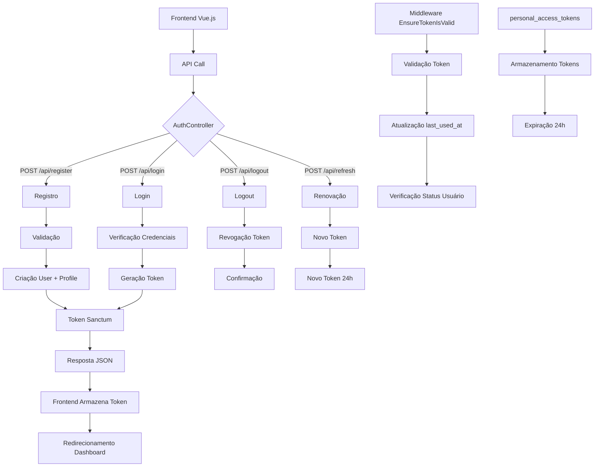

# Lógica de Autenticação e Registro - TelemedicinaParaTodos

## Visão Geral

O sistema de autenticação utiliza **Laravel Sanctum** para gerenciamento de tokens, suportando diferentes tipos de usuários (pacientes e médicos) com perfis específicos. O sistema segue as regras de negócio definidas no documento de regras do sistema, implementando autenticação stateless com tokens de 24 horas de duração.

## Estrutura Lógica

### Controllers

#### AuthController (API)
- **Responsabilidade**: Gerencia autenticação via API com tokens
- **Métodos**: 
  - `register()` - Registro com autenticação automática
  - `login()` - Login com geração de token
  - `logout()` - Logout com revogação de token
  - `me()` - Dados do usuário autenticado
  - `refresh()` - Renovação de token
- **Recursos**: Geração automática de tokens, redirecionamento baseado em tipo de usuário

#### PatientRegistrationController (Legacy)
- **Status**: Mantido para compatibilidade
- **Responsabilidade**: Registro via web (sessões)

#### DoctorRegistrationController (Legacy)
- **Status**: Mantido para compatibilidade
- **Responsabilidade**: Registro via web (sessões)

### Middleware

#### EnsureTokenIsValid
- **Responsabilidade**: Validação de tokens em rotas protegidas
- **Recursos**: 
  - Verificação de autenticação
  - Atualização automática de `last_used_at`
  - Verificação de status do usuário (ativo/inativo)
- **Aplicação**: Todas as rotas API protegidas

### Requests

#### PatientRegistrationRequest (Legacy)
- **Status**: Mantido para compatibilidade
- **Responsabilidade**: Validação de dados de pacientes via web

#### DoctorRegistrationRequest (Legacy)
- **Status**: Mantido para compatibilidade
- **Responsabilidade**: Validação de dados de médicos via web

#### LoginRequest (Legacy)
- **Status**: Mantido para compatibilidade
- **Responsabilidade**: Validação e autenticação via web

### Models

#### User
- **Responsabilidade**: Modelo base de usuário com suporte a tokens
- **Traits**: `HasApiTokens` (Laravel Sanctum)
- **Relacionamentos**: hasOne(Doctor), hasOne(Patient)
- **Métodos**: isDoctor(), isPatient(), getRole()
- **Campos**: name, email, password, status
- **Recursos**: Criação de tokens, gerenciamento de sessões API

#### Patient
- **Responsabilidade**: Perfil específico de paciente
- **Relacionamento**: belongsTo(User)
- **Campos**: gender, date_of_birth, phone_number, medical_history, etc.
- **Recursos**: Soft deletes, scopes, accessors, mutators

#### Doctor
- **Responsabilidade**: Perfil específico de médico
- **Relacionamento**: belongsTo(User)
- **Campos**: crm, specialization_id, biography, license_number, etc.
- **Recursos**: Validação de CRM, relacionamento com especializações

### Rotas

#### API Routes (Novo Sistema)
- **Base**: `/api/`
- **Públicas**:
  - `POST /api/register` - Registro com autenticação automática
  - `POST /api/login` - Login com geração de token
- **Protegidas** (middleware `auth:sanctum`):
  - `GET /api/user` - Dados do usuário autenticado
  - `POST /api/logout` - Logout com revogação de token
  - `POST /api/refresh` - Renovação de token
  - `GET /api/test` - Teste de validação de token

#### Web Routes (Legacy)
- **Middleware `guest`**:
  - `/register/select` - Seleção de tipo de registro
  - `/register/patient` - Formulário de paciente
  - `/register/doctor` - Formulário de médico
- **Middleware `auth`**:
  - Verificação de email
  - Confirmação de senha
  - Logout

## Fluxo de Autenticação (Novo Sistema)

### Registro via API
1. **Requisição**: `POST /api/register` com dados do usuário
2. **Validação**: Validação server-side dos dados
3. **Criação**: Cria User + Profile (Doctor/Patient) em transação
4. **Token**: Geração automática de token Sanctum (24h)
5. **Resposta**: Retorna token + dados do usuário + redirecionamento
6. **Frontend**: Armazena token e redireciona para dashboard

### Login via API
1. **Requisição**: `POST /api/login` com email/senha
2. **Validação**: Verificação de credenciais
3. **Status**: Verificação se usuário está ativo
4. **Revogação**: Remove tokens existentes
5. **Token**: Geração de novo token (24h)
6. **Resposta**: Retorna token + dados do usuário

### Logout via API
1. **Requisição**: `POST /api/logout` com token
2. **Revogação**: Remove token atual
3. **Resposta**: Confirmação de logout

### Renovação de Token
1. **Requisição**: `POST /api/refresh` com token válido
2. **Revogação**: Remove token atual
3. **Novo Token**: Gera novo token (24h)
4. **Resposta**: Retorna novo token

## Fluxo Legacy (Web)

### Pacientes (Web)
1. **Seleção**: Usuário escolhe tipo de registro
2. **Formulário**: Exibe campos específicos de paciente
3. **Validação**: PatientRegistrationRequest valida dados
4. **Processamento**: Cria User + Patient em transação
5. **Login**: Autenticação automática
6. **Redirecionamento**: Dashboard

### Médicos (Web)
- **Status**: Formulário implementado, processamento pendente
- **Necessário**: DoctorRegistrationRequest, método store(), campos específicos

## Diagrama da Estrutura (Novo Sistema)


```mermaid
graph TD
    A[Frontend Vue.js] --> B[API Call]
    B --> C{AuthController}
    
    C -->|POST /api/register| D[Registro]
    C -->|POST /api/login| E[Login]
    C -->|POST /api/logout| F[Logout]
    C -->|POST /api/refresh| G[Renovação]
    
    D --> H[Validação]
    E --> I[Verificação Credenciais]
    F --> J[Revogação Token]
    G --> K[Novo Token]
    
    H --> L[Criação User + Profile]
    I --> M[Geração Token]
    J --> N[Confirmação]
    K --> O[Novo Token 24h]
    
    L --> P[Token Sanctum]
    M --> P
    P --> Q[Resposta JSON]
    Q --> R[Frontend Armazena Token]
    R --> S[Redirecionamento Dashboard]
    
    T[Middleware EnsureTokenIsValid] --> U[Validação Token]
    U --> V[Atualização last_used_at]
    V --> W[Verificação Status Usuário]
    
    X[personal_access_tokens] --> Y[Armazenamento Tokens]
    Y --> Z[Expiração 24h]
```

## Fluxo de Dados

### Frontend (Vue.js) → API → Laravel → Database
```
1. Validação Client-side
2. POST /api/register ou /api/login
3. AuthController processa
4. Validação Server-side
5. Criação/Verificação User
6. Geração Token Sanctum
7. Resposta JSON com Token
8. Frontend armazena Token
9. Redirecionamento Dashboard
```

### Middleware de Proteção
```
1. Requisição com Token
2. EnsureTokenIsValid
3. Verificação Autenticação
4. Atualização last_used_at
5. Verificação Status Usuário
6. Continuação da Requisição
```

## Regras de Negócio Implementadas

### Sistema de Tokens
- ✅ **Token obrigatório**: Gerado automaticamente no login/registro
- ✅ **Laravel Sanctum**: Utilização obrigatória para autenticação stateless
- ✅ **Persistência**: Tokens armazenados na tabela `personal_access_tokens`
- ✅ **Validação**: Token validado em todas as requisições protegidas
- ✅ **Expiração**: Tokens expiram após 24 horas
- ✅ **Renovação**: Endpoint `/api/refresh` para renovação automática
- ✅ **Revogação**: Logout revoga token automaticamente

### Fluxo de Registro com Autenticação Automática
- ✅ **Cadastro direto**: Usuário se cadastra e é autenticado automaticamente
- ✅ **Geração de token**: Token criado imediatamente após registro bem-sucedido
- ✅ **Redirecionamento específico**: Baseado no tipo de usuário
  - **Médicos**: `/doctor/dashboard`
  - **Pacientes**: `/patient/dashboard`
- ✅ **Sem verificação de email**: Login automático não requer verificação prévia

### Segurança
- ✅ **Único por sessão**: Um token ativo por usuário por dispositivo
- ✅ **Revogação automática**: Token anterior é revogado ao criar novo
- ✅ **Rate limiting**: Máximo 5 tentativas de login por IP
- ✅ **Validação de status**: Apenas usuários ativos podem se autenticar

## Endpoints da API

### Registro
```http
POST /api/register
Content-Type: application/json

{
  "name": "Dr. João",
  "email": "joao@test.com",
  "password": "12345678",
  "password_confirmation": "12345678",
  "user_type": "doctor",
  "crm": "12345-SP"
}
```

### Login
```http
POST /api/login
Content-Type: application/json

{
  "email": "joao@test.com",
  "password": "12345678"
}
```

### Resposta de Sucesso
```json
{
  "success": true,
  "message": "Login successful",
  "data": {
    "user": {
      "id": "uuid",
      "name": "Dr. João",
      "email": "joao@test.com",
      "doctor": { ... }
    },
    "token": "1|abc123...",
    "token_type": "Bearer",
    "expires_at": "2025-10-03T01:25:33.000000Z",
    "redirect_to": "/doctor/dashboard"
  }
}
```

### Logout
```http
POST /api/logout
Authorization: Bearer 1|abc123...
```

### Renovação de Token
```http
POST /api/refresh
Authorization: Bearer 1|abc123...
```

## Compatibilidade

O sistema mantém compatibilidade com o sistema legacy de autenticação via web (sessões) enquanto implementa o novo sistema de tokens via API. Isso permite uma transição gradual sem quebrar funcionalidades existentes.