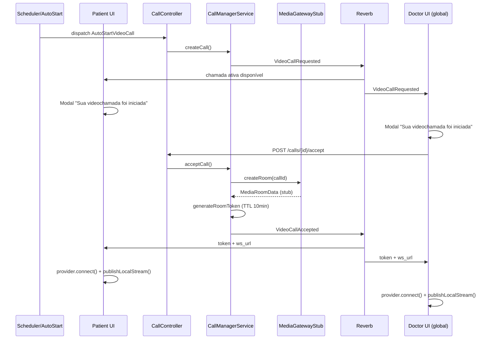
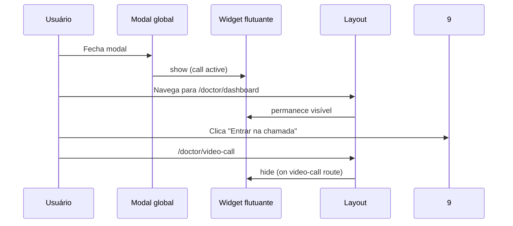

# Feature Spec — MediaGateway estável + UI persistente de videochamada

> Status: `draft`
> Autor: Tech Lead Agent · Data: 2026-05-24
> Relacionado: [`mediasoup-integration.md`](./mediasoup-integration.md) (integração SFU real — **fora de escopo desta entrega**)

---

## Objetivo

Estabilizar o fluxo Laravel ↔ `MediaGatewayInterface` para operar **sem SFU real** em dev/local, ajustar TTL do JWT para **10 minutos**, e entregar **modal + widget flutuante persistentes** que acompanham a videochamada em qualquer página autenticada.

## Motivação

- O PO explicitou: **sem integração SFU real por enquanto** — foco em correções de aplicação.
- Inconsistências atuais quebram o fluxo em stub (JWT obrigatório, `useSfu` tenta WS real, estado local perdido ao navegar).
- UX atual exige permanecer na página `VideoCall.vue`; não há retorno rápido após navegação.

---

## Escopo

### IN

| #   | Item                                                                                |
| --- | ----------------------------------------------------------------------------------- |
| 1   | Revisão/correção completa do contrato e implementações `MediaGatewayInterface`      |
| 2   | Estabilização de `CallManagerService` + binding `AppServiceProvider` para modo stub |
| 3   | TTL JWT: `telemedicine.video_call.token_ttl_minutes = 10`                           |
| 4   | Estado global frontend de sessão de chamada com Pinia                               |
| 5   | Modal principal ao criar/iniciar chamada                                            |
| 6   | Widget flutuante global persistente (fora da tela de videochamada)                  |
| 7   | Regras de exibição inteligente (sem duplicação, cleanup ao encerrar)                |
| 8   | Endpoint de recuperação de chamada ativa (refresh/navegação)                        |
| 9   | Modo stub de mídia no frontend (`useSfu`) — simula conexão sem WS real              |
| 10  | Testes unit/feature recomendados                                                    |
| 11  | Modo estrito SFU (fail-closed) sem fallback automático em indisponibilidade         |

### OUT

| Item                                                | Motivo                                                 |
| --------------------------------------------------- | ------------------------------------------------------ |
| Deploy/config de mediasoup-server real              | Spec futura: `mediasoup-integration.md`                |
| Alterações de protocolo WS SFU                      | Fora de escopo                                         |
| Sincronização multi-aba avançada (leader election)  | Fase 2 — apenas mitigação básica nesta entrega         |
| Alterações em `AutoStartVideoCall` schedule         | Manter comportamento; apenas consumir estado corrigido |
| Fallback automático de `sfu` para `stub` em runtime | Explicitamente proibido neste documento                |

---

## Estado atual vs desejado

### Backend — inconsistências identificadas

| #   | Problema                                                                    | Evidência                                                                     | Estado desejado                                                                                               |
| --- | --------------------------------------------------------------------------- | ----------------------------------------------------------------------------- | ------------------------------------------------------------------------------------------------------------- |
| B1  | `token_ttl_minutes` **ausente** em `config/telemedicine.php`                | `CallManagerService` usa fallback `5`; `SfuTestRoomService` usa fallback `60` | Chave única em config com valor **10**                                                                        |
| B2  | Regra de secret JWT inconsistente entre ambientes                           | Fallbacks diferentes e condicionais por ambiente                              | Exigir `SFU_JWT_SECRET` sempre que `VIDEO_CALL_ENABLED=true`                                                  |
| B3  | `STATUS_RINGING` existe no model/DB mas **nunca é persistido** pelo backend | `createCall()` grava `requested`; frontend seta `ringing` local via Echo      | Backend transiciona para `ringing` ao emitir `VideoCallRequested` **ou** remover `ringing` do domínio backend |
| B4  | `sfu_ws_url` lido direto de `config/services.php` no `CallManagerService`   | Acoplamento gateway ↔ config; stub não informa URL                           | Gateway retorna metadados de mídia via DTO tipado                                                             |
| B5  | Interface retorna `array` não tipado                                        | PHPDoc apenas; sem value object                                               | DTO `MediaRoomData` (ou array shape documentado + validação)                                                  |
| B6  | `destroyRoom` stub é no-op; registro `Room` permanece                       | Sem impacto funcional imediato, mas inconsistente                             | Manter registro (auditoria); gateway stub loga e retorna sucesso                                              |
| B7  | Binding Http exige **ambos** `sfu_http_url` + `api_secret`                  | Parcial config → stub silencioso                                              | Documentar matriz de binding; log `info` no boot indicando provider ativo                                     |
| B8  | Falta regra fail-closed quando provider SFU fica indisponível               | `accept` pode falhar tardiamente sem política explícita                       | Bloquear ações de servidor com `503` enquanto SFU estiver indisponível                                        |

### Frontend — inconsistências identificadas

| #   | Problema                                                  | Evidência                                                 | Estado desejado                                                                                                             |
| --- | --------------------------------------------------------- | --------------------------------------------------------- | --------------------------------------------------------------------------------------------------------------------------- |
| F1  | `useVideoCall()` cria **nova instância** por página       | `ref()` locais; Echo recriado em cada mount               | Singleton de sessão compartilhado                                                                                           |
| F2  | Estado **perdido ao navegar**                             | Inertia desmonta página                                   | Store global Pinia + bootstrap em layout                                                                                    |
| F3  | Echo duplicado: `configureEcho` em `app.ts` **não usado** | `useVideoCall` instancia `laravel-echo` manualmente       | Unificar via `@laravel/echo-vue` centralizando listeners no root + Pinia                                                    |
| F4  | `useSfu` sem contrato estável entre stub/SFU              | Hoje mistura conexão WS, mídia e estado em um fluxo único | Adapter com contrato único (`connect`, `disconnect`, `publishLocalStream`, `subscribeToRemoteStream`, `getConnectionState`) |
| F5  | Modal/widget **só existem** em `VideoCall.vue`            | Sem componente global                                     | Montar em `AppSidebarLayout.vue`                                                                                            |
| F6  | Sem recuperação após refresh                              | Nenhum `GET /calls/active`                                | Bootstrap via endpoint + Inertia shared prop opcional                                                                       |
| F7  | Ação de chat compete com prioridade da chamada            | `FloatingButton.vue` fixo no layout                       | Remover/desabilitar `FloatingButton` de chat e priorizar widget da chamada no canto superior direito                        |

---

## Perguntas de refinamento (com assumptions)

> PO não respondeu nesta rodada — defaults abaixo são **assumptions oficiais** para implementação.

| #   | Pergunta                                                           | Referência                                         | Assumption adotada                                                                                                            |
| --- | ------------------------------------------------------------------ | -------------------------------------------------- | ----------------------------------------------------------------------------------------------------------------------------- |
| Q1  | Estado global: adicionar **Pinia** ou **singleton composable**?    | Escalabilidade de estado cross-layout e cross-page | **Pinia** com store dedicada (`useVideoCallStore`)                                                                            |
| Q2  | Em stub, `useSfu` deve simular mídia ou apenas marcar `connected`? | `useSfu.ts` tenta WS + getUserMedia                | **Connected + preview local**, via adapter stub com o **mesmo contrato** do provider SFU real                                 |
| Q3  | JWT em dev sem `SFU_JWT_SECRET`: fallback ou erro?                 | `CallManagerService::generateRoomToken`            | **Erro explícito**: exigir `SFU_JWT_SECRET` quando `VIDEO_CALL_ENABLED=true`                                                  |
| Q4  | Modal aparece para caller/callee ou para todos participantes?      | Chamada é auto-iniciada pelo sistema               | Modal global idêntica para médico e paciente quando houver chamada ativa e usuário estiver fora da rota de vídeo              |
| Q5  | Sincronização entre abas?                                          | Echo por aba                                       | **BroadcastChannel** `video-call-session` para sync de estado; Echo permanece por aba                                         |
| Q6  | Recuperação pós-refresh: endpoint dedicado ou prop Inertia?        | Sem endpoint hoje                                  | **`GET /calls/active`** + hydrate no mount do layout                                                                          |
| Q7  | Widget vs `FloatingButton` chat: empilhar ou ocultar chat?         | Chamadas têm prioridade de UX                      | **Remover/desabilitar chat FAB** e posicionar widget de vídeo em `top-right` (`top-6 right-6`; mobile `top-4 right-4 left-4`) |

---

## Regras de negócio

1. Chamada **ativa** = status `requested`, `ringing` ou `accepted` (alinhado a `Call::isActive()`).
2. Modal principal exibe quando houver chamada ativa e usuário não estiver na rota de vídeo; fechar modal → widget assume persistência.
3. Na rota de videochamada (`/doctor/video-call`, `/patient/video-call`): **nenhum** modal/widget global.
4. Chamada encerrada/rejeitada (`ended`, `rejected`, `missed`): remover modal, widget e limpar sessão global.
5. Botão "Entrar na chamada" navega para rota role-aware (`doctor.video-call` / `patient.video-call`) para qualquer participante.
6. TTL JWT = **10 minutos** (config centralizada).
7. Modo stub: mantém o mesmo contrato do provider SFU real para evitar descarte de código ao integrar SFU.
8. Com `MEDIA_GATEWAY_PROVIDER=sfu`, ausência de conectividade/healthcheck SFU implica **bloqueio fail-closed** de ações de servidor (sem fallback automático para `stub`).

---

## Arquitetura proposta

### Backend — MediaGateway

```
CallController
    └─ CallManagerService
           ├─ MediaGatewayInterface (binding AppServiceProvider)
           │      ├─ MediaGatewayStub   (sem SFU_HTTP_URL ou api_secret)
           │      └─ MediaGatewayHttp   (futuro — mediasoup-integration.md)
           ├─ generateRoomToken() ← VIDEO_CALL_ENABLED + SFU_JWT_SECRET obrigatório
           └─ Events: VideoCallRequested | Accepted | Rejected | Ended
```

#### Alterações estruturais

| Alteração                           | Detalhe                                                                              |
| ----------------------------------- | ------------------------------------------------------------------------------------ |
| DTO `MediaRoomData`                 | `room_id`, `sfu_node`, `media_ws_url` (nullable em stub)                             |
| `MediaGatewayInterface::createRoom` | Retorna `MediaRoomData`                                                              |
| `MediaGatewayStub`                  | `DERoomId determinístico: `stub\_{callId}`; `media_ws_url = null`                    |
| `CallManagerService::acceptCall`    | Usa `media_ws_url` do gateway; fallback config apenas se gateway retornar null       |
| `CallManagerService::createCall`    | Persistir estado único de chamada ativa sem diferenciar caller/callee para UX global |
| JWT obrigatório                     | Validar `VIDEO_CALL_ENABLED=true` ⇒ `SFU_JWT_SECRET` obrigatório (inclusive em stub) |
| Novo endpoint                       | `GET /calls/active` → chamada ativa do usuário autenticado                           |

#### Binding provider (matriz)

| `MEDIA_GATEWAY_PROVIDER` | `SFU_HTTP_URL`     | `SFU_API_SECRET`   | Provider efetivo         | Política                                                 |
| ------------------------ | ------------------ | ------------------ | ------------------------ | -------------------------------------------------------- |
| `stub`                   | \*                 | \*                 | `MediaGatewayStub`       | Ambiente sem SFU real (desenvolvimento controlado)       |
| `sfu`                    | set                | set                | `MediaGatewayHttp`       | **Obrigatório healthcheck**; fail-closed se indisponível |
| `sfu`                    | vazio/set inválido | vazio/set inválido | **Erro de configuração** | Não sobe módulo de videochamada                          |

#### Política de indisponibilidade SFU (fail-closed)

| Cenário                                                         | Resultado                                                |
| --------------------------------------------------------------- | -------------------------------------------------------- |
| Provider = `sfu` e healthcheck falhou                           | Retornar `503 Service Unavailable` nas ações críticas    |
| Provider = `sfu` e timeout em `createRoom`                      | Falhar request sem fallback para `stub`; log estruturado |
| Provider = `sfu` e reconnect do frontend sem backend disponível | Exibir erro de indisponibilidade e manter estado seguro  |

Ações críticas bloqueadas com `503` quando SFU indisponível:

- `POST /calls/{call}/accept`
- criação de sala no gateway
- operações de publish/subscribe mediadas pelo backend
- (opcional por flag) `POST /calls` para impedir abertura de chamada sem capacidade de mídia

### Frontend — sessão global + UI

```
app.ts (configureEcho)
    └─ AppSidebarLayout.vue
           ├─ VideoCallSessionRoot (init Echo + bootstrap active call)
           ├─ VideoCallActiveModal.vue
           ├─ VideoCallFloatingWidget.vue
           └─ <slot /> páginas Inertia
                    └─ Doctor|Patient/VideoCall.vue (consome mesma sessão)
```

#### Camadas (separação)

| Camada     | Responsabilidade                                          | Artefato                                             |
| ---------- | --------------------------------------------------------- | ---------------------------------------------------- |
| Estado     | callId, status, token, appointmentId, role, dismiss flags | `stores/videoCall.ts` (Pinia)                        |
| Mídia      | WebRTC/SFU ou stub com contrato comum                     | `services/video-call-media/` (`VideoMediaProvider`)  |
| UI global  | modal + widget                                            | componentes em `components/video-call/`              |
| Navegação  | rotas role-aware                                          | composable `useVideoCallNavigation.ts`               |
| Transporte | Echo + REST                                               | `useVideoCallSession.ts` (orquestra + store actions) |

#### Refatoração `useVideoCall.ts`

- Tornar wrapper sobre ações/selectors da store Pinia.
- Remover refs locais duplicados.
- `setupEchoListeners` → chamado uma vez no root global.

---

## Fluxos

### Sequência — Sistema inicia chamada (stub com contrato real)



### Sequência — Navegação com widget



---

## Modelo de estado

### Backend (`calls.status`)

| Status      | Significado                                          | Transições válidas                                       |
| ----------- | ---------------------------------------------------- | -------------------------------------------------------- |
| `requested` | Chamada criada, aguardando entrada dos participantes | → `ringing`\*, `accepted`, `rejected`, `ended`, `missed` |
| `ringing`   | Destinatário notificado\*                            | → `accepted`, `rejected`, `ended`, `missed`              |
| `accepted`  | Sala criada, tokens emitidos                         | → `ended`                                                |
| `rejected`  | Recusada                                             | terminal                                                 |
| `ended`     | Encerrada                                            | terminal                                                 |
| `missed`    | Timeout (job futuro)                                 | terminal                                                 |

\* _Decisão:_ ao emitir `VideoCallRequested`, backend atualiza status para `ringing` para todos os participantes.

### Frontend (`VideoCallSessionState`)

| Estado UI       | Condição                                                          | Modal             | Widget                |
| --------------- | ----------------------------------------------------------------- | ----------------- | --------------------- |
| `idle`          | sem chamada                                                       | ❌                | ❌                    |
| `ready_to_join` | chamada ativa (requested/ringing/accepted), fora da rota de vídeo | ✅ (até dismiss)  | ✅ se modal dismissed |
| `in_call`       | accepted                                                          | ✅ "em andamento" | ✅ se fora da rota    |
| `on_call_page`  | in_call + rota video-call                                         | ❌                | ❌                    |
| `terminated`    | ended/rejected                                                    | ❌                | ❌                    |

### Flags auxiliares

| Flag                | Tipo              | Uso                                              |
| ------------------- | ----------------- | ------------------------------------------------ |
| `modalDismissed`    | boolean           | Modal fechado manualmente → widget               |
| `isOnVideoCallPage` | computed          | Derivado de `page.url`                           |
| `mediaProvider`     | `'stub' \| 'sfu'` | Definido por config; mesma interface de provider |

---

## Frontend

### Componentes novos

| Componente                    | Path                                                         | Props / eventos                                     |
| ----------------------------- | ------------------------------------------------------------ | --------------------------------------------------- |
| `VideoCallActiveModal.vue`    | `resources/js/components/VideoCall/VideoCallActiveModal.vue` | `open`, `mode: 'active'` · `@enter`, `@dismiss`     |
| `VideoCallFloatingWidget.vue` | `components/VideoCall/VideoCallFloatingWidget.vue`           | `callStatus`, `appointmentLabel` · `@enter`, `@end` |
| `VideoCallSessionRoot.vue`    | `components/VideoCall/VideoCallSessionRoot.vue`              | Orquestra modal+widget+session init                 |

### Composables / módulos

| Artefato                                              | Responsabilidade                                                                                                |
| ----------------------------------------------------- | --------------------------------------------------------------------------------------------------------------- |
| `stores/videoCall.ts`                                 | Estado global Pinia + actions/getters                                                                           |
| `useVideoCallSession.ts`                              | Echo, REST, bootstrap, sync BroadcastChannel                                                                    |
| `useVideoCall.ts`                                     | Wrapper retrocompatível para páginas                                                                            |
| `useVideoCallNavigation.ts`                           | `enterCall()` → rota por role                                                                                   |
| `services/video-call-media/VideoMediaProvider.ts`     | Contrato comum (`connect`, `disconnect`, `publishLocalStream`, `subscribeToRemoteStream`, `getConnectionState`) |
| `services/video-call-media/StubVideoMediaProvider.ts` | Implementação local com preview e remoto vazio/aguardando                                                       |
| `services/video-call-media/SfuVideoMediaProvider.ts`  | Implementação SFU real (fase futura, mesma interface)                                                           |

### Estados de UI

| Estado        | Comportamento                                            |
| ------------- | -------------------------------------------------------- |
| Loading       | Spinner no modal durante preparação de entrada           |
| Erro          | Toast via `useToast`; sessão → `error` → cleanup após 5s |
| Modal dismiss | Widget aparece com animação no topo direito              |
| A11y          | `DialogTitle`, `aria-label`, foco trap no modal          |

### Rotas Inertia (existentes)

| Role    | Rota                      | Componente              |
| ------- | ------------------------- | ----------------------- |
| Doctor  | `GET /doctor/video-call`  | `Doctor/VideoCall.vue`  |
| Patient | `GET /patient/video-call` | `Patient/VideoCall.vue` |

---

## Backend

### Endpoints

| Método | Rota                   | Controller              | Novo?   |
| ------ | ---------------------- | ----------------------- | ------- |
| POST   | `/calls`               | `CallController@store`  | —       |
| POST   | `/calls/{call}/accept` | `CallController@accept` | —       |
| POST   | `/calls/{call}/reject` | `CallController@reject` | —       |
| POST   | `/calls/{call}/end`    | `CallController@end`    | —       |
| GET    | `/calls/{call}`        | `CallController@show`   | —       |
| GET    | `/calls/active`        | `CallController@active` | **Sim** |

#### `GET /calls/active` — 808

```json
{
    "data": {
        "call_id": "uuid",
        "appointment_id": "uuid",
        "status": "accepted",
        "role": "doctor|patient",
        "token": "…",
        "sfu_ws_url": null,
        "video_call_route": "/doctor/video-call"
    }
}
```

- `null` quando sem chamada ativa (HTTP 204 ou `data: null`).
- Autorização: usuário participante da call.
- Token incluído **somente** se status `accepted` e usuário é participante.

### Service

| Método                                           | Responsabilidade                                         |
| ------------------------------------------------ | -------------------------------------------------------- |
| `CallManagerService::getActiveCallForUser(User)` | Query call ativa + eager load appointment/doctor/patient |
| `CallManagerService::acceptCall`                 | Usar `MediaRoomData`; TTL 10min                          |
| `MediaGatewayStub::createRoom`                   | ID determinístico; log estruturado                       |

### Config changes

```php
// config/telemedicine.php — adicionar em 'video_call':
'token_ttl_minutes' => (int) env('VIDEO_CALL_TOKEN_TTL_MINUTES', 10),
'enabled' => (bool) env('VIDEO_CALL_ENABLED', true),
'require_sfu_health' => (bool) env('VIDEO_CALL_REQUIRE_SFU_HEALTH', true),
```

Atualizar referências:

- `CallManagerService` → sem fallback hardcoded `5`
- `SfuTestRoomService` → usar mesma config key
- bootstrap da aplicação → falhar rápido se `VIDEO_CALL_ENABLED=true` e `SFU_JWT_SECRET` ausente
- provider de mídia backend → respeitar `MEDIA_GATEWAY_PROVIDER` e aplicar fail-closed em `sfu`

### Autorização

- Endpoints existentes: Gates `video-call-*` via `VideoCallPolicy`
- `GET /calls/active`: middleware `auth`; Policy method `viewActive` (participante)

---

## Banco de dados

**Sem migration nova.** Status `ringing` já existe na constraint da tabela `calls`.

---

## Observabilidade

| Evento                           | Nível     | Contexto                                                           |
| -------------------------------- | --------- | ------------------------------------------------------------------ |
| Provider binding                 | `info`    | `provider: stub\|http` no boot                                     |
| `MediaGatewayStub::createRoom`   | `debug`   | `call_id`, `room_id`                                               |
| Configuração inválida de JWT     | `error`   | `VIDEO_CALL_ENABLED=true` sem `SFU_JWT_SECRET`                     |
| SFU indisponível em modo estrito | `warning` | `provider=sfu`, endpoint, motivo (`timeout`, `healthcheck_failed`) |
| Session bootstrap miss           | `debug`   | `user_id`                                                          |
| Widget/modal render              | —         | sem log (frontend)                                                 |

---

## Segurança

- Token JWT **nunca** logado.
- `GET /calls/active` retorna token só para participante autenticado em call `accepted`.
- `SFU_JWT_SECRET` obrigatório quando `VIDEO_CALL_ENABLED=true` (todos providers).
- BroadcastChannel: não transmitir token (apenas callId + status).
- Modal não expõe `roomId` — apenas callId e labels.

---

## Edge Cases

| Cenário                              | Comportamento                                                    |
| ------------------------------------ | ---------------------------------------------------------------- |
| 409 chamada existente                | Modal/widget reidratam com `call_id` retornado                   |
| Refresh durante call accepted        | Bootstrap `/calls/active` restaura sessão                        |
| Duas abas: accept em uma             | BroadcastChannel sync; segunda aba atualiza UI                   |
| Navega para video-call               | Widget oculto; página assume UI completa                         |
| End call em outra aba                | Echo `VideoCallEnded` + BroadcastChannel → cleanup global        |
| SFU_WS_URL vazio (stub)              | `useSfu` entra modo stub; sem erro toast                         |
| Provider `sfu` sem conectividade SFU | `accept` retorna `503`; UI mostra indisponibilidade sem fallback |
| JWT expirado (>10min)                | Accept gera novo token; reconexão via re-enter                   |
| AutoStartVideoCall cria call         | Doctor e patient recebem modal global de chamada ativa           |

---

## Riscos e mitigações

| Risco                                          | Prob. | Impacto | Mitigação                                                                   |
| ---------------------------------------------- | ----- | ------- | --------------------------------------------------------------------------- |
| Pinia store memory leak                        | Média | Médio   | Teardown Echo no logout; `resetSession()` via action                        |
| Echo duplicado durante migração                | Média | Alto    | Feature flag interno; remover Echo manual após validar echo-vue             |
| Regressão de acesso rápido ao chat             | Média | Baixo   | Remoção controlada do FAB + monitorar uso                                   |
| Falha de bootstrap por env incompleta          | Média | Alto    | Validar env no boot e documentar obrigatoriedade                            |
| Queda SFU bloquear atendimento em modo estrito | Média | Alto    | Circuit breaker + mensagem clara de indisponibilidade + runbook operacional |
| Race accept duplo                              | Baixa | Médio   | Lock DB existente em `CallController@accept`                                |
| BroadcastChannel unsupported                   | Baixa | Baixo   | Degradar gracefully (sem sync cross-tab)                                    |

---

## Testes recomendados

### Backend

| Tipo    | Caso                                                                         |
| ------- | ---------------------------------------------------------------------------- |
| Unit    | `MediaGatewayStub` retorna shape `MediaRoomData`                             |
| Unit    | `generateRoomToken` expira em 10min (mock time)                              |
| Unit    | `VIDEO_CALL_ENABLED=true` sem `SFU_JWT_SECRET` lança erro de configuração    |
| Unit    | Provider `sfu` sem healthcheck disponível aciona bloqueio fail-closed        |
| Unit    | `getActiveCallForUser` retorna call correta                                  |
| Feature | `POST /calls` → `GET /calls/active`                                          |
| Feature | `accept` com stub → token + ws_url null                                      |
| Feature | `accept` com provider `sfu` indisponível → HTTP `503` + mensagem padronizada |
| Feature | `GET /calls/active` 204 sem call                                             |

### Frontend (manual / component)

| Caso                                                                      |
| ------------------------------------------------------------------------- |
| Modal aparece quando `/calls/active` retorna call ativa; dismiss → widget |
| Widget oculto em `/doctor/video-call`                                     |
| End call remove modal+widget                                              |
| Bootstrap após reload                                                     |
| Modal idêntica para doctor/patient sem lógica caller/callee               |

---

## Plano de implementação (ordenado)

### Fase 1 — Backend MediaGateway

1. Criar `App\DataTransferObjects\MediaRoomData` (ou `App\Support\Media\MediaRoomData`)
2. Atualizar `MediaGatewayInterface` + `MediaGatewayStub` + `MediaGatewayHttp`
3. Adicionar `token_ttl_minutes` em `config/telemedicine.php` (= 10)
4. Refatorar `CallManagerService` (DTO, ringing, JWT fallback guard)
5. Log provider binding em `AppServiceProvider`
6. Implementar `CallController@active` + rota em `routes/web/shared.php`
7. Testes unit/feature backend

### Fase 2 — Frontend sessão global

8. Adicionar Pinia (`createPinia`) e criar `stores/videoCall.ts`
9. Introduzir interface `VideoMediaProvider` + `StubVideoMediaProvider` com preview local
10. Refatorar `useVideoCall.ts` como wrapper
11. Criar componentes `VideoCallActiveModal`, `VideoCallFloatingWidget`, `VideoCallSessionRoot`
12. Montar `VideoCallSessionRoot` em `AppSidebarLayout.vue`
13. Integrar bootstrap `/calls/active` no mount
14. BroadcastChannel sync básico
15. Ajustar `Doctor/VideoCall.vue` e `Patient/VideoCall.vue` (sem caller/callee, sem modals duplicados locais)
16. Testes manuais fluxo completo stub

### Fase 3 — Polish

17. Atualizar `docs/specs/mediasoup-integration.md` cross-ref (TTL 10min)
18. Verificar mobile responsivo widget/modal
19. Review segurança + performance

---

## Checklist de implementação

### Backend

- [ ] DTO `MediaRoomData` criado
- [ ] Interface + Stub + Http alinhados
- [ ] `token_ttl_minutes = 10` em config
- [ ] `MEDIA_GATEWAY_PROVIDER` documentado e validado
- [ ] `CallManagerService` sem acoplamento direto a ws_url
- [ ] Status `ringing` persistido ou removido (decisão aplicada)
- [ ] `GET /calls/active` + Policy
- [ ] Logs provider + stub
- [ ] Política fail-closed (`sfu` indisponível ⇒ `503`)
- [ ] Testes passando

### Frontend

- [ ] Singleton session sem leak
- [ ] Modal + widget globais
- [ ] Regras de exibição por rota
- [ ] Modo stub `useSfu`
- [ ] Bootstrap pós-refresh
- [ ] Sem modals duplicados
- [ ] A11y Dialog
- [ ] Mobile OK

### Qualidade

- [ ] Fluxo stub create→accept→end manual
- [ ] Cross-ref mediasoup-integration.md
- [ ] Pinia instalado e integrado no bootstrap Inertia

---

## Arquivos a criar/modificar

### Criar

| Path                                                               |
| ------------------------------------------------------------------ |
| `app/DataTransferObjects/MediaRoomData.php`                        |
| `resources/js/stores/videoCall.ts`                                 |
| `resources/js/composables/useVideoCallSession.ts`                  |
| `resources/js/composables/useVideoCallNavigation.ts`               |
| `resources/js/components/VideoCall/VideoCallActiveModal.vue`       |
| `resources/js/components/VideoCall/VideoCallFloatingWidget.vue`    |
| `resources/js/components/VideoCall/VideoCallSessionRoot.vue`       |
| `resources/js/services/video-call-media/VideoMediaProvider.ts`     |
| `resources/js/services/video-call-media/StubVideoMediaProvider.ts` |
| `tests/Feature/Call/ActiveCallTest.php`                            |
| `tests/Unit/MediaGatewayStubTest.php`                              |

### Modificar

| Path                                            | Alteração                                                           |
| ----------------------------------------------- | ------------------------------------------------------------------- |
| `app/Contracts/MediaGatewayInterface.php`       | Retorno `MediaRoomData`                                             |
| `app/Services/MediaGatewayStub.php`             | ID determinístico + DTO                                             |
| `app/Services/MediaGatewayHttp.php`             | DTO + `media_ws_url`                                                |
| `app/Services/CallManagerService.php`           | DTO, TTL config, ringing, active query                              |
| `app/Http/Controllers/CallController.php`       | `active()`                                                          |
| `app/Providers/AppServiceProvider.php`          | Log binding                                                         |
| `app/Policies/VideoCallPolicy.php`              | `viewActive`                                                        |
| `config/telemedicine.php`                       | `token_ttl_minutes`                                                 |
| `.env.example`                                  | `VIDEO_CALL_ENABLED` + `SFU_JWT_SECRET` obrigatórios para módulo    |
| `routes/web/shared.php`                         | rota `calls.active`                                                 |
| `resources/js/composables/useVideoCall.ts`      | Wrapper da store Pinia                                              |
| `resources/js/composables/useSfu.ts`            | Delegar para `VideoMediaProvider`                                   |
| `resources/js/layouts/app/AppSidebarLayout.vue` | Montar SessionRoot                                                  |
| `resources/js/app.ts`                           | Registrar Pinia + remover `FloatingButton` de chat no layout global |
| `resources/js/pages/Doctor/VideoCall.vue`       | Consumir sessão global                                              |
| `resources/js/pages/Patient/VideoCall.vue`      | Consumir sessão global                                              |
| `app/Services/SfuTestRoomService.php`           | TTL unificado                                                       |

### Não modificar (gerados)

- `resources/js/routes/**`
- `resources/js/actions/**`

---

## Critérios de aceite

1. Com `MediaGatewayStub` ativo, fluxo create → accept → end completa sem SFU real.
2. JWT TTL = 10 minutos via config.
3. Modal aparece para qualquer participante quando houver chamada ativa e usuário estiver fora da rota de vídeo; widget persiste após dismiss/navegação.
4. Widget **não** aparece na página de videochamada.
5. Encerramento remove todos indicadores em ≤1s.
6. Refresh com call ativa restaura widget/modal via `/calls/active`.
7. Provider `sfu` indisponível retorna `503` em ações críticas, sem fallback automático para `stub`.
8. Nenhuma regressão nos Gates `video-call-*`.
